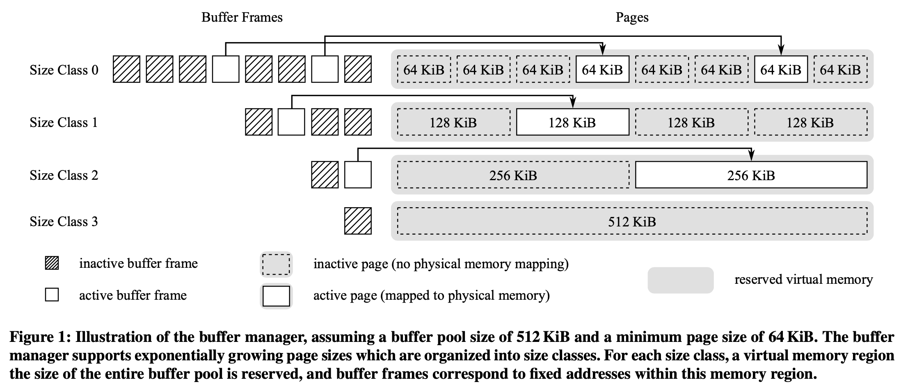
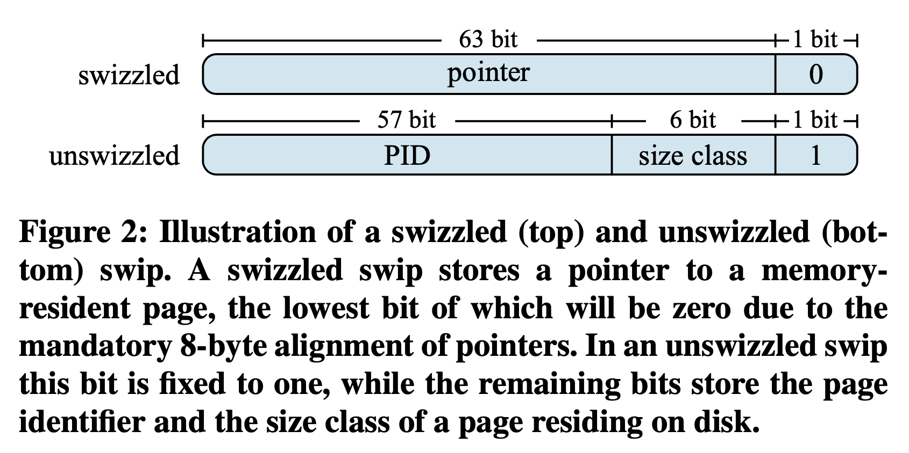
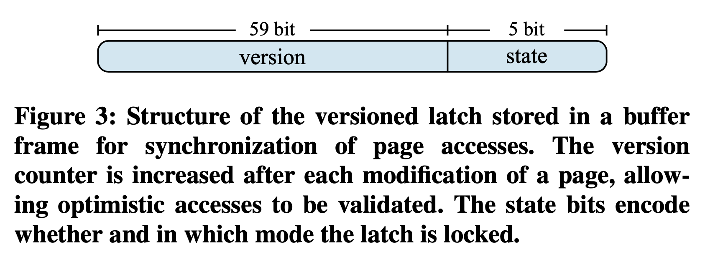
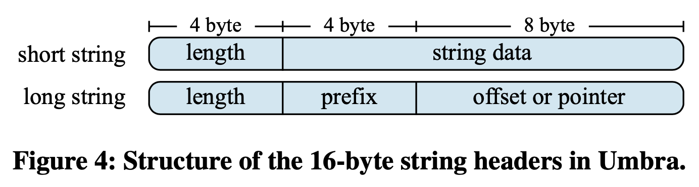
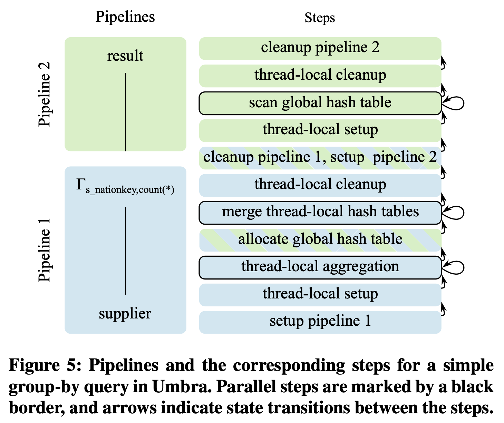
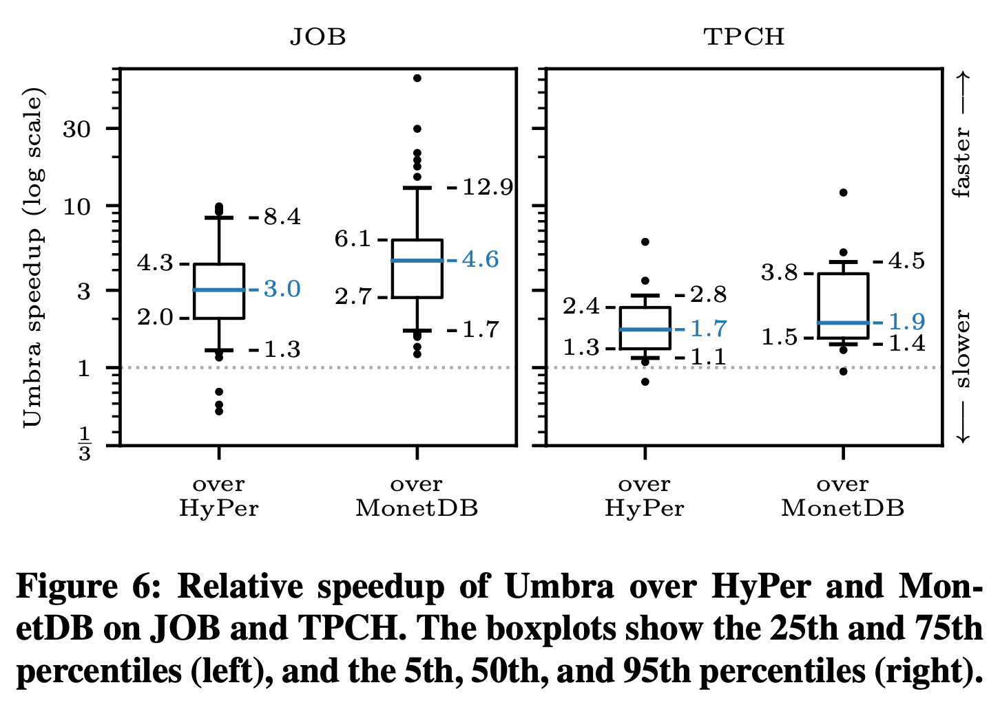

> 本文封面图片来自 [自然摄影师雷雨](https://space.bilibili.com/470226708/)

## 简介

这篇论文介绍了 TUM 的通用数据库 Umbra，它基于 SSD，能高效处理任意大小的数据集，是内存数据库 HyPer 的继任者。Umbra 的关键实现包括：不定长 page 和专用 buffer manager，pointer swizzling 和 versioned latch 等多核优化，高效的 log 和 recover 算法，代码生成等。

Umbra 是 LeanStore（基于 SSD 的定长 page 数据库）的演进，两者有许多相似之处。建议看 Umbra 前先看 LeanStore 的论文，或者看我写的这篇文章：[[ICDE 2018] LeanStore: In-Memory Data Management Beyond Main Memory](https://zhuanlan.zhihu.com/p/619669465)。

## Buffer Manager



LeanStore 的 Buffer Manager 管理定长 page，虽然高效，但需要额外处理可变大小的 tuple，增加系统复杂性和性能开销。

Umbra 的 Buffer Manager 管理变长 page，如图所示，page 按 size class 分类，每个 size class 的 page 大小是前一个的 2 倍。最小 64 KB，最大能覆盖整个 Buffer Pool。Buffer Manager 只有一个 Buffer Pool，管理所有 size class。Buffer Pool 的内存容量是全局配置的，不需为每个 size class 单独配置。默认情况下，Buffer Pool 只用可用内存的 50%，剩下的给查询执行。

### Buffer Pool Memory Management

内存碎片化是 Buffer Pool 支持多个 size class 的主要挑战。

Umbra 通过操作系统的虚拟地址和物理地址映射来解决这个问题。操作系统通过页表将用户的虚拟内存地址转换为实际的物理地址。这样，连续的虚拟内存可以分散地存储在碎片化的物理内存中，同时虚拟内存分配也可以和物理内存分配解耦开，用户程序可以在不实际分配物理内存以及不建立虚拟内存到物理内存地址映射的情况下分配一块虚拟内存。

Umbra 的 Buffer Manager 使用 mmap 来实现上述目标。具体来说，每个 size class 都被分配了一个足够装下整个 buffer pool 大小的虚拟内存，通过配置 mmap 系统调用使其仅分配虚拟内存地址不分配实际物理内存，然后将每个 size class 内的虚拟内存按照 page size 切分成一个个 chunk，每个 buffer frame 都包含一个指向对应 chunk 的内存指针。这些内存指针创建出来后就不再改变，后续 buffer manager 在需要时就将 page 从磁盘加载到这个虚拟内存地址对应的物理内存中。

**物理内存分配**：Umbra 用 pread 读磁盘 page 到 buffer frame，操作系统分配物理内存（可能不连续），建立虚拟地址和物理地址的映射。

**物理内存释放**：Umbra 用 pwrite 写 buffer frame 到磁盘文件，用 madvise 传 MADV_DONTNEED 标志，让操作系统回收物理内存。因为 mmap 没映射磁盘文件，madvise 开销很小。

Buffer Manager 跟踪物理内存使用情况，保证 buffer pool 不超配置容量。Umbra 和 LeanStore 的缓存替换策略相同，内存 page 先进 cooling stage 的 FIFO 队列头，到队列尾再驱逐。

### Pointer Swizzling



为了把页面序列化到磁盘中，页面不能用内存指针而要用 page ID（PID）来引用。一种常见的方法是用一个全局哈希表来映射 page ID 和内存指针，但这样每次访问页面都要获取 latch 来操作哈希表，会导致 latch contention 的性能问题。

和 LeanStore 一样，Umbra 采用了 pointer swizzling 来解决这个问题。pointer swizzling 是一种在序列化和反序列化时把基于名字或位置的引用转换成直接的内存地址的过程。Umbra 的每个页面都有一个 Swip 来访问子节点，Swip 是一个 64 位整数，最低位是 0 表示它是内存指针，最低位是 1 表示它是 page ID（需要从 cooling stage 或磁盘中加载页面）。

对于 page ID 的 Swip，Umbra 还用了 6 比特来表示页面所属的 size class，因为 Umbra 使用了变长页面。剩下的 57 比特表示实际的 page ID，范围是 0 到 2^57-1。Umbra 要求每个页面只有一个 Swip，方便缓存替换时更新 Swip 值。

### Versioned Latches



Umbra 用一个 64 位整数的原子变量实现了 versioned latch，支持 exclusive、shared 和 optimistic 三种上锁模式，以减少 latch contention。versioned latch 的 5 比特位表示锁的状态，0 为无锁，1 为 exclusive 锁，2 及以上为 shared 锁。shared 锁允许多个线程同时读取被保护的数据，exclusive 锁则只允许一个线程读写。versioned latch 的剩余 59 比特位表示版本计数器，每次修改数据时递增。optimistic 模式下，线程不会真正上锁，而是通过比较数据读取前后的版本计数器来判断是否需要重试。

Umbra 和 LeanStore 的区别在于，Umbra 支持 shared 模式上锁，而 LeanStore 只支持 optimistic 模式。这是因为 optimistic 模式可能需要重试，对于读写比重不明或者重试代价高的数据和查询来说，性能损失太大。

另外 Umbra 的 versioned latch 在后面演进成了 Hybrid-Latch，在 VLDB 2023 的这篇论文中通过伪代码详细介绍了各个模式的 latch 实现，论文不长，感兴趣朋友阅读一下：《[Scalable and Robust Latches for Database Systems](https://db.in.tum.de/~giceva/papers/damon_latches.pdf?lang=de)》。

### Buffer-Managed Relations

Umbra 用 B+ 树存储 tuple，用单调递增的 8 字节 tuple ID 作为 Key。这样内部节点固定为 64 KiB，扇出为 8192，插入效率均匀。只有当 tuple 超过现有 page 容量时，才会分配新的叶子节点，一般都是 64 KiB。tuple 采用 PAX 格式，固定大小字段列式存储在页面开头，可变大小字段密集存储在页面末尾，插入时可压缩。这种页面布局下，获取部分字段可能导致所有字段都加载到内存中，Umbra 未来计划在将来进行优化，比如用 DataBlock 格式（参考：《[Data Blocks: Hybrid OLTP and OLAP on Compressed Storage using both Vectorization and Compilation](https://db.in.tum.de/downloads/publications/datablocks.pdf)》）优化冷数据。

B+ 树的并发访问通过 versioned latch 实现的 optimistic latch coupling 完成。写线程通过 exclusive latch 修改内部或叶子节点，读线程通过 shared latch 读取叶子节点或加载子节点。非修改遍历用 optimistic latch。Umbra 的 B+ 树节点没有兄弟指针，通过 fence key 实现了 range scan。为避免重试和整树遍历，读线程持有父节点的 optimistic latch，读完一个叶子节点后尽量直接从父节点读兄弟节点。

### Recovery

Umbra 采用 ARIES 恢复算法。因为采用了变长 page，在磁盘空间复用时不能让多个小 page 复用大 page 的磁盘空间。比如下面这个例子：

一个 128 KiB 的数据库文件，它当前完全被一个 128 KiB 的页面占用。将此页面加载到内存中，删除它，并创建两个新的 64 KiB 页面，这些页面重用该文件中的磁盘空间。系统崩溃时，可能只有 WAL 写入磁盘了，而实际的新页面数据还没写入。在恢复期间，ARIES 会从该文件读取第二个 64 KiB 页面的 LSN，而实际上读取上来的是已删除的 128 KiB 页面的某些数据，并错误地将其解释为了 LSN，导致后续故障恢复出现异常情况。

Umbra 解决思路比较简单，仅在 size class 内部支持磁盘空间复用。

## Further Considerations

Umbra 采用了变长 page，实现了对应的 buffer manager。其他模块都需要在这个基础上进行适配，论文提了字符串和统计信息收集两个方面。

### String Handling



因为 page size 是变长的，一个 string 也不需要被拆分成多段了，Umbra 简单的将其存成 length + data 两部分：

Umbra 将字符串分为两个部分来存储：一个包含元数据的 16 字节 header 和一个包含实际数据，可变大小的 body。header 和其他固定大小的属性一样存储在页面开头的列式布局中，而实际字符串数据则存储在页面末尾，长字符串也不需分割（放不下就触发分裂，然后 buffer manager 分配一个能放下它的叶子结点）。

header 的前 4 位用于存储字符串长度，而后 12 位根据字符串长度有两种编码格式：
- 对于不长于 12 字节的短字符串，它们的数据直接存储在 header 的后 12 位内
- 后 12 位的 4 位用于存储字符串的前四个字符，允许 Umbra 快速进行一些字符串比较，剩下的 8 位存储其数据的指针或某个已知位置的偏移量

由于长字符串存储在其他物理页面上，这些页面可能没有加载到内存中，因此这些字符串需要特殊处理：Umbra 引入了三种存储类别，即持久、瞬态和临时存储。存储类别编码在字符串头部存储的偏移量或指针值的两个比特中：
- 持久存储：对持久存储的字符串引用（例如查询常量）在数据库运行时间内始终有效
- 瞬态存储：对瞬态存储的字符串引用，只有在当前工作单元正在处理时有效
- 临时存储：由查询执行实际创建的字符串（例如 UPPER 函数）具有临时存储期

### Statistics

Umbra 中支持的统计信息主要是每个表上的随机采样和每个列上可更新的 HyperLogLog。Umbra 实现了一个可扩展的在线蓄水池采样算法，参考：《[Scalable Reservoir Sampling on Many-Core CPUs](https://altan.birler.co/static/papers/2019SIGMOD_ScalableReservoirSampling.pdf)》。相比 HyPer 仅支持定期更新样本的方式，Umbra 可以用最小的开销确保优化器始终具有最新的样本。

### Compilation & Execution

Umbra 大致上采用了 HyPer 的执行策略：逻辑查询计划被转换为高效的并行机器码，然后执行以获得查询结果。Umbra 采用了比 HyPer 更细粒度的物理执行计划。HyPer 的物理执行计划本质上是一个整体代码片段，Umbra 的物理执行计划则被表示为模块化状态机。以下面的 query 为例：

```sql
select count(*) from supplier group by s_nationkey
```

对上面这个 TPC-H 查询，HyPer 会采用两个 Pipeline 来执行它，第一个 Pipeline 扫描 supplier 表并执行 group by 操作，第二个 Pipeline 扫描每个 group 的数据并打印查询输出。在 Umbra 中，这些 Pipeline 进一步分解为 step，每个 step 可以是单线程的也可以是多线程的。上述 query 的 pipeline 和 step 如下图所示：：



在生成的代码中，每个 step 对应一个单独的函数，可以由 Umbra 的 runtime system 调用。在查询执行时，通过这些 step 完成 pipeline 内的状态转换，step 的执行由 Umbra 的查询执行器协调。多线程 step 采用 morsel-driven 的方式执行。

这样做的好处有很多：
- 可以在每次调用 step 函数后暂停查询执行，比如系统 IO 负载超过某个阈值可以及时暂停。
- 查询执行器可以在运行时检测并行 step 是否仅包含单个 morsel，这种情况下不必将所需的工作分派到另一个线程，从而避免潜在的上下文切换开销。
- 可以轻松支持 pipeline 内的多个并行 step，如上图所示

另一个和 HyPer 不同的地方是代码不是直接生成成 LLVM IR，而是在 Umbra 中实现了一个自定义的轻量级 IR，这使 Umbra 能在不依赖 LLVM 的情况下高效（省去一些额外开销，能够比 LLVM 更高效）地生成代码。

Umbra 不会立即将 IR 编译为优化后的机器码。Umbra 采用了自适应编译策略，用来权衡每个 step 的编译和执行时间。step 的 IR 先被转换为高效的字节码，由 Umbra runtime system 解释执行。对于并行 step，自适应执行引擎会跟踪执行进展以决定编译是否有益，如果是，则将 Umbra IR 转换为 LLVM IR，然后交给 LLVM JIT 编译后执行。

## Experiments



作者测试了 TPC-H 和 JOB 两个 Benchmark 10GB 的数据，每个查询重复五次，选取最快的重复结果（也就是充分预热后的结果）。和 Hyper 相比，Umbra 的性能提升明显，主要来自自适应的 IR 编译。特别是在 JOB 上，Umbra 的 geometric mean 提升为 3.0×，在 TPC-H 上为 1.8×。在这些查询中，HyPer 实际上在查询编译上花费的时间远远超过查询执行时间，最多达到 29×。

而如果仅看纯计算开销，Umbra 也要好于 Hyper。平均而言，在 JOB 上执行时间波动约为 30%，在 TPC-H 上波动约为 10%。JOB 上的相对差异较大，大多数是由于 HyPer 和 Umbra 选择了不同的执行计划。尽管 Umbra 的基数估计要好得多，但它偶尔会选择比 HyPer 更差的逻辑计划。这是因为 Hyper 里出现了负负得正的 Join Order 优化效果。

作者还单独测试了 buffer manager，感兴趣的朋友可以详细阅读论文这一节，本文不再展开。