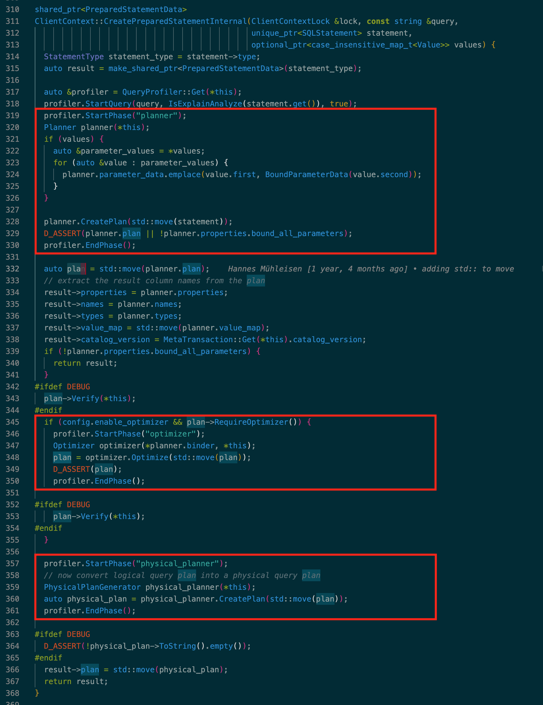
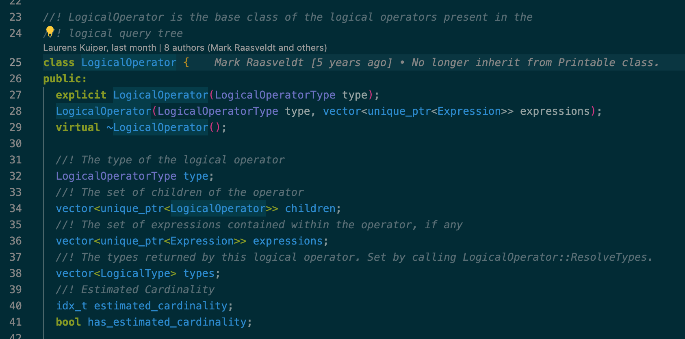
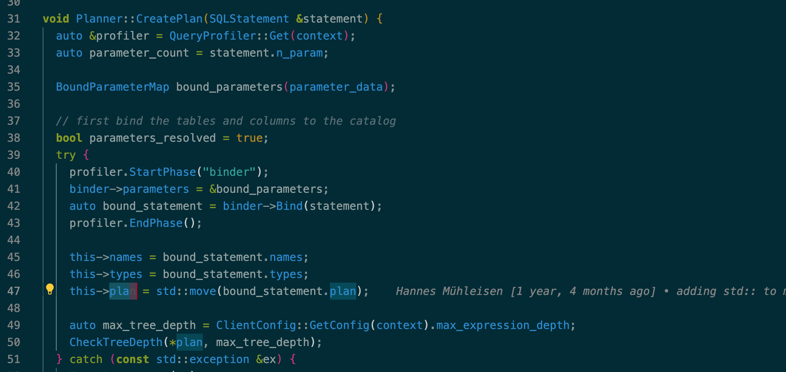
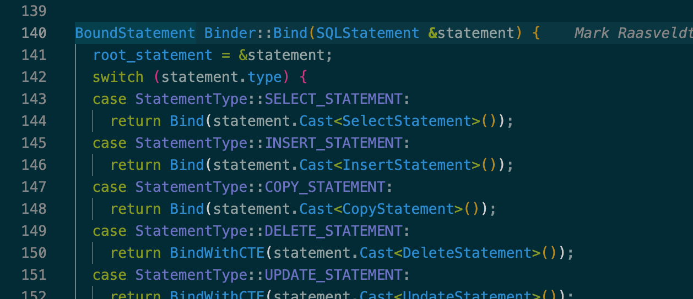
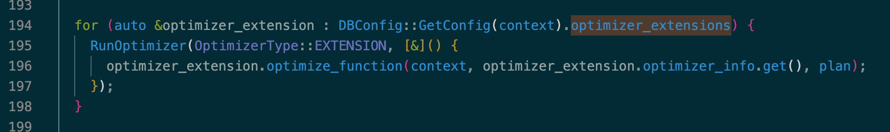
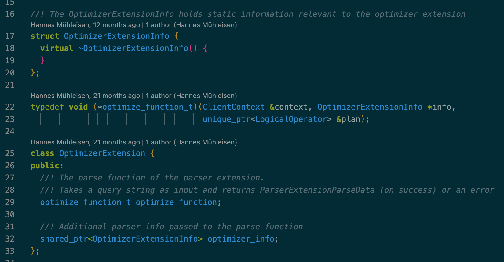
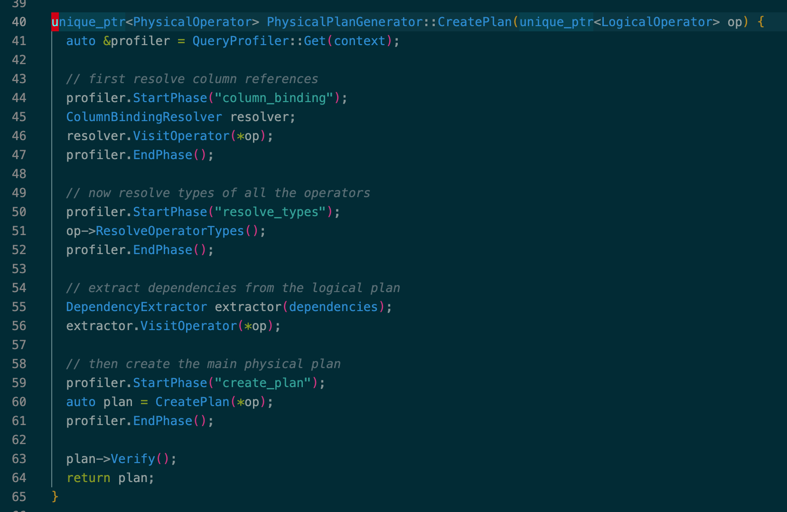
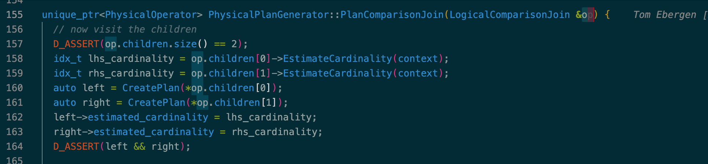
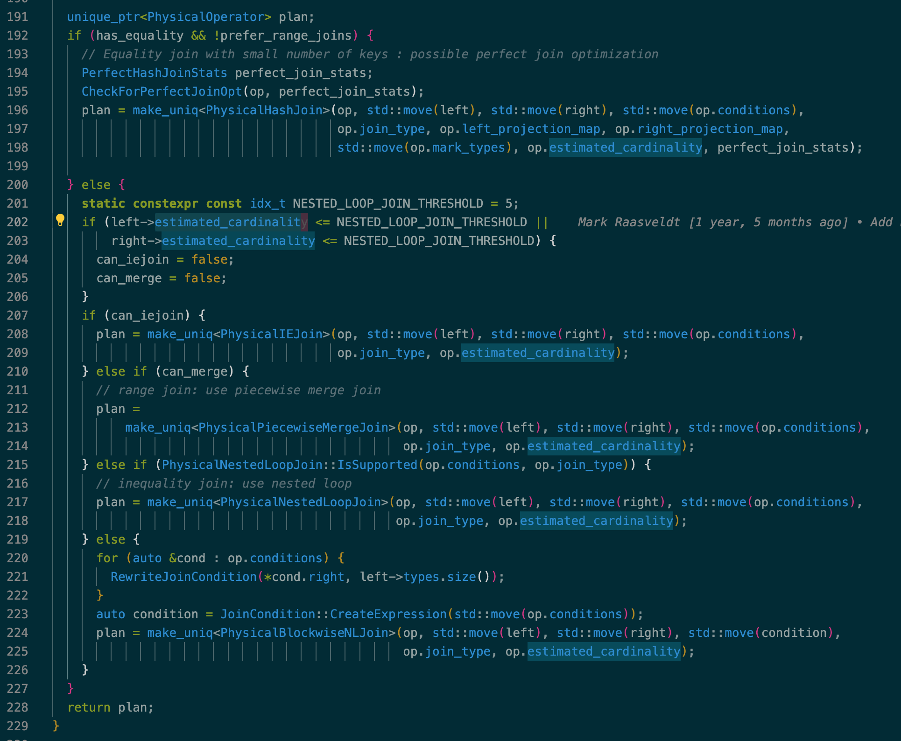

> Glacier, Tilicho Lake, Annapurna, 2024

## 简介

本文以目前 DuckDB main 分支最新代码（commit: [670cd34](https://github.com/duckdb/duckdb/tree/670cd341249e266de384e0341f200f4864b41b27)）为例，介绍 DuckDB 查询优化的整体过程和部分细节。

和大多数优化器一样，DuckDB 查询优化也可以分为逻辑优化和物理优化两个阶段。如下图所示，整个查询优化由 `ClientContext::CreatePreparedStatement()` 驱动完成，其中的关键步骤和组件为：
1. `Planner`：负责将 AST 中的 SQLStatement 转换为初始未经优化的 logical plan，对应图中第 1 个红框部分的代码
2. `Optimizer`：负责 logical optimize，对初始 logical plan 做一系列等价变换的优化后得到最终 logical plan，对应图中第 2 个红框部分的代码
3. `PhysicalPlanGenerator`：负责 physical optimize，将优化后的 logical plan 转换成最终用于执行的 physical plan，对应图中第 3 个红框部分的代码


> 参考代码：src/main/client_context.cpp

从上面的代码片段可以看到，DuckDB 将逻辑优化和物理优化分成两个独立的阶段，没有额外其他优化机制，其中逻辑优化（Optimizer）可以选择性的打开或关闭，整体来说比较简单。接下来我们分别看看每个阶段的大致实现原理。

## Planner and binder

和大多优化器一样，DuckDB 的逻辑执行计划也是树形结构。每个节点由 `LogicalOperator` 表示，根节点代表了整个逻辑执行计划。每个 LogicalOperator 主要由这些部分组成：
1. children：所有孩子节点，代表了以孩子节点为根的所有 subplan
2. types：该算子输出的 output schema，也就是计算结果中每列的数据类型
3. estimated_cardinality：估算的 cardinality


> 参考代码：src/include/duckdb/planner/logical_operator.hpp

将 `SQLStatement` 转换为这样的逻辑执行计划由 `Planner::CreatePlan()` 完成：


> 参考代码：src/planner/planner.cpp

实际执行由 `Binder` 完成，它会根据 SQLStatement 的具体类型先创建出 `BoundStatement`，然后根据 BoundStatement 创建由 LogicalOperator 表示的逻辑执行计划。这个过程会遍历该 SQLStatement 的每个 SQL 子句，有非常多细节需要处理，相关代码在 `src/planner/binder/statement/` 目录中，感兴趣的朋友可以自行查阅，本文不再展开介绍：


> 参考代码：src/planner/binder.cpp

## Logical plan optimizer

`Optimizer::Optimize()` 负责所有逻辑优化，这里每个启发式优化规则都是有收益的，优化规则之间的先后顺序经过精细调整固化在了 Optimizer 代码中。逻辑优化就是 Optimizer 顺序应用所有优化规则，这些优化规则按照应用的先后顺序分别是：
1. EXPRESSION_REWRITER：不改变 logical plan 的算子结构，仅优化每个算子的表达式树。所有 rewrite rule 在 `Optimizer` 初始化时确定。expression rewrite 会不停迭代直到没有任何 rule match
3. FILTER_PULLUP
4. FILTER_PUSHDOWN
5. REGEX_RANGE
6. IN_CLAUSE
7. DELIMINATOR
8. JOIN_ORDER
9. UNNEST_REWRITER
10. UNUSED_COLUMNS
11. DUPLICATE_GROUPS
12. COMMON_SUBEXPRESSIONS
13. TOP_N
14. COLUMN_LIFETIME
15. STATISTICS_PROPAGATION
16. COMMON_AGGREGATE
17. COLUMN_LIFETIME
18. REORDER_FILTER
19. EXTENSION

末尾的 EXTENSION 是用户自定义优化规则，在所有 built-in 优化规则执行完后，DuckDB 会枚举 config 中设置的 optimizer extensions，依次应用这些自定义优化规则：


> 参考代码：src/optimizer/optimizer.cpp

可以认为 EXTENSION 是 DuckDB 的优化器插件，允许开发者按需实现自定义的优化规则。插件接口也不复杂，下图是所有接口定义，只需要依次实现 `OptimizerExtensionInfo`、`OptimizerExtension` 以及 `optimize_function_t` 函数即可，可以参考 DuckDB 源码中的 demo(test/extension/loadable_extension_optimizer_demo.cpp)：


> 参考代码：src/include/duckdb/optimizer/optimizer_extension.hpp

DuckDB 支持的优化规则比较多，有些优化规则比较复杂，这里就不一一介绍了，之后有机会再单独详细分析。

## Physical plan generator

物理执行计划由 `PhysicalOperator` 表示，通过 `PhysicalPlanGenerator` 完成物理优化，由 `PhysicalPlanGenerator::CreatePlan()` 完成。和其他优化器不一样，DuckDB 的物理优化是个启发式优化过程，没有利用 cardinality 和 physical property 进行 cost-based optimization（CBO）：


> 参考代码：src/execution/physical_plan_generator.cpp

以 LogicalComparisonJoin 的物理优化过程为例，`CreatePlan()` 采用 bottom-up 的方式先得到子树的 estimated cardinality 和物理执行计划，最后再启发式的为当前算子构造 PhysicalOperator：


> 参考代码：src/execution/physical_plan/plan_comparison_join.cpp

构造物理执行计划时利用 estimated cardinality 选择适合的物理算子：


> 参考代码：src/execution/physical_plan/plan_comparison_join.cpp

其他算子的物理优化也采用类似的物理优化过程，这里不再详细展开。

## 一些思考

关于 logical optimize，DuckDB 采用了手动维护顺序的启发式优化规则，好处是优化器的结果和耗时可预测，问题比较好排查。缺点也很明显，添加优化规则的心智负担大，需要考虑放在哪些依赖的优化规则之后，以及添加后对其他优化规则有什么影响，也会有 query 不能完全优化的问题。也许类似 volcano/cascades 或者 DuckDB ExpressionRewriter 那样通过 rule matching 不断迭代和优化直到没有任何 rule match 为止在灵活性和优化效果上会好点，不过这样原本的可预测性优点就没了，出问题后也比较难调查和调试，需要通过更复杂的机制（比如 planner trace）来解决。

关于 physical optimize，DuckDB 没有采用 cost-based optimization，物理算子的物理属性也无法充分利用上，可能会存在 sub-optimal plan 的问题，比如下面这个例子中冗余的 order by 目前 DuckDB 无法消除。不过对目前的 DuckDB 来说应该不是个问题，它没有 index scan、merge aggregate、merge join 等能够提供某种顺序的物理算子，只有 order by 能够保证顺序，虽然建表时支持唯一索引、二级索引，但即使 order by 索引列也并不能利用索引来提速，哪怕是 `select * from t order by a limit 1` 这样的简单语句也需要扫全表后再求 TopN。这样其实只需要在逻辑优化阶段特殊优化 order by 就好了，比如下面的例子可以添加和应用一个 order by 消除的规则：

```sql
select * from (
  select * from t order by a) t
left join (
  select * from s order by a) s
on t.a=s.a
order by t.a;
```

DuckDB 不支持创建按照某些属性进行数据分布的表，虽然执行引擎采用了 pushed based execution model（详见：[\[DuckDB\] Push-Based Execution Model](https://zhuanlan.zhihu.com/p/402355976)），每个 pipeline 并发执行，但也没有引入 shuffle/exchange 算子，pipeline 的 source 和 sink 都是读写全局数据，整个 query 执行过程不会产生特定的数据分布，因此物理优化过程也不需要考虑 data distribution 这样的物理属性。

不需要考虑 order 和 distribution 这两个物理属性，物理优化过程就可以极大的简化了，像 DuckDB 这样采用启发式方式就足够使用了，等哪天支持了 index scan/lookup、hash/range partition table，应该才有必要在优化器和执行器上利用这些 physical property 进一步优化。