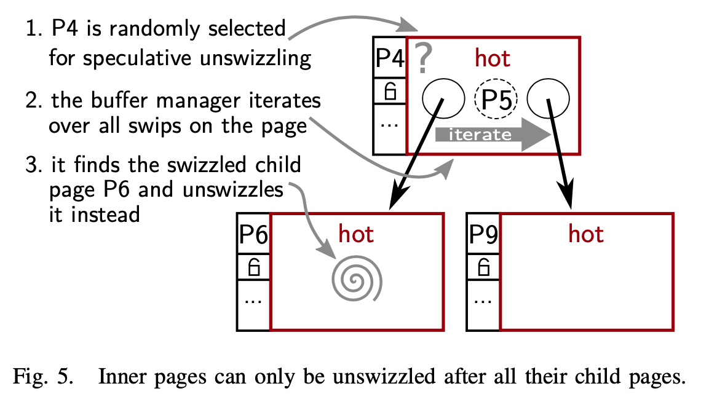
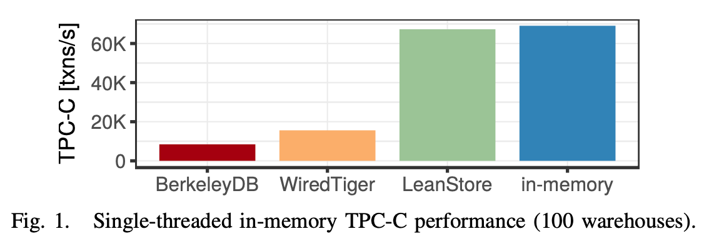
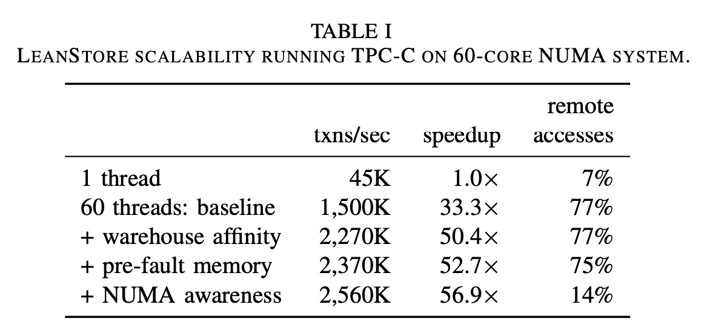
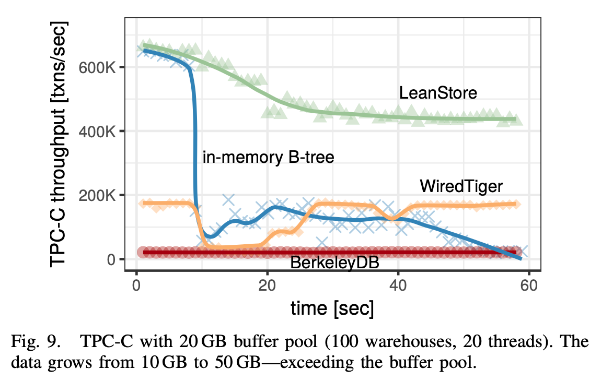
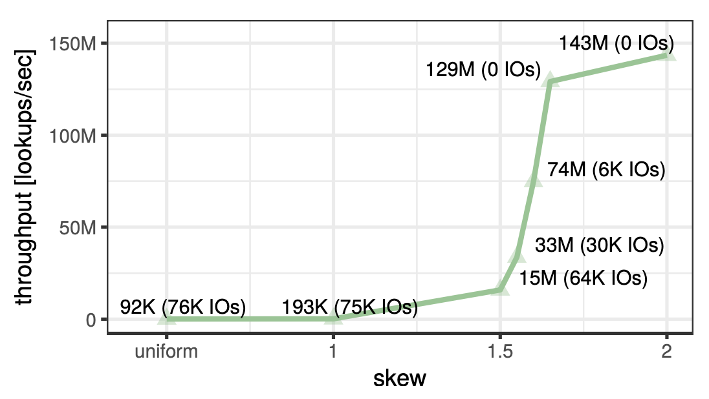
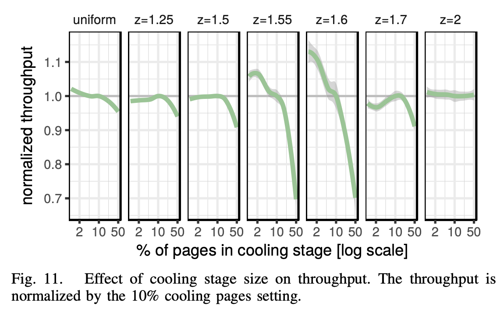
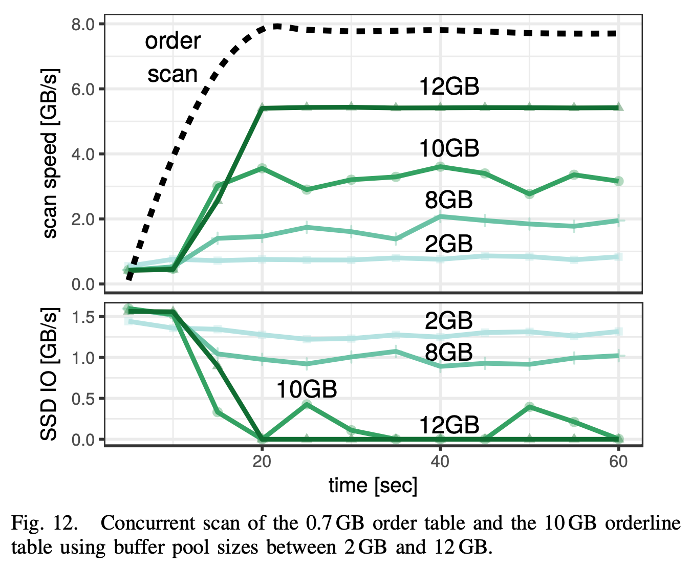

> 图片来源于 [旅行摄影师唐僧](https://space.bilibili.com/405561962/)

## Introduction

Buffer Manager 和 B+ Tree 在 In-Memory 的负载上有很多性能瓶颈，比如将 Page ID 转换成内存指针的 Hash Table 和它对应的全局 Latch，比如访问 B+ Tree 的每个内存节点时需要获取的 Latch 等。为了达到更好的性能，像 H-Store、Hekaton、HANA、HyPer、或 Silo 这样的内存数据库都摒弃了 Buffer Manager 的设计，把数据和索引直接存储在内存中，通过内存指针而不是 Page ID 来高效的访问这些数据。

larger-than-RAM 的负载广泛存在的，但目前支持 larger-than-RAM 的内存数据库比如 Anti-Caching 和 Siberia 又因为不支持缓存替换策略显得不够通用。考虑到 SSD 越来越通用了，价格相比 DRAM 便宜了 10 倍，性能虽然也是 10 倍的差距但比起 SATA 却好太多了。于是从性价比的角度看，SSD 和支持缓存替换的 Buffer Manager 就变得有吸引力了起来。

这篇论文介绍了 LeanStore 的设计与实现。作者通过去中心化的 Pointer Swizzling 和 Page Replacement 实现了工作在 SSD 上的 Buffer Manager，通过这个 Buffer Manager 和 Optimistic Latch Coupling 等关键技术实现了高性能 B+ Tree，让 LeanStore 既能支持 larger-than-RAM 的工作负载，又能提供和内存数据库一样的性能表现。

## Building Blocks

LeanStore 的基石有 3 个，分别是 Pointer Swizzling、Efficient Page Replacement 和 Scalable Synchronizatio。这里先简单看看它们各自的原理，后面会有更详细的介绍。

### Pointer Swizzling

内存中 B+ Tree 的 Page 都由 Buffer Manager 管理，访问 B+ Tree 的内存 Page 需要通过 Page ID 从 Buffer Manager 那获取对应的内存指针。通常 Buffer Manager 使用 Hash Table 来存储 Page ID 到内存指针的映射，方便快速知道一个 Page 在不在内存中以及对应的内存在哪。而为了支持并发安全的 Hash Table 读写操作，这个 Hash Table 上有个全局 Latch，这个 Latch 的锁竞争就是传统 B+ Tree 的性能瓶颈之一。

LeanStore 去除了这个全局 Hash Table 以及对应的 Latch，采用了 Pointer Swizzling 的方案。B+ Tree 每个 Page 都有一个称为 Swip 的引用来表示该 Page 的 Page ID 或内存指针。Swip 本质上是一个 8 字节整数，通过 [Pointer Tagging](https://en.wikipedia.org/wiki/Tagged_pointer) 使用 1 个比特位来区分这 8 字节是 Page ID 还是内存指针。

### Efficient Page Replacement

一般 Buffer Manager 采用 LRU 或者 Second Chance 的缓存替换策略，这些策略是有额外开销的，比如追踪所有的 Page 访问操作。另外并发对那些热点 Page（比如 B+ Tree 的根节点）更新 LRU 链表、Second Chance 比特位等也存在无法 Scale 的性能瓶颈。

LeanStore 不再追踪 Page 的访问信息，因为 Buffer Pool 可用的内存通常都很大，经常访问的热数据相比冷数据会更多，与其花费额外的开销追踪这些热数据增加大多数读写操作的负担，不如去追踪这些不经常访问的冷数据。

LeanStore 将所有 Unswizzled Page 维护在一个 Cooling Stage 中（占整体 Buffer Pool 的 10%）。这个 Cooling Stage 本质是一个 FIFO 队列，刚被 Unswizzle 的 Page 放在队头，当其移动到队尾时则 Flush Dirty Page。处在内存 B+ Tree 中的 Page 称为 Hot Page，处在 FIFO 队列中的 Page 称为 Cooling Page，而处在磁盘 SSD 上的 Page 称为 Cold Page。上图很好的展示了这三种 Page 之间的转换关系。和 Second Chance 策略类似，如果队列中某个 Cooling Page 被内存中的 B+ Tree 再次访问到，它会从 Cooling Stage 中移除出去，重新变成 Hot Page。

### Scalable Synchronization

一般 Buffer Manager 采用 Latch（数据库的 Latch 和操作系统的 Lock 是对等的概念，指的是编程语言中的 Mutex）进行线程间同步。每个内存 Page 都由一个 Latch 来保护。B+ Tree 上为了支持并发读写而使用的 Lock Coupling（在数据库的语义下称其为 Latch Coupling 更准确些）机制也需要依赖这些 Latch 来实现。B+ Tree 的并发性能很大程度受这些 Latch 的影响，尤其是多线程并发对一些热点 Page（比如 Root 节点）加锁时，并发性能会因为锁竞争进一步降低。为了让 B+ Tree 的并发性能在多核 CPU 上 Scale，LeanStore 使用了如下方案：
1. 引入 Pointer Swizzling 机制，去掉 Buffer Manager 的 Hash Table 和它对应的全局 Latch
2. 引入 Epoch 机制，不再需要为每个 Page 维护 pin counter，并在访问时修改 counter
3.  引入一组乐观的、基于时间戳的原语，用在 Buffer Manager 管理的数据结构上，大大减少了 Latch 的获取次数。在 LeanStore 里，Swizzled Page 上的 Lookup 不需要获取任何 Latch，Insert/Update/Delete 一般也只需要获取叶子结点的 Latch，B+ Tree 的读写操作拥有非常好的性能表现。

## LeanStore

这里开始详细介绍 LeanStore 的主要组件和各自的技术原理。

### Overview

LeanStore 内部主要分为 3 个组件用于实现 Buffer Manager 需要具备的 3 个功能：
1. 根据 Page ID 判断对应的数据是否在内存中，返回对应的内存指针：如上图上部分的 Buffer Pool 所示，LeanStore 将每个 Page 的内存指针或 Page ID 包装在 Swip 中，并将 Swip 交给其父亲页面管理，不再依赖中心化的 Hash Table
2. Buffer Pool 满了时需要决定哪些 Page 应该保留在内存中：如上图左下角所示，LeanStore 随机挑选所有子页面都 Unswizzle 的 Page 放入 Cooling Stage 中，不再依赖中心化的 LRU List，也不需要每次遍历 Page 时都维护额外的访问信息。
3. 管理所有正在进行的 IO 操作：如上图右下角所示，LeanStore 通过 In-Flight I/O 模块管理所有 Page 的加载操作。

下面依次来看各个模块是如何实现的。

### Swizzling Details

LeanStore 使用 8 字节整数表示 Swip，当 Swip 的 8 字节表示Unswizzle时称为 Swizzled，当表示 Page ID 时称为 Unswizzled。

LeanStore 不再有全局的 Hash Table 来存储 Page ID 到内存指针的映射。所有 Page ID 到内存指针的映射关系都被去中心化的存储在了各个 Swip 中。如果每个 Page 有多个 Swip 存储在其他 Page 中，Page 剔除时就需要更新所有存储在各个 Page 上的 Swip，而要正确维护和更新这些 Swip 使它们数据一致就需要引入额外的工作机制，会使系统变得复杂和低效。

LeanStore 简化了这个问题，所有 Page 都只有一个 Swip 存储在其父节点中，兄弟节点之间不再有 Swip 存在。去除兄弟节点之间的 Swip 后，LeanStore 通过 Fence Keys 实现了 Range Scan，通过 Optimistic Latch Coupling 实现了高性能的并发读写，这个在后面会提到。

LeanStore 要求只有所有的子 Page Unswizzle 后才能 Unswizzle 父 Page，在这个约束下，Buffer Manager 必须能够遍历 Page 上的所有 Swip，找到能够 Unswizzle 的孩子节点。如上图所示，为了避免将 Page 内部信息暴露给 Buffer Manager，每个类型的 Page 都实现了一个 Iteration Callback。Buffer Manager 通过这个 Callback 遍历 B+ Tree，随机寻找一个可以 Unswizzle 的 Page。

为了 Unswizzle 一个 Page，Buffer Manager 需要找到其父节点，将存储在父节点的 Swip 修改成 Page ID。而为了找到父节点 ，每个 B+ Tree 内存节点维护了一个指向父节点的内存指针。因为父节点一定在子节点之后 Unswizzle，所以子节点中这个指针在它访问时一定有效。

之前提到每个节点只会有一个 Swip，这样能够简化 Unswizzle 节点时的 bookkeeping 工作，但其实也每个节点也可以有多个 Swip。比如维护多个 Parent Pointer 指向拥有该节点 Siwp 的所有节点（也是 Unswizzle 时需要修改的 Swip）。

另外除了 LeanStore 这种紧凑型的 Swip 以外，还可以使用 Fat Swip，里面同时存储 Page ID 和对应的内存指针。

### Cooling Stage

当 Buffer Pool 满的时候，会在 Cooling Stage 中维护被随机 Unswizzle 的 Page（占整个 Buffer Pool 的 10%），他们称之为 Cooling Page，他们的内存指针被存储在一个 FIFO 的队列里，最近 Unswizzle 的 Page 放在队头，每次从队尾取出一个 Cooling Page，根据需要 Flush 脏页，然后复用对应的内存，填充从磁盘加载进来的新 Page。

Unswizzle 的 Page 在内存 B+ Tree 中只会留下 Page ID，当用户线程在这个 Page 被 Unswizzle 后再次访问它时，它可能还处于 Cooling Stge 的 FIFO 队列里，没 Flush 也没被回收复用。LeanStore 会先尝试从 Cooling Stage 的 FIFO 队列里面寻找 Page ID 对应的 Page，找到了就把它从 Cooling Stage 中剔除，重新 Swizzle 加入到内存的 B+ Tree 中。为了加速这个寻找过程，LeanStore 在 Cooling Stage 中引入了一个 Hash Table。访问这个 Hash Table 需要获取对应的 Latch，但因为这个 Hash Table 和它的 Latch 只有在需要磁盘 IO 的时候才需要获取，而磁盘 IO 的开销比锁竞争大多了，所以综合来看这个 Latch 对性能的影响不大。

Buffer Pool 的缓存替换，包括 Cooling Stage 的维护、Unswizzle Page 和 Swizzle Page 这些操作都不是由后台线程维护的，而是在处理用户请求需要额外内存（比如创建新 Page 或者根据 Page ID 加载 Page）时进行的，工作线程会根据当前需要 Unswizzle Buffer Pool 中的 Page 使其不超过配置的阈值。

### Input/Output

当同一个页面同时被多个线程并发加载进 Buffer Pool 时可能出现正确性问题，而且同时加载相同的 Page 也很低效。LeanStore 会管理所有的 IO 请求，这一点和其他 Buffer Manager 一样。它用 Hash Table 来存储 Page ID 到 I/O Frame 的映射，每个 I/O Frame 包含一个 Latch 和一个指向 Buffer Frame 的指针。触发页面加载的线程首先获取 Hash Table 上的 Latch，创建一个 I/O Frame 并获取这个 Frame 的 Latch。然后释放 Hash Table 的全局锁，之后用一个阻塞的系统调用加载页面。其他线程会找到已经存在的 I/O Frame，阻塞在获取它的 Latch 上，当第一个线程完成页面加载释放 Latch 后，该页面对所有线程可见了。

同样，这个 Hash Table 上的 Latch 相比磁盘 IO 来说开销也不大。

### Buffer-Managed Data Structures

和存储于 Buffer Pool 中的 Page 一样，其他由 Buffer Pool 管理的数据结构也需要实现这个 Iteration Callback，方便 Buffer Manager 找到能够 Unswizzle 的对象。

原文这一小节介绍了页面的 Unswizzle 过程，在前面的 “Swizzling Details” 中我们已经包含了这部分内容，这里不再继续重复。

### Optimistic Latches

Optimistic Latch 内部有个版本计数器，每当数据更新发生后就增加版本计数器的值。读数据的时候不需要获取任何 Latch，而是检查读取数据前后版本计数器是否变化，和 Optimistic Concurrency Control 类似。LeanStore 在 Optimistic Latch 的基础上实现了 Optimistic Latch Coupling：

1. Read 操作遍历树时不加 Latch，在读数据时通过每个 Optimistic Latch 内的版本计数器来验证是否冲突，冲突则重试
2. 跨越多个叶子结点的 Range Scan 通过 Fence Keys 转换成了各个叶子结点上的 Read
3. Insert、Delete、Update 操作先像 Read 一样不加 Latch 从根节点遍历到叶子结点，然后对需要修改的叶子结点加 Latch，排除其他 Writer，也使潜在 Reader 失效。如果不涉及到树结构变更，则直接修改当前叶子结点，然后释放 Latch。如果需要修改树结构，需要重新遍历整个树，这时对受影响需要修改的内部页面都加 Latch，然后完成这次修改。

这个 Optimistic Latch 挺有意思的，在 TUM 2016 发表在 DaMoN 上的《[The ART of Practical Synchronization](https://db.in.tum.de/~leis/papers/artsync.pdf)》论文中提出，后面有时间仔细研究下。

### Epoch-Based Reclamation

在 Optimistic Latch 机制下，读 Page 不会对获取它的 Latch，而这时候如果有其他线程想要剔除或者删除这个 Page 就会导致内存问题。为了避免这些潜在问题，LeanStore 引入了基于 Epoch 的 Page 回收机制。

LeanStore 通过 Epoch Manager 周期性的推进 Global Epoch，每个线程维护一个 Thread Local Epoch，在访问 Page 之前先去读取 Global Epoch 来推进自己 Thread Local Epoch，访问 Page 结束后将自己的 Epoch 设置为特殊值（比如 ∞）表示当前该线程没有访问任何 Buffer Pool 中的数据。

Cooling Stage 的每个 Cooling Page 都有一个对应的 Epoch，这个 Epoch 是在这个 Page 成为 Cooling Page 入队时从 Global Epoch 获取的，所有在这个 Epoch 之后的线程都无法通过内存指针访问到这个 Cooling Page，因为它对应的 Swip 已经被 Unswizzle 了。

当一个 Cooling Page 到达队尾时，LeanStore 会检查是否它的 Epoch 小于所有活跃的 Thread Local Epoch，确保没有线程还持有这个 Cooling Page 的内存指针，只有满足这个条件时，队尾的 Cooling Page 才能安全的被剔除和复用。在上图中：
- P8 的 Cooling Epoch 是 e4，小于所有 Thread Local Epoch，因此可以安全的剔除
- P2 的 Cooling Epoch 是 e7，大于 Thread 3 的 Epoch e3。Thread 3 访问 Page 的时间早于 P2 进入 Cooling Stage，可能持有 P2 的内存指针正在读 P2 的内容，因此不能安全的剔除。

这样一来 Global Epoch 的推进周期就很关键了。推进的太快会导致其他 CPU Core 的 Cache 频繁失效，推进的太慢会导致 Unswizzled Page 迟迟无法释放和复用。

另外线程访问 Page 的时间也不能太长，不然无法及时推进 Epoch 也会阻塞 Cooling Page 的剔除和复用。Page 上的 Scan 可以划分成一个个小的 Scan 来及时推进 Thread Local Epoch。对于耗时很长的 IO 操作，LeanStore 如果发现当前要获取的 Page 不在内存中，在释放完所有 Lock 后就退出当前 Epoch，然后执行这个 IO 操作把对应的 Page 加载到 Buffer Pool 中，最后再重试一开始要进行的 B+ Tree 操作。这样 IO 操作发生在 Epoch 之外，不会阻塞 Cooling Page 的剔除和释放。

### Memory Allocation and NUMA-Awareness

除了支持 larger-than-RAM 的数据结构，Buffer Manager 也提供了内存管理的功能。因为 Buffer Pool 中 Page Size 是固定大小的，这个内存管理会更简单，也可以避免内存碎片的问题。Buffer Pool 可以根据需要（比如第一次访问时）由操作系统分配，也可以在启动时预先一次性分配好。

LeanStore 支持 NUMA-Aware 的内存分配策略，每个 NUMA Node 都有一个 Buffer Pool 和 Free List 的 Partition。当线程需要内存时优先分配当前 NUMA Node 上的内存，只有在本地 Partition 没有空余页面时才在其他 NUMA Node 上分配。

### Implementation Details and Optimizations

这里讲了一些 LeanStore 的实现和优化细节。

LeanStore 的 Buffer Frame 和 Page 内容是 Interleave 在一起的，目的是为了提升数据的 Cache Locality，同时避免 CPU Cache Associativity 导致的性能问题。

LeanStore 每个线程维护了一个 Thread Local Cache，用来存放那些因为 Page 合并操作而删除的 Page。这个 Thread Local Deleted Page Cache 和 Cooling Stage 中的 Cooling Page 一样采用基于 Epoch 的淘汰替换策略。当一个线程需要新的空 Page 时优先从本地的 Deleted Page Cache 获取，本地没有时才去 Cooling Stage 取。一般情况下 Epoch 会及时推进，本地 Deleted Page 也会在之后被当前线程继续复用，保证了良好的 Cache Locality。

LeanStore 采用了一个后台线程异步的将需要淘汰的 Dirty Page 写回磁盘。这个后台线程周期性的遍历 Cooling Stage 中的 FIFO 队列，把队尾可以淘汰替换的 Cooling Page 写回磁盘。

为了支持低延迟的 Scan 操作，LeanStore 实现了 IO Prefetch。通过前面提到的 In-Flight IO 组件一次调度多个 Page 的 IO 任务，这些任务会在后台执行，IO 结束后对应的 Page 放在 Cooling Stage 中，等待其他线程访问。

另外一个优化是支持通过 Hint 使刚被加载和读取的 Page 保持在 Cooling Stage 中，而不是变成 Hot Page 存放在内存 B+ Tree 里，通过这种方式可以避免 Buffer Pool 被污染。

## In-Memory Evaluation

### Experimental Setup

作者同时实现了一个纯内存 B+ Tree 和一个基于 Buffer Manager 的 B+ Tree 用来对比验证 Buffer Manager 的性能开销。使用 Berkeley DB 6.0（用在 Oracle NoSQL Database）和 WiredTiger 2.9（用在 MongoDB 中），将他们配置为 B+ Tree 模式进行 TPC-C 的对比测试。测试过程中关掉 Transaction、Logging、Compaction 和 Compression 等操作。这里主要是使用 TPC-C 的复杂 workload 和数据访问模式来测试基于 Buffer Manager 的 B+ Tree 性能表现。

操作系统：Linux 4.8 system with an Intel Xeon E5-2687W v3 CPU (3.1 GHz, Haswell EP, 10 cores, 20 hardware threads)，64 GB 内存。

### TPC-C

从单线程的测试来看，LeanStore 带 Buffer Manager 的吞吐和内存 B+ Tree 的吞吐差不多，相比 BerkeleyDB 和 WiredTiger 有好几倍的提升。

接着按照 Pointer Swizzling、Replacement Strategy 和 Optimistic Latch 的的顺序逐渐开启这些优化，来看他们对性能提升的帮助分别有多大。单线程情况下 Pointer Swizzling 和 Replacement Strategy 对性能提升帮助最大。10 线程的结果是单线程结果的 9 倍，接近线性提升。多线程的结果也能看出来 Pointer Swizzling 和 Replacement Strategy 中去掉的两把全局锁对性能提升的巨大收益。

多线程情况下 LeanStore 相比 WiredTiger、BerkelyDB 的性能差异随着线程增多而增大。LeanStore 的线性扩展能力是最好的。

### Scalability on Many-Core Systems

接着测试了一个有 60 Core 的 NUMA 系统，它由 4 个 15 Core 的 Intel Xeon E7-4870 v2 (Ivy Bridge, 2.3GHz) CPU 组成，没有 L3 Cache。前后分别做了 3 个优化：
1. Warehouse Affinity：每个 Worker 线程处理一个 Local Warehouse，是一种针对 TPC-C Workload 的优化，相比 Baseline 性能提升 50.4 倍
2. Pre-Fault Memory：这个应该是预先分配好 Buffer Pool 的内存，避免系统运行期间因为操作系统分配内存导致的一系列问题，相比 Baseline 性能提升 52.7 倍
3. NUMA Awareness：远端内存访问降低到了 14%，相比 Baseline 提升了 56.9 倍，这个性能提升更加明显一些。

## OUT-OF-MEMORY EVALUATION

实验硬件采用 PCIe-attached 400GB Intel DC P3700 SSD，可以提供 2,700/1,080 MB/s 的顺序读写吞吐，以及性能相近的随机 IO 吞吐。测试采用 Direct IO，避免操作系统缓存使性能更稳定。

作者在测试的时候发现了一些操作系统和文件系统的问题：
> - we ran into a number of Linux scalability issues, in particular when performing many random reads and writes simultaneously.
> - We also found the file system (ext4) to be a scalability bottleneck, even though our database is organized as a single large file.

### TPC-C

LeanStore、BerkeleyDB、和 WiredTiger 的 Buffer Pool 都设置为 20GB，同时内存 B+ Tree 开启 Swap 也加入对照测试。在 500MB/s 的 IO 情况下 LeanStore 的性能一直很高（不过看起来 TPC-C 性能有些波动）。BerkelyDB 的表现比较有意思，作者说是因为它的性能太差了，10 分钟才能填满 Buffer Pool，所以上面这个 1 分钟的图来看它的表现很平稳。

作者接着在冷启动的情况下对比了不同磁盘的性能表现：
- PCIe SSD (Intel DC P3700 SSD)：8 秒钟达到峰值性能
- SATA SSD (Crucial m4)：35 秒达到峰值性能
- A magnetic disk (Western Digital Red)：15 分钟后才达到峰值性能

### Point Lookups

TPC-C 是一个 Insert Heavy 的测试集，那些大表比如 stock、customer 的访问模式非常随机，最大的表 orderline 访问模式也很奇怪。作者为了进一步评估 LeanStore 的读性能，设计了几个 Read-Only 的和 YCSB Workload C 很像的 Benchmark。

使用 Uniform 和 Zipf 分布生成了 5GB 的数据集进行了几组点查测试，使用 1GB 的 Buffer Pool，Cooling Stage 容量设置为 10%，Key 固定 8 字节，value 120 字节，总共 41M 个 Key-Value。

这里展示了不同数据倾斜情况下，固定 Cooling Stage 为 10% 的吞吐表现。可以看到的是数据倾斜越程度越高，测试过程中的 IO 越少，最终的吞吐也越高，算是符合预期。

这里展示了不同 Cooling Stage 大小在不同数据倾斜情况下的吞吐表现。目的是想看什么样的 Cooling Stage 容量是合适的。以 Cooling Stage 为 10% 的性能表现作为基准（图中的灰色横线）。一些图细看还是比较有意思。综合来看 10% 是个比较不错的 Cooling Stage 配置。

作者也比较了 1GB Buffer Pool，5GB  数据量，Zipf Factor =1.0 的情况下不同缓存替换算法的 Page 命中率，虽然比 LRU 和 2Q 在小数点后面有所下降，但考虑到维护负担后 LeanStore 的 Replacement Strategy 会有更好的性能。

### Scans

作者最后测试了 Full Table Scan 的性能。使用 TPC-C 400 warehouse 的数据，order 表 0.7GB，orderline 表 10GB。Buffer Pool 从 2GB 测试到 12GB 得到了上面的图。两个表各用一个线程分别在不停的 Scan。

从 Scan Speed 来看，order 表因为只有 0.7GB 能够全部放在内存中，它的 Scan 性能没有受到 orderline 表和 Buffer Pool 大小（最小也是 2GB）的影响。而 orderline 表的性能在 10GB Buffer Pool 配置下的性能表现比较有意思，在第 25 秒和 50 秒有一个 IO 尖峰，同时 Scan 性能也相应的掉下来了，作者解释说这是因为每次数据都会从头到尾全部扫描一遍，刚好 25 秒读完了所有 orderline 表的数据，所以看到了这么个现象。

## Summary

LeanStore 这篇论文整体看下来感受比较深刻的是非常注重多核 CPU 的 Scalability，通过 Pointer Swizzling、Page Replacement、Optimistic Latch Coupling 等尽量消除 Latch 竞争，极大的提高了系统的吞吐，使得它在处理 larger-than-RAM 负载的情况下还能达到内存数据库的性能，太强了。