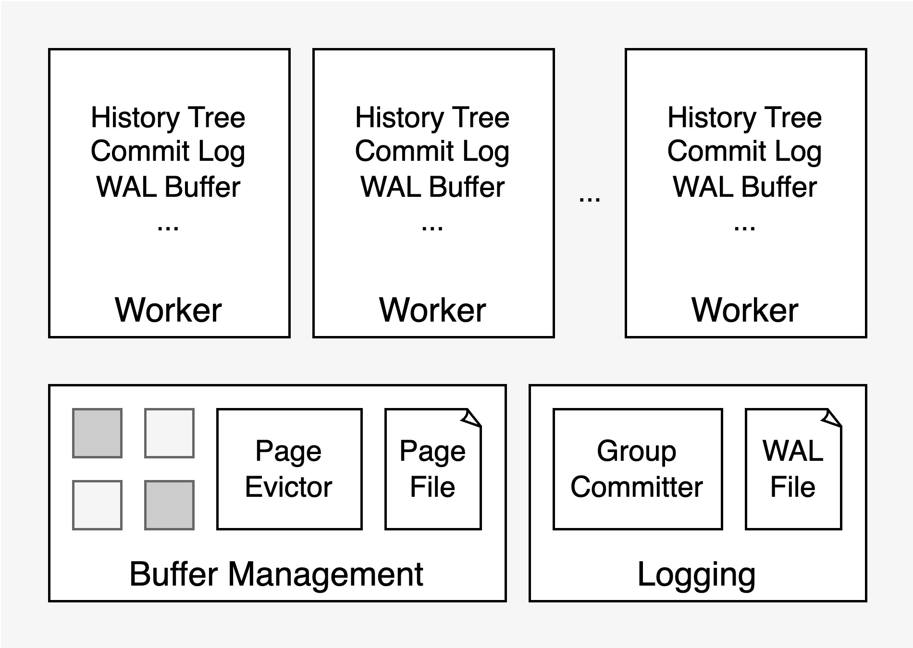
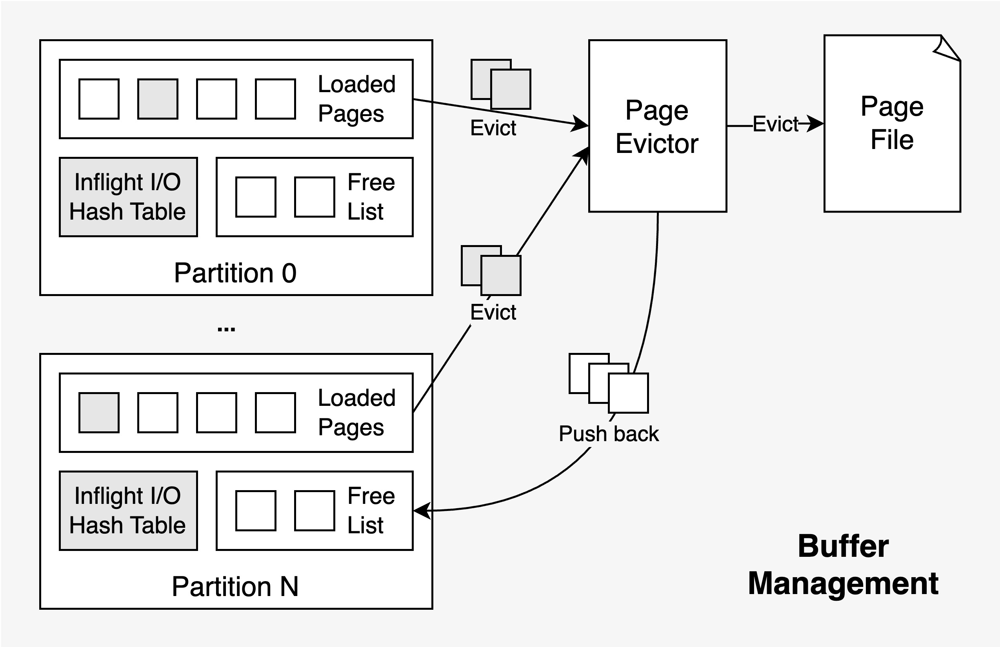
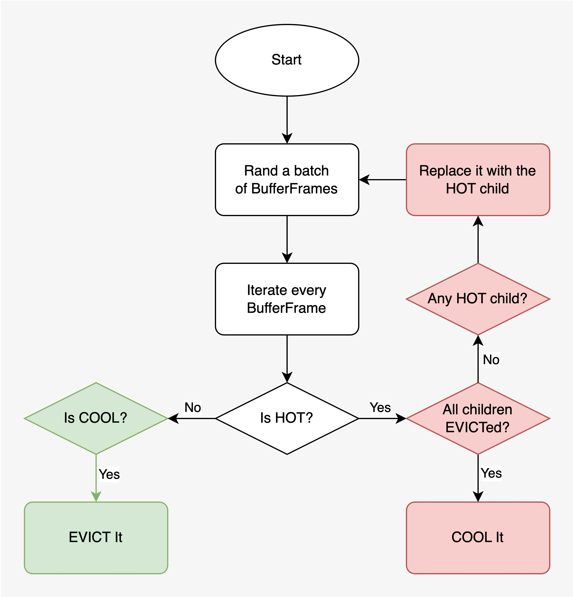
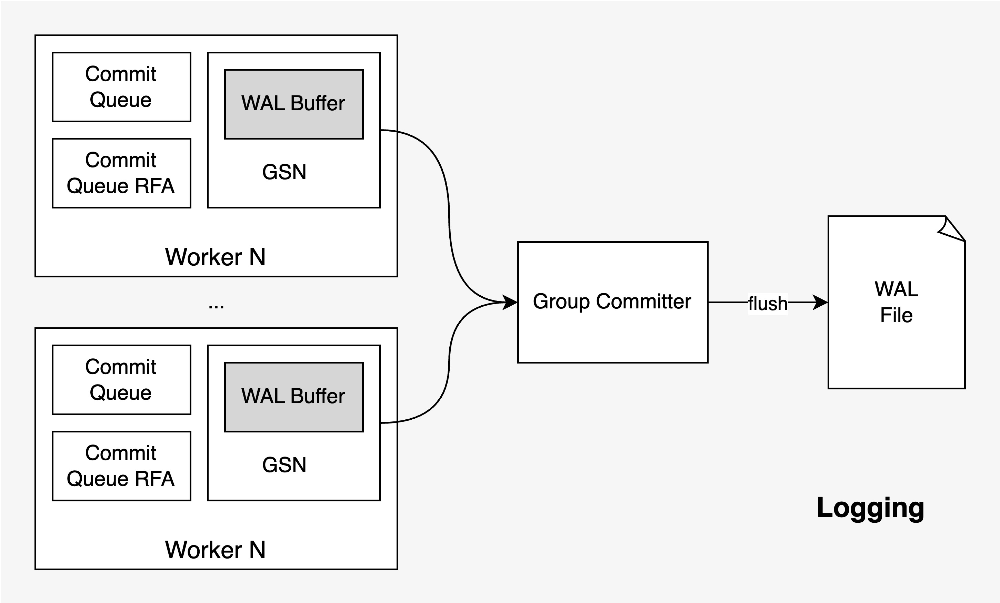

LeanStore 是一个 Larger-than-Memory Database，面向 NVMe SSD 和多线程优化，数据不用全部缓存在内存中，性能接近内存数据库。之前为了研究 LeanStore 代码方便 fork 到了我的 github 账号下，在研究过程中对代码做了大量的修改，基本架构和原理和原来 LeanStore 一致，在正确性、可读性上做了些修改，方便后面阅读和进一步做各种实验。

本文根据 [zz-jason/leanstore](https://github.com/zz-jason/leanstore) 最新代码介绍其整体架构和关键模块的实现原理。

## 整体架构

LeanStore 技术架构如下所示，采用 B+ Tree 存储和组织数据，主要由 Buffer Manager、Logging、以及执行用户请求的 Worker 组成：

> LeanStore Architecture

Buffer Manager 的 page 大小为 4KB，Buffer Pool 中的 page 分为 hot 和 cool 两种状态，所有 page 都存放在 1 个文件里，缓存替换由后台线程 Page Evictor（也就是原 LeanStore 代码中的 Page Provider）完成。

Logging 模块由后台线程 Group Committer 和 1 个 write-ahead log 文件组成。Group Committer 会不断轮询所有 Worker 本地的 WAL Buffer，通过 libaio 将所有 log 写入磁盘，和 page size 一样，写入粒度也是 4KB。LeanStore 通过 page 级的依赖检测实现了 Remote Flush Avoidance（RFA）识别互相独立的事务避免 commit 等待。

Worker 是处理用户请求的工作线程，LeanStore 实现了 MVCC，并且能够避免 long-running transaction 导致 GC 滞后影响正常查询执行的问题。在 Worker 中包含了所有事务执行需要的上下文信息，其中 WAL Buffer 用于缓存当前事务的 write-ahead log，Commit Log 用于实现 LCB 和可见性检查，以及 History Tree 用于存放所有该 Worker 产生的历史版本。

## Buffer Manager

> Buffer Management

Buffer Manager 由 Buffer Pool 和 Page Evictor 组成。其中 Buffer Pool 在 Store 启动时初始化，大小固定，基本单元是 Buffer Frame，每个 Buffer Frame 大小为 4KB + 512 字节，其中的 4KB 用于存储 Page，512 字节用于存储 Buffer Frame Header。

Buffer Frame 中的 Page 由工作线程根据需要从磁盘读取进来，同时由后台线程 page evictor 按照缓存替换算法将其写回磁盘以保证前台工作线程有足够的空闲 Buffer Frame 使用。为了减少 page 读取过程中的锁竞争，整个 page id 空间按照 hash 分片成了 64 个 partition，每个工作线程在 resolve page 时需要先根据 page id 定位到对应的 partition，再获取该 partition 的 hash table 以查询对应 page 的读取状态，所需要的空闲 Buffer Frame 也直接从该 partition 的 free list 中获取。

Page Evictor 是个不停工作的后台线程，其主要作用缓存替换，驱逐 buffer pool 中不再需要的 page，使每个 partition 的 BufferFrame free list 维持在一个健康的水位线上，保障前端工作线程有足够的空闲 BufferFrame 使用。Page eviction 采用 secondary chance 策略：

每轮 page eviction 开始会先随机挑选一批 BufferFrame，然后根据 BufferFrame 中 page 的状态来判断是应该将其 evict 还是 cool 还是挑选它的一个 child 继续处理：
- 如果 page 处于 HOT 状态并且它在 B+ Tree 中的的所有孩子节点所处的 page 都已经 evict，那么就将该 page 状态修改为 COOL 并从当前 BufferFrame batch 中移除。COOL 状态的 page 仍然处于内存中，可以被 page 正常访问，如果 page 读写到 COOL 状态的 page 后会将其状态修改为 HOT，否则它会一直维持在 COOL 状态。
- 如果 page 处于 COOL 状态，表明该 page 从之前某次 page eviction 被修改为 COOL 后一直没有任何工作线程读写过它，属于不被经常访问的那一类 page，这一轮 page eviction 中该 page 就可以直接被 evict 掉了。如果是 dirty page，则需要将脏页回写至底层的 page file。
- 如果 page 处于 HOT 状态且有某个孩子节点尚未 evict，并且其中某个节点为 HOT，则用 HOT 状态的孩子节点替换当前 BufferFrame，然后重复上面的过程

以 B+ Tree 的视角来看，所有在内存中的中间节点全部都是 HOT 状态，只有最后一层在内存中的叶子结点或中间节点可能是 COOL，page eviction 会从叶子结点层层向上 evict。

## B+ Tree

每个 Page 都包含了一个 BTreeNode，Page 由 Page Header 和 Page Payload 构成，其中 Page Payload 即为 BTreeNode。 BTree Node 的内存布局如下所示：

LeanStore 采用的是普通 B+ Tree 实现，没有像 B-link Tree 那样存储 right sibling，也没有指向父亲节点的指针。

## Synchronization Primitives

这里主要介绍内部广泛使用的 HybridLatch 和 JUMPMU。

### HybridLatch

HybridLatch 是结合 std::atomic 和 std::shared_latch 实现的可以提供三种锁模式的混合锁，这三种模式分别为：
- optimistic shared：乐观共享锁，用于读操作，读之前上锁，记录 atomic 的值，判断是否有人以 pessimistic exclusive 的方式持有锁，若无则上锁成功。读完后释放锁，检查 atomic 变量是否发生变化，检测到变化说明这段期间被锁保护的数据发生了修改，之前的读操作需要重试。
- pessimistic shared：悲观共享锁，用于读取可能经常被修改的数据，本质上就是对 shared_mutex 加了 shared lock。这类数据如果使用 optimistic shared 的方式上锁和读取会因为比较高频的并发写导致不断重试。不如直接使用 pessimistic shared 的方式先上个锁，引入锁竞争，阻止其他人在读取期间修改，避免 optimistic shared 无效重试带来的额外 CPU 开销。
- pessimistic exclusive：悲观排它锁，用于写操作，也就是对 shared_mutex 加了 unique lock，在上锁时增加 atomic 的值，释放锁时再次增加 atomic 的值，使 optimistic shared 模式下上锁的并发线程能够检测到数据更新。

这部分代码在 xxx，LeanStore 中 B+ Tree 遍历操作会先对中间节点上乐观共享锁，对叶子结点根据需要上乐观或悲观锁。这里对工作负载的假设是读多写少，B+ Tree 上很少发生 node split 和 merge，因此中间节点直接上乐观共享锁。而所有的读写操作都在叶子结点，如果要写则直接上悲观排它锁，如果要读可以先上乐观共享锁试试，如果检测到读写冲突，则重试时上悲观共享锁。这部分代码可以参考 TransactionKV 的 Lookup 接口实现。（注：TransactionKV 也就是原 LeanStore 代码中的 BTreeVI，实现了 MVCC 和 SI 隔离级别的并发控制）

关于 HybridLatch 可以参考这篇文章：[[DaMoN 2020] Scalable and Robust Latches for Database Systems](https://zhuanlan.zhihu.com/p/623976822)
### JUMPMU

前面提到在乐观共享锁模式下检测到冲突时需要重试整个读操作。从性能的角度来说，重试的 CPU 开销需要越低越好，从代码编写的角度来说，重试需要能够跨函数调用，还需把沿途在栈上分配的对象和他们管理的资源都释放掉，尤其是锁。比如 B+ Tree 遍历，可能遍历到最后一层中间节点时才发现冲突，这时候就需要从根节点开始重新遍历，之前持有的中间节点和其他数据的锁都需要全部释放掉。

目前来看只有 longjump 能够非常高效的实现跨函数调用的跳转和重试（goto 只能单文件内跳转，C++ exception 处理的 CPU 开销又很高），但是 longjump 仅释放栈上内存，不调用相关对象的析构函数，所以 RAII 编程范式在这里就失去了效果，资源也就没法在对象析构时有效的释放。为了解决这个问题。LeanStore 使用了一个全局数组来保存这些对象，并在需要重试进行 jump 之前将上次 setjump 以来所有收集到的需要释放资源的对象都去析构一遍，完成 jump 之前的资源释放。为了使栈上生成的对象都被自动加入到该数组中，只需在这些对象的构造函数中将该他们放入数组中即可。

最终，这套 JUMPMU 原语相当于使用 longjump 实现了个轻量级的异常捕获机制，编码使用它时也可以这么去类比。

JUMPMU 的代码实现在 xxx，使用方法如下：

## Logging

LeanStore 通过后台线程 Group Committer 将 WAL 写入磁盘。Worker 先将 WAL 写入本地的 WAL Buffer，Group Committer 不停收集所有 Worker 的 WAL Buffer，收集新增的 WAL Record，最后通过 libaio 将所有收集到的 WAL Record 一次性落盘。

LeanStore 通过类似 Lamport 时钟的 GSN 机制追踪并发事务之间的依赖关系。具体来说每个 Page 和 Worker 都各自维护了一个 GSN，每当 Worker 遍历 B+ Tree 读取 Page 时都会使用各个 Page 上的 GSN 来更新自己的 GSN，在 Worker 更新 Page 时会同时更新 Page 和 Worker 的 GSN。

事务 T1 执行过程中如果发现某个 Page 的 GSN 比当前 Worker 的 GSN 更大，并且该 Page 的上次写入者不是当前 Worker，则该事务 T1 依赖某个并发执行的事务 T，事务 T1 能提交的前提是所有依赖的并发事务的 wal 已经落盘。这个检测是在 Group Committer 中做的，Worker 在更新自己的 WAL Buffer 时也会将最新 WAL Record 对应的 GSN 记录下来。Group Committer 收集到这些 WAL Records 和 GSN，将所有 WAL Record 写入的同时也计算 min flushed GSN 作为全局 GSN 水位线，所有 GSN 小于该水位线的事务都可以安全提交。

如果事务执行过程中发现没有任何远端依赖，则它只需要等自己的 wal records 都被写入后即可提交。这个就是 LeanStore 的 Remote Flush Avoident 机制。在事务提交时，根据事务是否有远端依赖将其放入有远端依赖的 commit queue 或无远端依赖的 commit queue，针对不同的 commit queue 采用不同的方式判断是否能够 commit。

## MVCC

MVCC 的实现原理可以参考这篇文章：[[VLDB 2023] Scalable and Robust Snapshot Isolation for High-Performance Storage Engines](https://zhuanlan.zhihu.com/p/631694262)

LeanStore MVCC 的特点一个是 precise GC，一个是避免 long-running transaction 和 short-running transaction 互相影响。

## Worker

