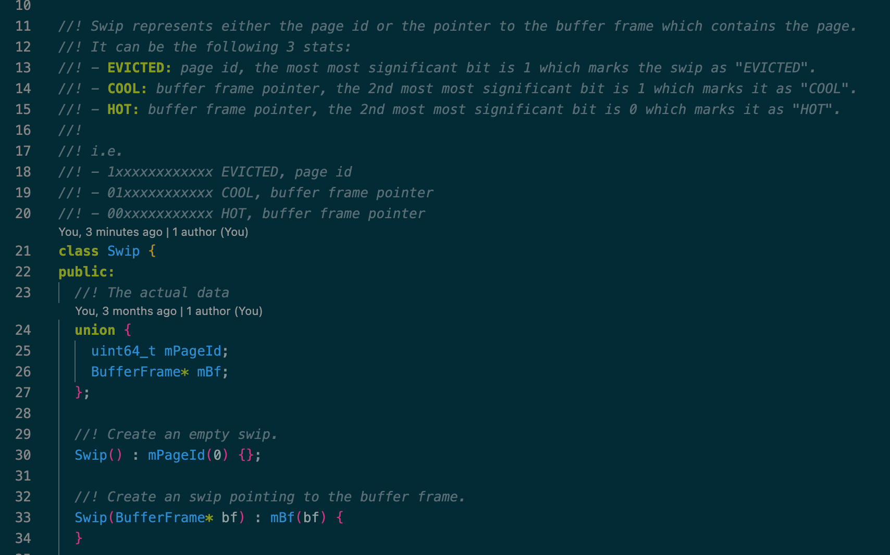
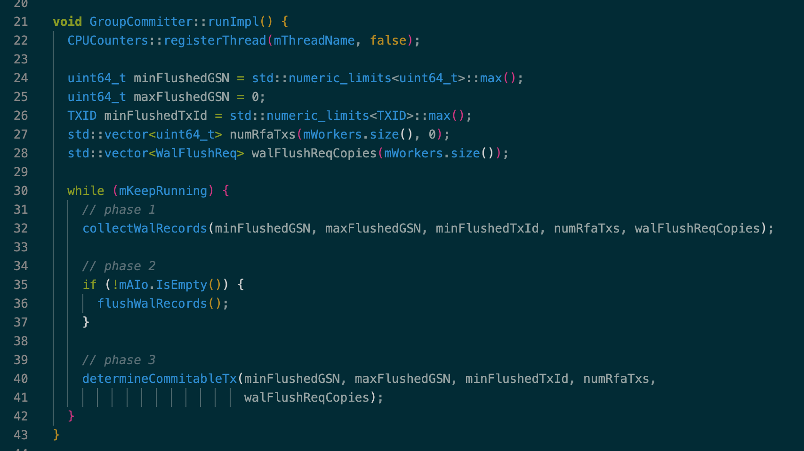
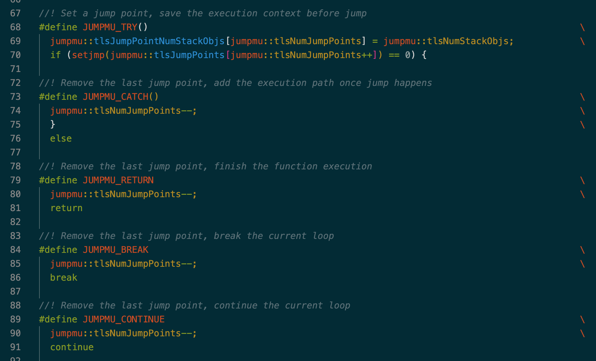
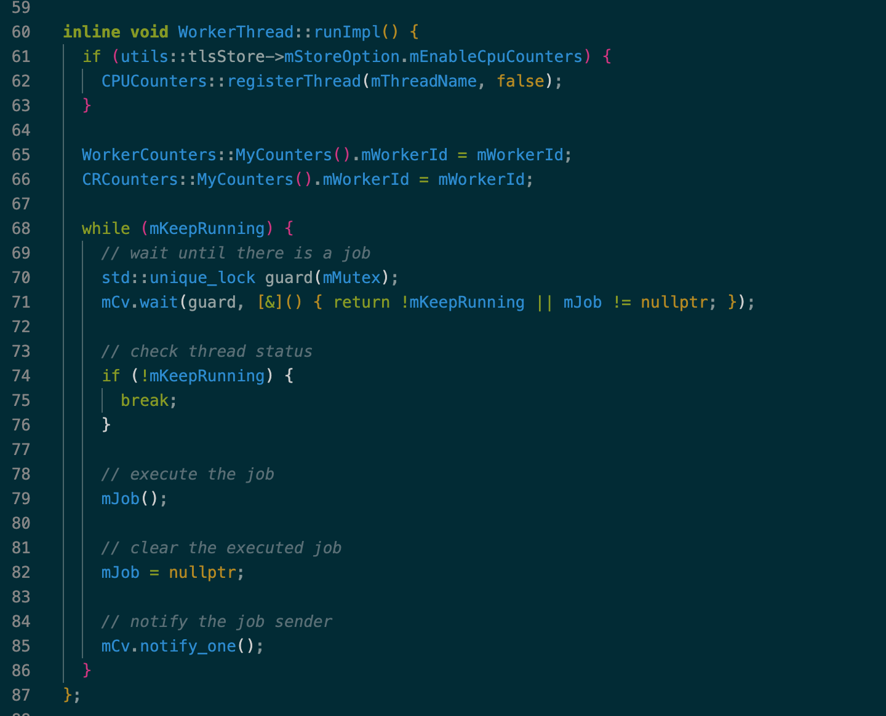
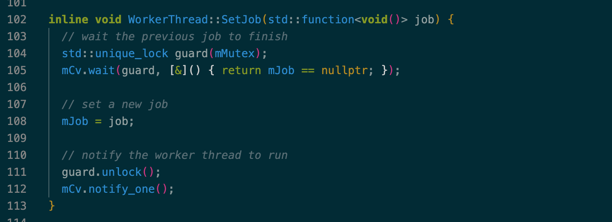
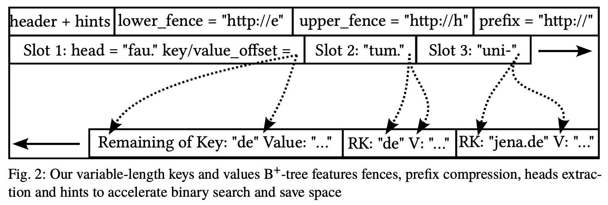
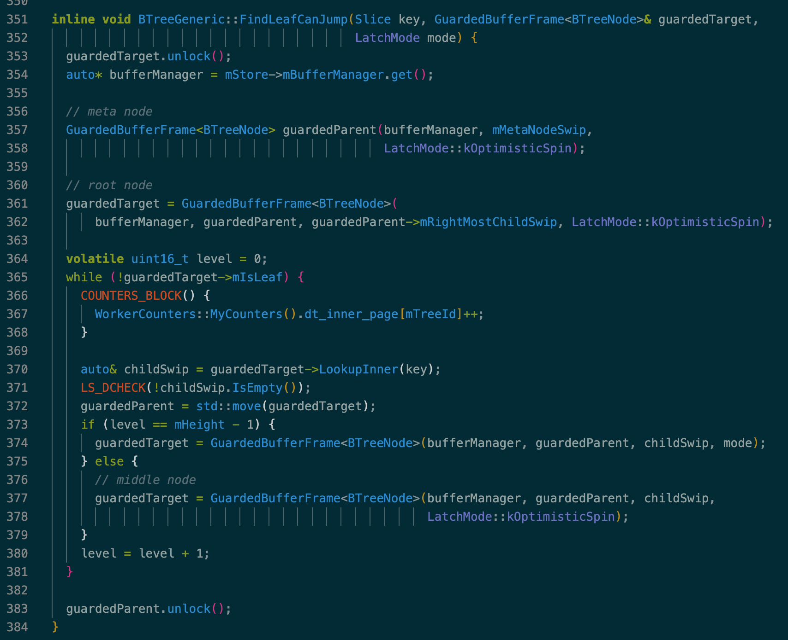
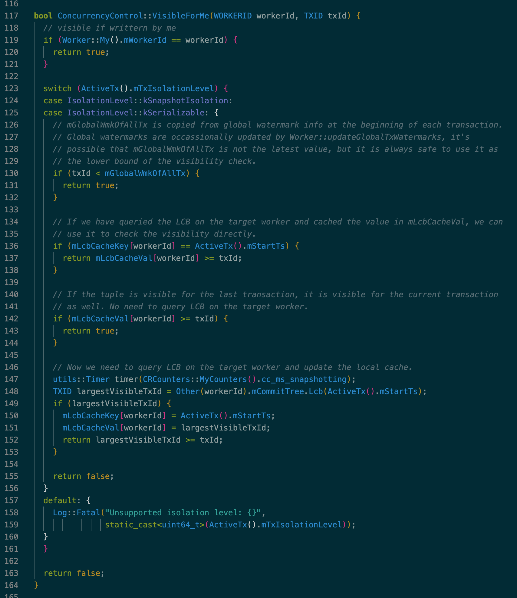

> 冰山梁 - 独石口镇, 2024

## 1. Introduction

LeanStore 是一个 larger-than-memory database，面向 NVMe SSD 和多线程优化，性能接近内存数据库，数据不用全部缓存在内存中 。为了方便学习和实验将 LeanStore 代码 fork 到了 [zz-jason/leanstore](https://github.com/zz-jason/leanstore)，在保持代码架构和原理还是和原来 LeanStore 一样的前提下，修复了发现的问题，增加了测试，删减了无用代码，也修改了代码风格使其更加易懂。

这篇文章根据 [zz-jason/leanstore](https://github.com/zz-jason/leanstore) 最新代码介绍 LeanStore 的整体架构和相关代码路径。许多内容在之前论文分享的文章中已经详细介绍过，部分模块的实现和之前的论文会有些出入，最能反应目前代码实现的是《[The Evolution of LeanStore](https://dl.gi.de/server/api/core/bitstreams/edd344ab-d765-4454-9dbe-fcfa25c8059c/content)》这篇论文。

## 2. Architecture overview


LeanStore 技术架构如上所示。工作线程 worker 执行用户读写请求，包含了所有事务并发控制需要的上下文信息，比如存储 MVCC 版本链的 history tree，用于可见性检查的 commit log，用于构造 wal 的 wal buffer 等。

关于 Buffer Management，LeanStore 使用 B+ tree 组织和存储数据，每个 page 大小为 4KB，内存中的 page 由 buffer manager 集中管理，存储在 4KB+512B 的 buffer frame 中，通过 page evictor（也就是原 LeanStore 代码中的 page provider）进行缓存替换，为工作线程从磁盘读取 page 提供空闲 buffer frame。

关于 Logging，工作线程会先将 wal 生成在本地的 wal buffer 中，由后台线程 group committer 不停的收集所有工作线程的 wal buffer，然后通过 libaio 将 wal 写入磁盘文件，并根据事务的依赖关系判断各个 worker 上的活跃事务是否可以 commit。LeanStore 通过 page 级的依赖检测实现了 remote flush avoidance（RFA），能够识别互相独立的事务以避免 commit 等待。

所有的数据和线程资源都通过 `LeanStore` 对象来管理，它们在 `LeanStore` 构造函数中初始化，在析构函数中释放。相关代码路径：
* include/leanstore/LeanStore.hpp
* src/LeanStore.cpp

## 3. Buffer management


Buffer Manager 由 buffer pool 和 page evictor 组成，所有组件代码都在 src/buffer-manager 目录下，例如 BufferManager：
- src/buffer-manager/BufferManager.hpp
- src/buffer-manager/BufferManager.cpp

### BufferFrame/Page/Swip

Buffer pool 是由 mmap 初始化的大小固定的连续内存，基本单元是 BufferFrame。每个 BufferFrame 大小为 4KB + 512 字节，其中的 4KB 用于存储从磁盘读取上来的 Page，512 字节用于存储 BufferFrameHeader。BufferFrameHeader 包含了 BufferFrame/Page 的状态、锁、page id 等信息。

LeanStore 采用 pointer swizzling 存储 BufferFrame 的内存地址或 page id。Swip 的实现如下所示，本质上就是个 page id 和 BufferFrame 指针的 union，通过在最高位上打 tag 的方式标志这个 64 位的 union 是 page id 还是 BufferFrame 指针，如果是指针的话也标注了对应 BufferFrame 的状态，BufferFrame 的状态用于 page eviction：



相关代码路径：
* BufferFrame/BufferFrameHeader/Page：src/buffer-manager/BufferFrame.hpp
* Swip：src/buffer-manager/Swip.hpp

### Partitioned IO

LeanStore 通过 BufferManager::ResolveSwipMayJump() 将 Swip 解析成 BufferFrame。如果是 HOT 或 COOL 状态的 Swip 则直接返回对应的 BufferFrame 指针，否则需要从磁盘读取对应的 page。

考虑到同一时刻可能有多个工作线程读取同样的 page，需要使用锁来进行线程同步。为了减少 page 读取过程中的锁竞争，LeanStore 将 page id hash 分片成了 N（默认 64）个 partition，每个 partition 由 inflight IO hash table 和 free BufferFrame list 构成，buffer pool 初始化时所有的 BufferFrame 都均匀分配到了各个 partition 的 free list 中。工作线程在读取 page 时会先根据 page id 定位到对应的 partition，再获取该 partition 的 inflight IO hash table 上的锁以查询对应 page 的读取状态，所需要的 free BufferFrame 也直接从该 partition 的 free list 中获取。通过这种 partitioned IO 的方式减小锁粒度和所竞争开销，提升了多核 scalability。

相关代码：
* src/buffer-manager/Partition.hpp
* src/buffer-manager/Partition.cpp
* src/buffer-manager/FreeList.hpp
### Page eviction

Page evictor 是个不停工作的后台线程，通过驱逐 BufferFrame 中不再需要的 page 为 partition 补充 free BufferFrame list，保障工作线程有足够的 free BufferFrame。

Page eviction 采用 secondary chance 策略。先随机挑选一批 BufferFrame，然后根据 BufferFrame 中 page 的状态来判断是应该将其 evict 还是 cool 还是挑选它的一个 child 继续处理：
- 如果 page 处于 HOT 状态并且它在 B+ Tree 中的的所有孩子节点所处的 page 都已经 evict，那么就将该 page 状态修改为 COOL 并从当前 BufferFrame batch 中移除。COOL 状态的 page 仍然处于内存中，worker 读写到 COOL 状态的 page 后会将其状态修改为 HOT，否则它会一直维持在 COOL 状态。
- 如果 page 处于 COOL 状态，表明该 page 从之前某次 page eviction 被修改为 COOL 后一直没有任何工作线程读或写过它，在这一轮 page eviction 中就可以 evict 了，如果是 dirty page，则需要将脏页回写至底层的 page file。
- 如果 page 处于 HOT 状态且有某个 HOT 状态的孩子节点尚未 evict，则该孩子节点替换当前 BufferFrame，然后重复上面的过程。

当这一批 BufferFrame 处理结束，一部分 HOT 状态的 BufferFrame 会被 COOL，一部分之前被 COOL 的 BufferFrame 会被 evict，evict 后对应的 BufferFrame 则释放出来，提交到对应 partition 的 free BufferFrame list 中。以 B+ Tree 的视角来看，page eviction 是从叶子结点层层向上 evict。

相关代码：
* src/buffer-manager/PageEvictor.hpp
* src/buffer-manager/PageEvictor.cpp

## 4. Logging && recovery


Worker 会先将 WAL 写入本地的 WAL buffer，group committer 在后台不断遍历所有 Worker 的 WAL buffer，通过 libaio 将收集到的 WAL record 一次性落盘。这部分的代码实现和 《Rethinking Logging, Checkpoints, and Recovery for High-Performance Storage Engines》（[论文阅读]((https://zhuanlan.zhihu.com/p/622351039) 材料）这篇论文出入不大，只不过没实现 checkpoint。

### Wal buffer

每个 worker 内都有一个 WAL buffer，所有的 WalEntry 都从这个 buffer 中 placement new 出来，保证所有 WalEntry 的内容都在 WAL buffer 中连续存放。Worker 会记录 mWalBuffered 和 mWalFlushed，前者表示当前 WAL buffer 的总共写入的 offset，后者表示已经被 group committer 写入磁盘的 offset。Wal buffer 是个 ring buffer，group committer 在取 WAL records 需要根据 mWalBuffered 和 mWalFlushed 的相对大小来判断哪一段才是没有 flush 的 WalEntry。

WAL buffer 定义在 Logging 的 `mWalBuffer` 字段中，WAL buffer 的写入在 Logging 的 `ReserveWALEntryComplex()`/`SubmitWALEntryComplex()` 函数中，读取在 group committer 的 `collectWalRecords()` 中，相关代码：

Logging：
* src/concurrency/Logging.hpp
* src/concurrency/Logging.cpp
* src/concurrency/LoggingImpl.hpp

GroupCommitter：
* src/concurrency/GroupCommitter.hpp
* src/concurrency/GroupCommitter.cpp

### Remote flush avoidance

LeanStore 通过类似 Lamport 时钟的 GSN 机制追踪并发事务之间的依赖关系。具体来说每个 Page 和 Worker 都各自维护了一个 GSN，每当 Worker 遍历 BTreeNode 读取 Page 内容时都会使用上面的 GSN 来更新自己的 GSN，在 Worker 更新 Page 时会推进 Page 和 Worker 的 GSN 将其 +1。

事务 T1 执行过程中如果发现某个 Page 的 GSN 比当前 Worker 的 GSN 更大，并且该 Page 的上次写入者不是当前 Worker，则该事务 T1 依赖某个并发执行的事务 T2，事务 T1 能提交的前提是所有依赖的并发事务的 WAL 已经落盘。这个检测由 group committer 完成：Worker 在更新 WAL buffer 时也会将最新 WAL record 对应的 GSN 记录下来，group committer 收集到这些 WAL records 和 GSN，将所有 WAL record 写入的同时也计算 min flushed GSN 作为全局 GSN 水位线，所有 GSN 小于该水位线的事务都可以安全提交。

如果事务执行过程中发现没有任何远端依赖，则它只需要等自己的 wal records 都被写入后即可提交。这就是 LeanStore 的 Remote Flush Avoident 机制。在事务提交时，根据事务是否有远端依赖将其放入不同的 commit queue，group committer 会遍历这两个 queue 并采用不同的方式判断他们各自是否可以 commit。

事务提交在 Worker::CommitTx() 函数中，group committer 收集 GSN，计算水位线，判断哪些事务可以提交在 GroupCommitter::determineCommitableTx() 函数中，相关代码：

Worker:
* src/concurrency/Worker.hpp
* src/concurrency/Worker.cpp

GroupCommitter：
* src/concurrency/GroupCommitter.hpp
* src/concurrency/GroupCommitter.cpp

### Group commit

Group committer 是一个后台线程，在 LeanStore 启动时启动。它会不停的执行这样的循环：收集所有工作线程上的 WAL records，通过 libaio 将收集到的 WAL records flush 到磁盘上的 WAL 文件中，判断所有工作线程上的事务哪些可以提交：



## 5. Sync primitives

B+ Tree 的并发访问过程中，最限制多核 scalability 的是锁竞争，LeanStore 通过 optimistic latch coupling 减少了不必要的锁竞争，是实现高并发必不可少的优化。而 optimistic latch 依赖两个基础功能：HybridLatch 和 JumpMu，前者用于提供乐观共享锁模式，后者用于锁冲突后的轻量级重试。这部分的代码实现和 《Scalable and Robust Latches for Database Systems》（[论文阅读](https://zhuanlan.zhihu.com/p/623976822)）基本一样，只不过其中的 rw mutex 用的是 std::shared_mutex 而不是 Parking Lot。

### HybridLatch

HybridLatch 是结合 std::atomic 和 std::shared_mutex 实现的可以提供三种锁模式的混合锁，这三种模式分别为：
- optimistic shared：乐观共享锁，用于读操作，读之前上锁，记录 atomic 的值，判断是否有人以 pes simistic exclusive 的方式持有锁，若无则上锁成功。读完后释放锁，检查 atomic 变量是否发生变化，检测到变化说明这段期间被锁保护的数据发生了修改，之前的读操作需要重试。
- pessimistic shared：悲观共享锁，用于读取可能经常被修改的数据，本质上就是对 shared_mutex 加了 shared lock。这类数据如果使用 optimistic shared 的方式上锁和读取会因为比较高频的并发写导致不断重试。不如直接使用 pessimistic shared 的方式先上锁，引入锁竞争，阻止其他人在读取期间修改，避免 optimistic shared 无效重试带来的额外 CPU 开销。
- pessimistic exclusive：悲观排它锁，用于写操作，也就是对 shared_mutex 加了 unique lock，在上锁时增加 atomic 的值，释放锁时再次增加 atomic 的值，使 optimistic shared 模式下上锁的并发线程能够检测到数据更新。

在获取或释放悲观排它锁时都需要增加 mVersion，使得乐观共享锁能够感知到并发数据更新：

```cpp
  void LockExclusively() {
    mMutex.lock();
    mVersion.fetch_add(kLatchExclusiveBit, std::memory_order_release);
    LS_DCHECK(IsLockedExclusively());
  }

  void UnlockExclusively() {
    LS_DCHECK(IsLockedExclusively());
    mVersion.fetch_add(kLatchExclusiveBit, std::memory_order_release);
    mMutex.unlock();
  }
```

LeanStore 中 B+ Tree 遍历操作会先对中间节点上乐观共享锁，对叶子结点根据需要上乐观或悲观锁。这里对工作负载的假设是读多写少，node split 和 merge 很少发生，因此中间节点上乐观共享锁失败的重试概率很低。而所有的读写操作都在叶子结点，如果要写则直接上悲观排它锁，如果要读可以先上乐观共享锁试试，如果检测到读写冲突，则重试时上悲观共享锁。这部分代码可以参考 TransactionKV 的 Lookup 接口实现。（注：TransactionKV 也就是原 LeanStore 代码中的 BTreeVI，实现了 MVCC 和 SI 隔离级别的并发控制）

相关代码：
* HybridLatch：src/sync/HybridLatch.hpp
* HybridGuard：src/sync/HybridGuard.hpp
* TransactionKV：src/btree/TransactionKV.cpp
### JumpMu

前面提到在乐观共享锁模式下检测到冲突时需要重试整个读操作。从性能的角度来说，重试的 CPU 开销需要越低越好，从代码编写的角度来说，重试需要能够跨函数调用，还需把沿途在栈上分配的对象和他们管理的资源都释放掉，尤其是锁。比如 B+ Tree 遍历，可能遍历到最后一层中间节点时才发现冲突，这时候就需要从根节点开始重新遍历，之前持有的中间节点和其他数据的锁都需要全部释放掉。

目前来看只有 longjump 能够非常高效的实现跨函数调用的跳转和重试（goto 只能单文件内跳转，C++ exception 处理的 CPU 开销又很高），但是 longjump 仅释放栈上内存，不调用相关对象的析构函数，所以 RAII 编程范式在这里就失去了效果，资源也就没法在对象析构时有效的释放。为了解决这个问题。LeanStore 使用了一个全局数组来保存这些对象，并在需要重试进行 jump 之前将上次 setjump 以来所有收集到的需要释放资源的对象都去析构一遍，完成 jump 之前的资源释放。为了使栈上生成的对象都被自动加入到该数组中，只需在这些对象的构造函数中将该他们放入数组中即可。最终，这套 JumpMu 原语相当于使用 longjump 实现了个轻量级的异常捕获机制，编码使用它时也可以这么去类比：



相关代码：
* src/utils/JumpMU.hpp
* src/utils/JumpMU.cpp

## 6. Worker threads

工作线程用于处理所有用户请求，在 LeanStore 启动时初始化，整个生命周期中不停的处理用户提交的任务：



相关代码：
* WorkerThread：src/concurrency/WorkerThread.hpp
* Worker：src/concurrency/Worker.hpp 和 src/concurrency/Worker.cpp
* Logging：src/concurrency/Logging.hpp 和 src/concurrency/Logging.cpp

### Job submission

任务提交通过 WorkerThread 的 SetJob() 完成，设置 mJob 后再通过 conditional variable 唤醒工作线程：



## 7. B+ Tree

LeanStore 采用了朴素的 B+ Tree 实现，每个中间节点存储了所有 child 的 swip，每个叶子结点存储了所有具体的 key-value 数据。BTree 相关代码：
* src/btree/core/BTreeGeneric.hpp
* src/btree/core/BTreeGeneric.cpp

### BTreeNode



如上图所示，BTreeNode 的内存分布和大多数 B+ Tree 一样，头部为 Slot 的位置信息，尾部为具体变长的 key-value 数据，中间为空闲区域，随着 slot 的增多而减少。

每个 BTreeNode 都有 inclusive lower fence key 和 exclusive upper fence key，因为没有存储兄弟节点的指针，所以当需要访问比如 right sibling 时需要根据 fence key 从根节点向下遍历，遍历时中间节点采用乐观共享锁，开销很低，避免了像 B-link Tree 那样维护 sibling 指针带来的负担。

相关代码：
* src/btree/core/BTreeNode.hpp
* src/btree/core/BTreeNode.cpp

### Traverse/FindParent

BTree 的遍历采用二分，一个典型的例子是 `BTreeGeneric::FindLeafCanJump()`，BTree 的 meta 节点单独使用一个 page 存储，meta 节点的 right most child 为根节点，lock coupling 也是从 meta 节点和根节点开始：



FindParent 也是从根节点开始向下遍历，过程类似，可以参考：`BTreeGeneric::FindParent()`。相关代码：
* src/btree/core/BTreeGeneric.hpp
* src/btree/core/BTreeGeneric.cpp

### Contention split/XMerge

Contention split 和 XMerge 参考这篇论文：[Contention and Space Management in B-Trees](https://www.cidrdb.org/cidr2021/papers/cidr2021_paper21.pdf)。在修改 BTreeNode 时会记录 contention stats，其中包含读写冲突的次数，update 的次数等信息，根据需要触发 node split，参考：TreePessimisticExclusiveIterator::UpdateContentionStats()。

XMerge 的作用是把相邻的 N 个 BufferFrame 合并成 N-1 个，释放出 1 个 free BufferFrame 出来，提升 buffer pool 的内存利用率，目前该功能默认关闭。

相关代码：
* UpdateContentionStats()：src/btree/core/BTreePessimisticExclusiveIterator.hpp
* BTreeGeneric::XMerge()：src/btree/core/BTreeGeneric.cpp

## 8. MVCC transaction

LeanStore MVCC 的实现原理可以参考这篇文章：[[VLDB 2023] Scalable and Robust Snapshot Isolation for High-Performance Storage Engines](https://zhuanlan.zhihu.com/p/631694262)。目前只实现了 SI 隔离级别，能够隔离 long-running transaction 对 short-running transaction 的影响，基于 commit log 的 LCB 接口实现了可见性检查，version storage 分散在各个 worker 的 history tree 中。
### Version storage

代码中的 FatTuple 目前只是个半成品，默认关闭，先关注默认采用的 ChainedTuple。在 ChainedTuple 模式下，当前 BTreeNode 的 key-value 中只存储最新版本的数据。每个 worker 都有一个 history tree，history tree 具体来说是 2 个 B+ Tree，分别用于存储 delete 和 update 操作产生的老版本，这两个 B+ Tree 的 key 是（workerId, transactionId, commandId），value 为 old version data 或者 update delta，update delta 存储的是新旧 value 的异或值。

当前事务在执行过程中需要调用  `ChainedTuple::GetVisibleTuple()` 来获取其可见的最新版本，相关代码：
* HistoryStorage：src/concurrency/HistoryStorage.hpp
* TransactionKV::Lookup()：src/btree/TransactionKV.cpp
* ChainedTuple::GetVisibleTuple()：src/btree/TransactionKV.hpp

### Visibility check

每个 Worker 都记录了最近 N 条 commit log，其中 N 为 worker 数量。commit log 是个 (commitTs, startTs) 的 vector，事务开始时会判断 commit log 是否 full 并进行 compact。



使用 LCB 进行可见性检查的代码如上所示，VisibleForMe() 用于判断由 workerId 在 txId 写入的数据是否对当前活跃事务可见。因为 LCB 会并发访问 commit log，在充分利用已有信息比如 LCB cache 后还不能判断可见性时才会查询该 Worker 的 LCB。

相关代码：
* CommitLog、LCB 由 CommitTree 实现：src/concurrency/ConcurrencyControl.hpp
* ConcurrencyControl::VisibleForMe()：src/concurrency/ConcurrencyControl.cpp

### Long-running transaction isolation

为了避免 long-running transaction 导致的版本累积，每个 TransactionKV 都有个由 BasicKV 实现的 graveyard，用于存放 short-running transaction 已经删除但是 long-running transaction 还在使用的数据。在  `TransactionKV::Remove()` 中，老版本数据会被放入当前 worker 的 history tree 中，然后在 btree node 的当前位置留下一个 tombstone 标记，之后在 GC 过程中写入 graveyard。在 `TransactionKV::Lookup()` 中，如果当前事务是 long-running transaction，且在当前 TransactionKV 中没有找到，则会继续从它的 graveyard B+ tree 中寻找。

相关代码在 TransactionKV::Remove()、TransactionKV::GarbageCollect() 以及 TransactionKV::Lookup() 中，代码路径：
* src/btree/TransactionKV.cpp

### Garbage collection

LeanStore 采用了激进的 precise GC 策略，每次事务结束时都会进行。在 GC 时留在 TransactionKV 中的 tombstone 会转移到 graveyard 中，避免 long-running transaction 和 short-running transaction 互相影响。由于 GC 需要区分 long-running transaction 和 short-running transaction 各自的水位线，整个过程比较复杂。

GC 的入口在 ConcurrencyControl::GarbageCollection()，相关代码：
* ConcurrencyControl::GarbageCollection()：src/concurrency/ConcurrencyControl.cpp
* TransactionKV::GarbageCollect()：src/btree/TransactionKV.cpp

## 9. Summary

本文简单介绍了 LeanStore 的原理和代码实现，虽然之前 LeanStore 上发表了许多论文，但和代码实现还是有很多差异，有些功能甚至还没实现，我把一些看到、想到的问题和计划都整理在了 [这个 issue](https://github.com/zz-jason/leanstore/issues/89) 中，后面大部分业余时间都会投入在 [zz-jason/leanstore](https://github.com/zz-jason/leanstore) 的开发和完善上面，欢迎感兴趣的朋友一起来玩。