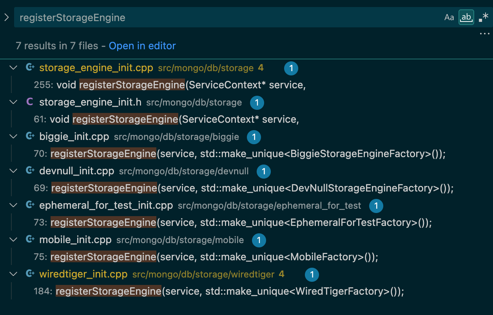

## How to compile

编译 mongo 4.0，依赖  pytyhon 2.7，环境准备好后，执行下面命令：

```sh
python2 buildscripts/scons.py all compiledb --disable-warnings-as-errors -j32 --dbg=on
```

## How to run and debug mongo

Run a mongo server:

```sh
mkdir -p /tmp/mongodb
nohup ./mongod --dbpath /tmp/mongodb --port 27017 > /tmp/mongodb/nohup.out 2>&1
```

Connect to it and run a query, see more in https://www.mongodb.com/docs/v4.4/mongo/#working-with-the-mongo-shell:

```sh
./mongo --host 127.0.0.1 --port 27017
```

In the running mongo shell:
```
db.myCollection.insertOne({x:1});
db.myCollection.count()
db.myCollection.find({x:1})
```

MongoDB 3.2 开始默认使用 WiredTiger，如何修改默认存储引擎，参考 [Default Storage Engine Change](https://www.mongodb.com/docs/v6.0/release-notes/3.2-compatibility/#default-storage-engine-change)，在启动 mongodb 时使用 `--storageEngine` 参数：

```sh
nohup ./mongod --dbpath /tmp/mongodb --port 27017 --storageEngine yourStorageEngine > /tmp/mongodb/nohup.out 2>&1
```

## 一些概念

`StorageEngine`，定义在 `src/mongo/db/storage/storage_engine.h` 中，

`StorageEngine::Factory`，定义在 src/mongo/db/storage/storage_engine.h 中，

`KVEngine`，定义在 src/mongo/db/storage/kv/kv_engine.h 中，代表了一个存储引擎实现，比如 WiredTiger，主要作用是创建、查找 RecordStore 等。

`RecordStore`，定义在 src/mongo/db/storage/record_store.h 中，一个 RecordStore 代表了一个 Collection，或者 Collection 的索引（也是 KV 结构），主要用于 Collection 中 Document 的 CURD 操作。

参考：
- [MongoDB mongorocks 引擎原理解析](https://zhuanlan.zhihu.com/p/414821545)

## Logbook：为 MongoDB 添加存储引擎

简单起见，我们目标是：
1. 添加一个内存中的存储引擎，数据全部存储在 `std::unordered_map<std::string, std::string>` 中，该存储引擎名字叫做 “yastore”，yet another storage 的简称
2. 能够跑通基本的 CURD

目前只知道需要实现 KVEngine 和 RecordStore 两个接口，但还有许多信息未知，比如 mongodb 如何使用新存储引擎启动，如何将 CURD 操作路由到新存储引擎中等，这些问题我们将通过不断的实验和 debug 来一步步来发现解决。

### 1. 使用新存储引擎启动 MongoDB

新存储引擎名字叫做 yastore，启动命令如下：

```sh
nohup ./mongod --dbpath /tmp/mongodb --port 27017 --storageEngine yastore > /tmp/mongodb/nohup.out 2>&1
```

启动后进程快速退出了，查看 `/tmp/mongodb/nohup.out` 中的日志发现如下报错：

```txt
 Cannot start server with an unknown storage engine: yastore, terminating
```

在代码中搜索这个 error message，找到了报错的地方在 `/root/code/mongo/src/mongo/db/storage/storage_engine_init.cpp`的 `initializeStorageEngine()` 函数中。继续分析代码，应该是没有在已注册 storage factory 中找到该 storage 导致的，也就是下面这个函数返回了 nullptr：

```cpp
StorageEngine::Factory* getFactoryForStorageEngine(ServiceContext* service, StringData name) {
    const auto result = storageFactories(service).find(name.toString());
    if (result == storageFactories(service).end()) {
        return nullptr;
    }
    return result->second.get();
}
```

`storageFactories(service)` 本质上是一个 storage name 到 storage factory 的 map，新的存储引擎需要通过 `registerStorageEngine()` 函数将对应的 factory 注册进去，例如：



模仿 wiredtiger，我们创建一个 `storage/yastore` 目录，并在里面创建一个 yastore_init.cpp 文件，实现 `YaStoreFactory`，然后调用 `registerStorageEngine()` 函数将其注册给 MongoDB

### 2. 实现 `YaStoreFactory`

### 3. 实现 `YaStoreKVEngine`

### 4. 实现 `YaStoreRecordStore`

在实现 `YaStoreKVEngine` 时大部分接口我们都采用了默认实现，或者返回 `NotImplemented` Status，但比较明显的 RecordStore 相关的两个接口：
- `createRecordStore()`
- `getRecordStore()`

这两个接口应该是和 Collection 相关的