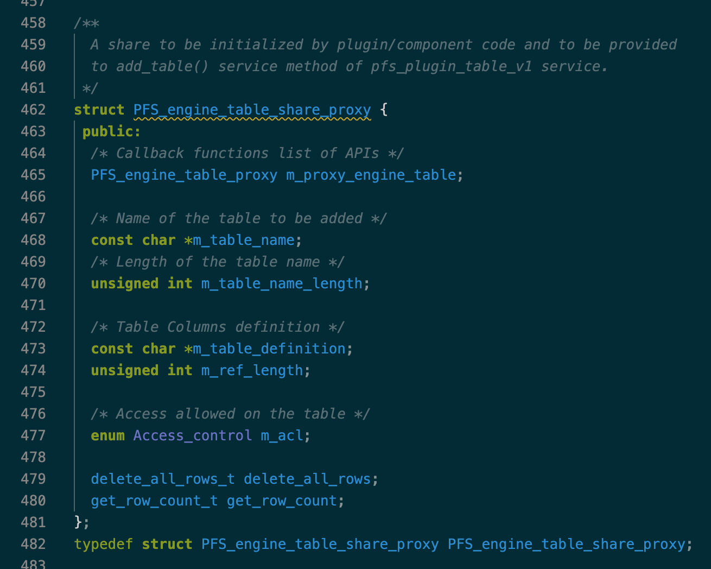
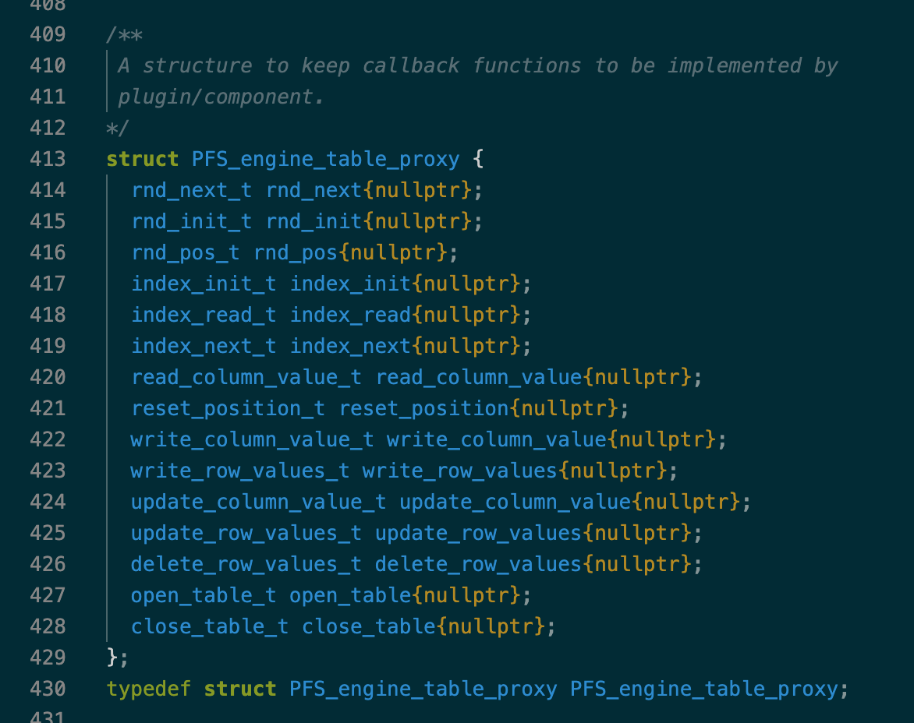
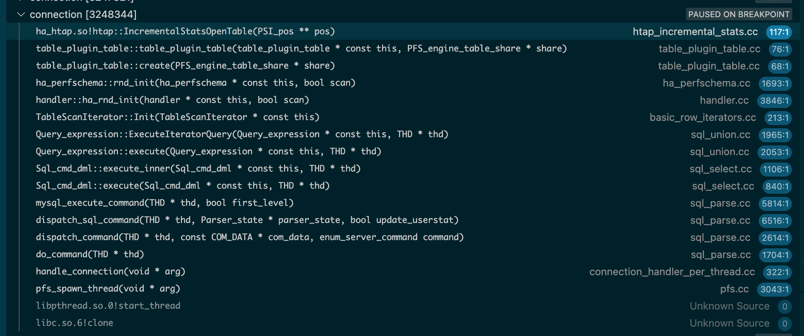

本文基于 MySQL 8.4

## PFS_engine_table_share_proxy


代表一个 pfs 表。



## PFS_engine_table_proxy

代表一个 table handle，每个 query 都会创建一个 handle，mysql pfs engine 通过该 handle 的接口和 pfs plugin 交互。接口定义如下：


> 参考代码include/mysql/components/services/pfs_plugin_table_service.h


### open_table
open table:


OpenTable 由 `table_plugin_table` 构造时调用，open table 返回的 handle 保存在 plugin_table_handle 中供后续使用：

```cpp
table_plugin_table::table_plugin_table(PFS_engine_table_share *share)
    : PFS_engine_table(share, nullptr),
      m_share(share),
      m_table_lock(share->m_thr_lock_ptr) {
  this->m_st_table = &share->m_st_table;
  this->plugin_table_handle = m_st_table->open_table(&m_pos);
  /* Setup the base class position pointer */
  m_pos_ptr = m_pos;
}
```

需要注意：table_plugin_table 之后使用 plugin_table_handle 时不会做 null 检查，如果插件实现者在 open 函数中返回了 nullptr，需要其他接口实现的地方自己去做 null 检查，否则会导致空指针解引用的问题，比如：close table：

```cpp
  ~table_plugin_table() override {
    delete m_index;
    m_st_table->close_table(this->plugin_table_handle);
  }
```

### rnd_init

在正式 scan 之前的初始化

### index_next


## Example: pfs_example_plugin_employee

安装插件：
```sql
 INSTALL PLUGIN pfs_example_plugin_employee SONAME 'pfs_example_plugin_employee.so';
```

每个 pfs table 都会创建对应的 dd table，由 create_native_table_for_pfs() 完成

## Example 1: Table Scan


## Example 2: Index Scan