> 本文封面图片来自 [自然摄影师雷雨](https://space.bilibili.com/470226708/)

《Dynamic Programming Strikes Back》这篇论文提出了非常著名的 DPhyp 算法，能处理复杂的 join predicate，也能处理复杂的 join 算子，比如 outer join、semi join、anti join、dependent join 等。MySQL 8.0 实验性地支持了 DPhyp，我们最近的项目中也采用了 DPhyp，它有很高的实用价值，非常值得学习。

## INTRODUCTION

join reorder 算法主要是两类，一类是像 DPsize、DPsub、DPccp 这样 bottom-up 的动态规划算法，一类是像 top-down partition search 这样的记忆化搜索算法，它们目前都没有被大规模生产使用，主要原因：
1. 它们都没有考虑包含多个表，或者非等值的 join predicate
2. 它们都没有考虑 outer join，anti join，semi join，dependent join 等不能随意 reorder 的 join operator

已有的一些解决方案都不是很完美，于是作者提出了 DPhyp，希望能够同时解决上面两个问题，使其能够被用于实际生产环境中。

## HYPERGRAPHS

DPhyp 的思想和 DPccp 是类似的，都是按照一定的顺序不重复的枚举所有的 csg-cmp-pair 来完成 join reorder 的动态规划过程。

不一样的地方是，为了处理像 R1+R2+R3=R4+R5+R6 这样的多表复杂 join predicate，需要将原来的 query 构造成 hyper graph，在 hyper graph 中按照一定顺序不重复的枚举所有的 csg-cmp-pair 来完成基于 hyper graph 的 DPhyp 算法。在介绍 DPhyp 之前我们先来了解一些关于 hypergraph 的概念。

### Definitions
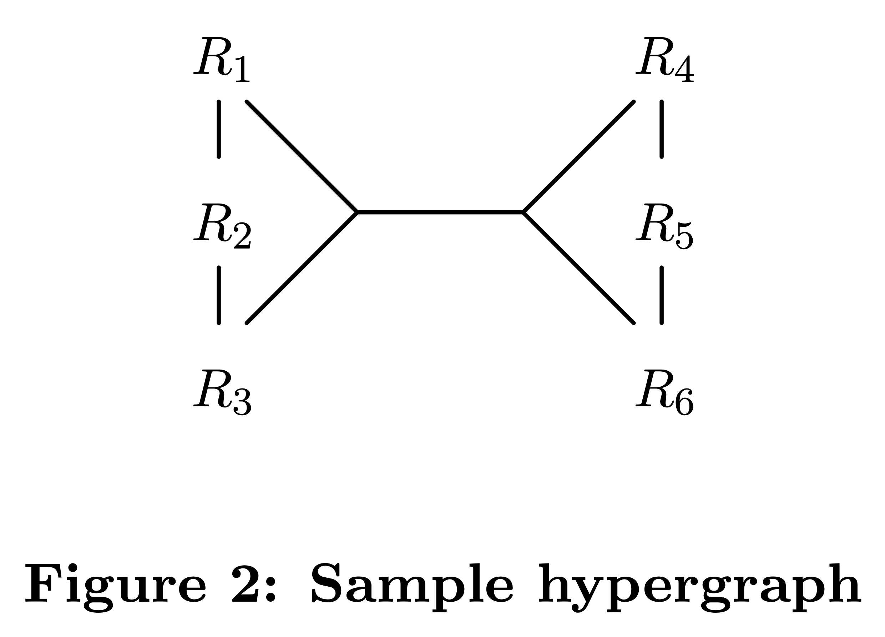

hypergraph 由 hypernode 和 hyperedge 构成：
1.  hypernode：普通节点的集合。例如上图中的 hypernode {R1} 和 {R1, R2, R3}
2.  hyperedge：连接两个 hypernode V 和 U 的边，其中 V∩U=∅

这样，所有的 join predicate 都可以看做是一个 hyperedge，比如 R1.a + R2.b + R3.c = R4.d + R5.e + R6.f 这个 predicate 代表了一个 hyperedge，连接了两个 hypernode {R1, R2, R3} 和 {R4, R5, R6}。

### Csg-cmp-pair

同样的，hypergraph 也有自己的 csg 和 cmp 的定义，只是把普通节点换成了 hypernode，把普通边换成了 hyperedge。例如，上图中：

1. {{R4}, {R6}} 不是一个 csg，因为它们之间没有直接相连的 hyperedge，不联通。
2. {{R1}, {R2}} 是一个 csg，{{R4}, {R5}} 是它的一个联通 cmp，但 {{R4}, {R6}} 不是。

和 DPccp 一样，csg-cmp-pair 指有 hyperedge 相连的 csg 和 cmp。用 min(S) 表示 hypernode 中最小的节点，DPhyp 仅枚举满足 min(S1) < min(S2) 的 csg-cmp-pair，根据最优子结构求解最佳 join order。

### Neighborhood

和 DPccp 的一样，所有的 csg 和 csg-cmp-pair 都是从一个节点出发，然后根据它的 neighborhood 不断扩展来搜索到的。

hypergraph 的情况稍微复杂。

non-subsumed hyperedge：所有不被其他 hyperedge 所包含的 hyperedge 所组成的边集。例如下图中有三个超边 ({R1}, {R2}), ({R1}, {R2, R3}), ({R1, R2}, {R3, R4})，那么：
1.  ({R1}, {R2}) 被 ({R1}, {R2, R3}) 包含；
2. ({R1}, {R2, R3}) 是一个非包含的超边，因为它没有被其他任何超边包含；
3.  ({R1, R2}, {R3, R4}) 也是一个非包含的超边。

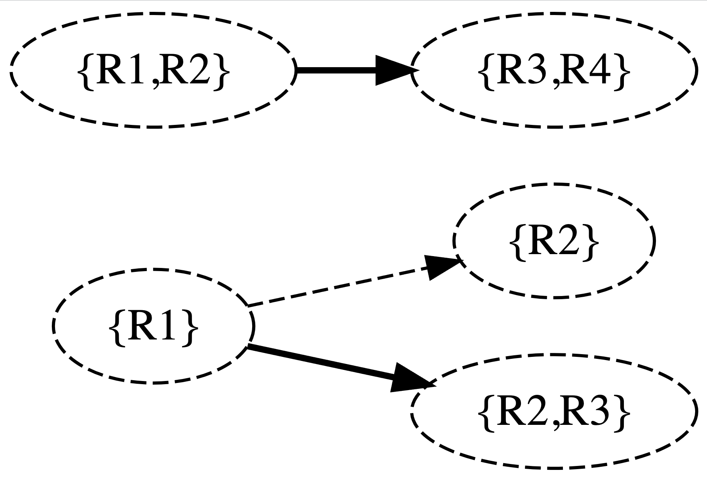
non-subsumed hypernode：不被其他 hypernode 包含的 hyper node，比如 hypernode {R1} 和 {R2} 被 {R1, R2} 包含，{R1} 和 {R2} 都是 non-subsumed hypernode，而 {R1, R2} 不是 non-subsumed hypernode。

interesting hypernode：寻找 interesting hypernode 分为两步：
1. 找到所有潜在的 interesting hypernode 集合 E↓′(S, X)，然后最小化 E↓′(S, X)，消除其中被包含的 hypernode，得到最终的 interesting hypernode 集合 E↓(S, X)。

就这些定义，给定一个 hypernode S 和一个 excluded 节点集 X，它的 neighborhood 点集 N(S, X) 为：

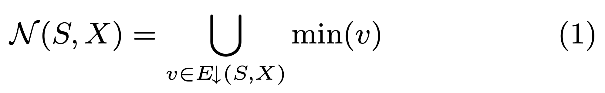
对于一开始图 2 中的 hypergraph 来说，当 S 和 X 都为 {R1, R2, R3} 时，N(S, X) 为 {R4}。

## THE ALGORITHM

主要的挑战：
1. 如何高效的遍历 Hyperedge，使得我们可以遍历出所有相邻的 Hypernode。
2. Hyperedge 指向的 Hypernode 可能包含多个节点，使得递归遍历和增长 Hypergraph 子图变的非常复杂。

为了方便的保存算法执行过程的上下文信息，论文将 Hypergraph Join Order 算法需要使用的中间数据保存在 DPhyp 这个 class 中，将算法所涉及到的 5 个子过程实现为 DPhyp 的成员函数。

算法的入口是 Solve() 函数，用来初始化动态规划的 DP 表，以及所有子状态（也就是单表的最佳 Join Order）的初始值。接着调用 EmitCsg() 和 EnumerateCsgRec()。

EnumerateCsgRec() 负责递归的枚举所有联通子图。

### Solve()

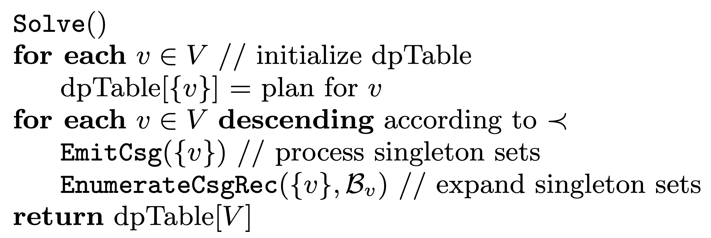

1. The algorithm calls EmitCsg({v}) for single nodes v ∈ V to generate all csg-cmp-pairs ({v}, S2) via calls to EnumerateCsgCmp and EmitCsgCmp.
2. The calls to EnumerateCsgRec extend the initial set {v} to larger sets S1.

### EnumerateCsgRec()

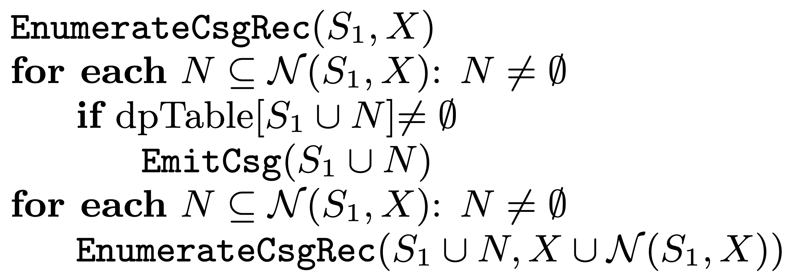

EnumerateCsgRec 的主要作用通过 csg S1 的 neighborhood 将其扩展成更大的 csg。

1. For each of these subsets N, it checks whether S1 ∪ N is a connected component. This is done by a lookup into the dpTable. If this test succeeds, a new connected com- ponent has been found and is further processed by a call EmitCsg(S1 ∪ N ).
2. Then, in a second step, for all these sub- sets N of the neighborhood, we call EnumerateCsgRec such that S1 ∪ N can be further extended recursively.

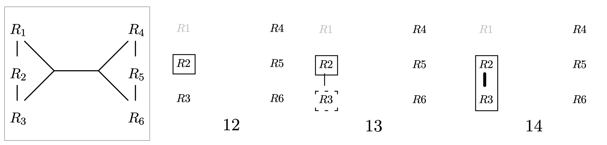

Take a look at step 12. This call was generated by Solve on S1 = {R2 }. The neighborhood consists only of {R3 }, since R1 is in X (R4,R5,R6 are not in X either, but not reachable). EnumerateCsgRec first calls EmitCsg, which will create the joinable complement (step 13). It then tests {R2 , R3 } for connectedness. The according dpTable entry was generated in step 13. Hence, this test succeeds, and {R2,R3} is further processed by a recursive call to Enumer- ateCsgRec (step 14). Now the expansion stops, since the neighborhood of {R2, R3} is empty, because R1 ∈ X.

### EmitCsg()

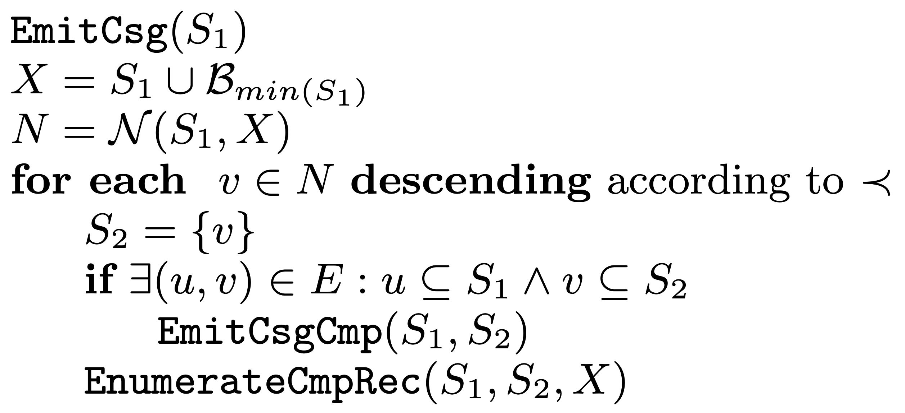

EmitCsg 的主要作用是根据 csg S1 的 neighborhood 生成匹配的 csg-cmp-pair。

1. B_min(S1): All nodes that have ordered before the smallest element in S1 (captured by the set B_min(S1)) are removed from the neighborhood to avoid duplicate enumerations.
2. Since the neighborhood also contains min(v) for hyperedges (u, v) with |v| > 1, it is not guaranteed that S1 is connected to v.

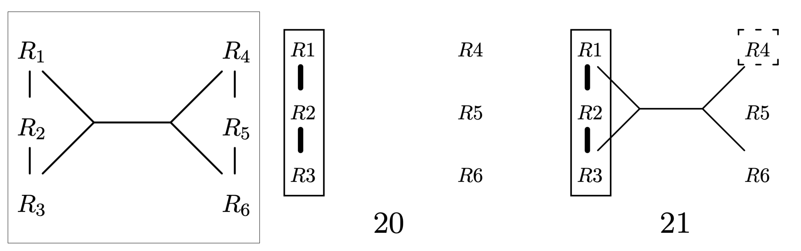

Take a look at step 20. The current set S1 is S1 = {R1, R2, R3}, and the neighborhood is N = {R4}. As there is no hyperedge connecting these two sets, there is no call to EmitCsgCmp. However, the set {R4} can be extended to a valid complement, namely {R4, R5, R6}. Properly extending the seeds of complements is the task of the call to EnumerateCmpRec in step 21.

### EnumerateCmpRec()

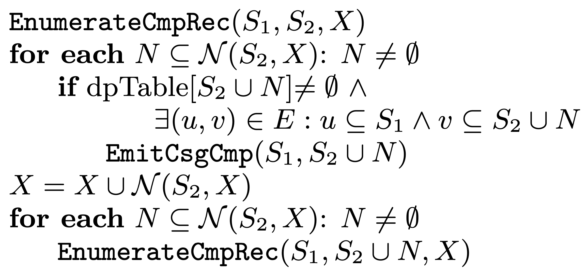

EnumerateCmpRec 的主要作用是基于初始的 cmp S2  和它的 neighborhood N(S2, X) 扩展更多的 cmp。

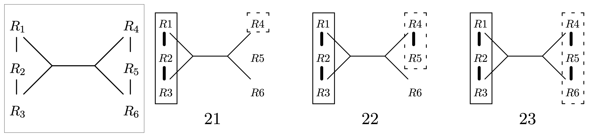

Take a look at step 21 again. The parameters are S1 = {R1, R2, R3} and S2 = {R4}. The neighborhood consists of the single relation R5. The set {R4,R5} induces a connected subgraph. It was inserted into dpTable in step 6. However, there is no hyperedge connecting it to S1. Hence, there is no call to EmitCsgCmp. Next is the recursive call in step 22 with S2 changed to {R4,R5}. Its neighborhood is {R6}. The set {R4,R5,R6} induces a connected subgraph. The according test via a lookup into dpTable succeeds, since the according entry was generated in step 7. The second part of the test also succeeds, as our only true hyperedge connects this set with S1. Hence, the call to EmitCsgCmp in step 23 takes place and generates the plans containing all relations.

### EmitCsgCmp()

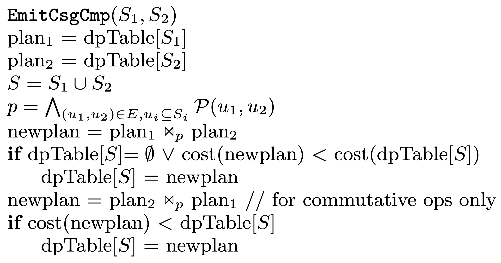

EmitCsgCmp 的主要作用是将 csg-cmp-pair (S1, S2) 的最佳 plan join 起来，计算 S1、S2 的 join predicate 和 join cost，更新 dpTable。

The task of EmitCsgCmp(S1,S2) is to join the optimal plans for S1 and S2, which must form a csg-cmp-pair. For this purpose, we must be able to calculate the proper join predicate and costs of the resulting joins.

## Evaluation

目前没有太多关于 Hypergraph 的 Join Order Benchmark，所以论文自己尝试构造了几个 Benchmark：

> The general design princi- ple of our hypergraphs used in the experiments is that we start with a simple graph and add one big hyperedge to it. Then, we successively split the hyperedge into two smaller ones until we reach simple edges. As starting points, we use those graphs that have proven useful for the join ordering of simple graphs.

论文着重考虑 Cycle 和 Star Query，没有考虑 Chain 和 Clique Query：

> The behavior of join ordering algorithms on chains and cycles does not differ much: the impact of one additional edge is minor. Hence, we decided to use cycles as one starting point.
>
> Star queries have also been proven to be very useful to illustrate different performance behaviors of join ordering algorithms. Moreover, star queries are common in data warehousing and thus deserve special attention. Hence, we also used star queries as a starting point.
>
> The last potential candidate are clique queries. However, adding hyperedges to a clique query does not make much sense, as every subset of relations already induces a connected subgraph.

论文给了 Split Hyperedge 得到更多 Hypergraph 的例子：

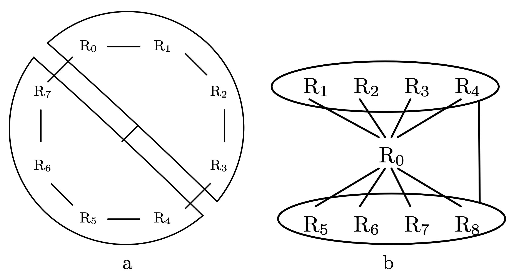

> Fig. 4a shows a starting cycle-based query. It con- tains eight relations R0 , . . . , R7 . The simple edges are ({Ri},{Ri+1}) for 0 ≤ i ≤ 7 (with R7+1 = R0). We then added the hyperedge ({R0,...,R3}, {R4,...,R7}). Each of its hypernodes consists of exactly half of the re- lations. From this graph (call it G0), we derive hypergraphs G1 , . . . , G3 by successively splitting the hyperedge. This is done by splitting each hypernode into two hypernodes comprising half of the relations. That is, apart from the simple edges, G1 has the hyperedges ({R0 , R1 }, {R6 , R7 }) and ({R2, R3}, {R4, R5}). To derive G2, we split the first hyperedge into ({R0 }, {R6 }) and ({R1 }, {R7 }). G3 addi- tionally splits the second hyperedge into ({R2},{R4}) and ({R3 }, {R5 }).

比较可惜的是，这篇论文仅关注了 DPhyp 生成 Join Order 的优化时间，没有关注生成的 Join Order 实际运行时间。在 Selectivity 估算、Cost Model 都理想的情况下，DPhyp 确实能产生不错的执行计划。不过考虑到 Selectivity 估算误差，所做出来的 Join Order 的实际运行时间是否也是最优的可能还需要更多的实验来验证。不过这个就属于 Join Order 问题的其他子问题了：
1. 如何准确、高效的估算 Join Cardinality
2. 如何建立 Cost Model 以考虑不同的 Join 算子物理实现之间的代价

### Cycle-Based Hypergraphs

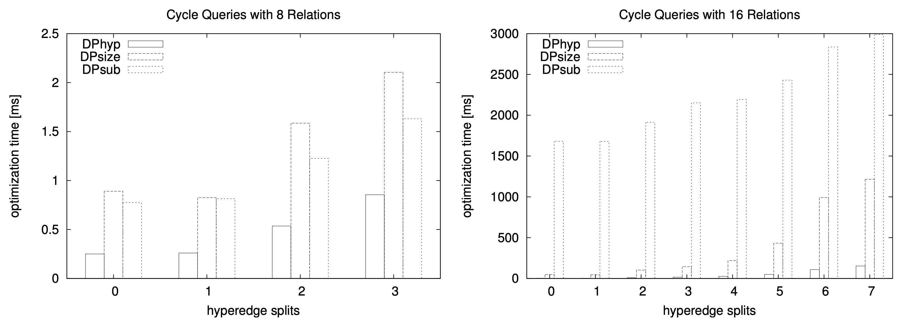

### Star-Based Hypergraphs

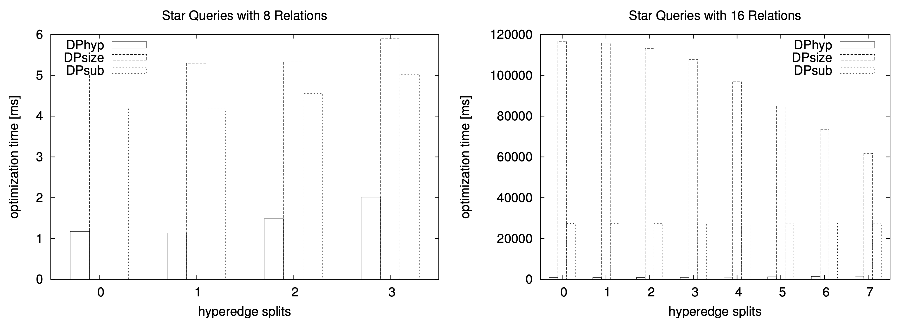

### Queries with Regular Graphs

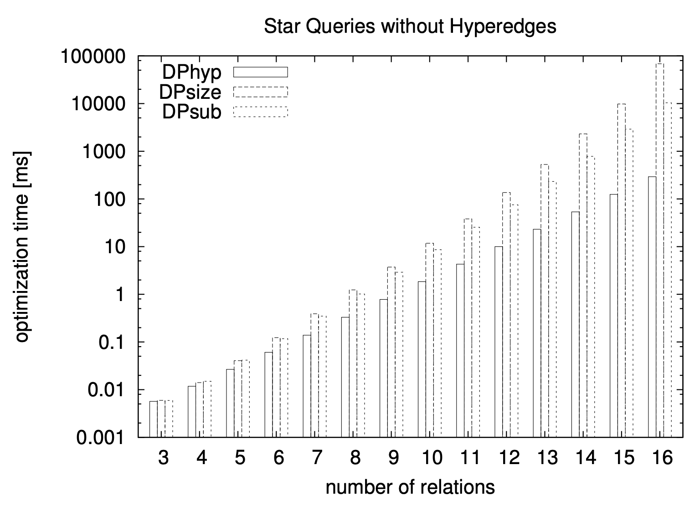

## NON-REORDERABLE OPERATORS

### Considered Binary Operators

> Besides the fully reorderable join (B), we also consider the following operators with limited reorderability capabilities: full outer join (M), left outer join (P), left antijoin (I), left semijoin (G), and left nestjoin (T). Except for the nestjoin, these are standard operators.

nestjoin 有一种变种称之为 d-join，d-join 可以和看做是 SQL Server 中的 Apply 算子，或者 Hyper 中的 DependentJoin 算子。在子查询优化中通常用来表示关联子查询，对子查询的解关联优化非常有帮助。

### Reorderability

### Existing Approaches

Rao et al 在《A practical approach to outerjoin and antijoin reordering》中提出了基于 extended eligibility list (EEL) 的方案，能够高效的处理普通 join、left join 和 anti join，但是不能处理 dependent join。另外是它需要在 EmitCsgCmp 中检查，

### Non-Commutative Operators

## TRANSLATION OF JOIN PREDICATES

