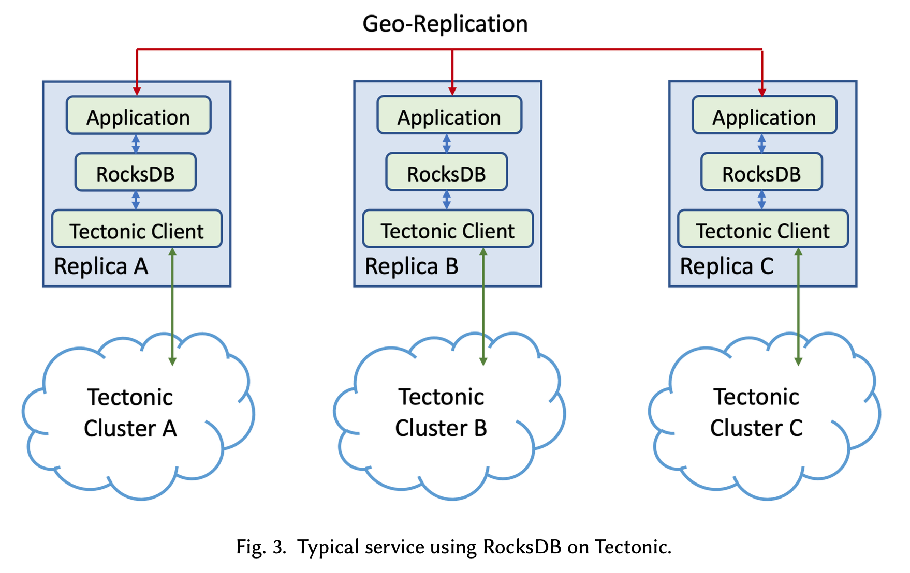

## 简介

这篇论文介绍了作者们将 RocksDB 扩展到利用分离式存储的经验，并介绍了他们为提高其可靠性和性能所做的优化。作者们讨论了分离式存储的优点和挑战，并介绍了他们如何使用 Tectonic 文件系统来构建存储分离的 RocksDB。他们还介绍了在存储分离架构中优化 RocksDB 的经验方法，包括减少元数据网络访问和使用本地 SSD 缓存等。最后，作者们分享了他们的实验结果，证明了他们的优化方法可以显著提高 RocksDB 在分离式存储环境中的性能。

采用 Tectonic 文件系统部署 RocksDB 后，以前使用 RocksDB 的应用程序可以继续使用 RocksDB，而用户也可以配置 RocksDB 继续使用本地文件，整个应用架构可以用下图概括：

这篇论文笔记，我主要关注如下几个方面：
1. 为什么采用分布式文件系统，和本地 SSD 相比，有什么优劣势
2. 面向分布式文件系统做了哪些优化，在性能上能否满足应用程序的预期
3. 基于分布式文件系统，RocksDB 有哪些新玩法

## BACKGROUND AND MOTIVATION

这里介绍了什么是 RocksDB，为什么采用存算分离的架构，为什么采用分布式文件系统，它有哪些优劣势等，也就是我比较关注的第 1 个问题。

采用分离式存储的主要目的是提升存储和 CPU 的资源利用率，同时解决存储和计算资源的扩展性的问题。存算分离后， RocksDB 需要的存储空间可以从共享存储池动态分配，所有 RocksDB 实例共享存储池中的空闲存储，总的存储使用量因此大大减少。同时当计算资源比如 CPU 不够时，不用拷贝本地数据即可将 RocksDB 实例快速迁移到 CPU 资源更充足的机器上，扩容简单、轻量、快速。

那如果要提升计算和存储的资源利用率，为什么要继续使用 RocksDB 呢。总结下来主要是下面 4 个原因：
1. 从需求来看，大部分 Meta 的应用场景主要瓶颈是存储空间不足而不是 IO 性能不好，RocksDB 的存储空间利用率非常好，在存算分离的情况下非常适合这些应用场景。
2. 从迁移成本来看，从相比造一个新的存储引擎，继续使用 RocksDB 能够最小化应用的迁移负担，RocksDB 的本地存储模式和存算分离模式可以共存，当存算分离模式不能满足需求时也可以继续使用本地存储模式。
3. 从代码的维护性来看，RocksDB 是个开源项目，不管是社区的贡献还是 Meta 自己的改进，这些通用优化能够同时适用于原本的本地存储模式和存算分离模式。
4. 从技术实现上来看， RocksDB 的 LSM tree 数据结构，日志和数据都是追加的方式写入的，天然就适合这样的分布式存储。

Tectonic 是 Meta 研发的分布式文件系统，可以参考《[Facebook’s Tectonic Filesystem: Efficiency from Exascale](https://www.usenix.org/system/files/fast21-pan.pdf)》这篇论文了解其内部原理，它的特点：
1. 数据高可用：数据要么采用擦除码要么采用多副本的方式持久化存储。Tectonic 文件由 block 组成，block 的 chunk 存储在不同的 failure domain 中，在发生故障重建数据时，可以快速从其他节点的 chunk 恢复数据。
2. Tectonic 目录和文件映射关系，文件、block、chunk 之间的映射关系，以及 chunk 节点信息等都存储在 Tectonic 的 metadata layer 中。
3. 应用程序通过 Tectonic client 向 metadata layer 获取节点信息，然后向具体的存储节点读写数据，是一个逻辑功能比较繁重的客户端。

那为什么选择 Tectonic 这样的分布式文件系统呢：
1. 从性能上来说，Tectonic 这种仅支持 append-only 的文件系统相比其他更加通用的块存储或者文件系统（比如支持随机写的文件系统）来说拥有更好的 append 性能，而 RocksDB 的设计使得它的数据和日志文件都是通过顺序写生成的，文件的 append 延迟越低整体性能越好。
2. 从兼容性和生态来说，Tectonic 提供了类似于 HDFS 的分层文件系统 API，各大云厂商基本上都有类似的存储解决方案。只要数据能够按照文件组织，文件能够按照目录分组，文件名能够用户自定义，文件内容能够以 append-only 的方式写入，能够从某个 offset 开始读取，这样的存储系统就能够运行这个改造后的 RocksDB。
3. 从可靠性来说，Tectonic 文件系统已经在 Meta 广泛的数据仓库和块存储等用例中得到了证明。

而且得益于 Tectonic 文件系统的特点，使用 Tectonic 文件系统还有一些额外好处：
1. Tectonic 天然保证了数据高可用和服务高可用，能够从各种常见故障中恢复。在以前 RocksDB 应用需要采用多个 RocksDB 副本保证数据高可用，在使用 Tectonic 文件系统后，仅需少量 RocksDB 副本即可达到和以前相同的可用性，存储成本相比之前会更低。
2. 快速恢复。
3. 

## ARCHITECTURE OVERVIEW AND MAIN CHALLENGES

### Architecture

Tectonic 集群是 data center local 的，对于有跨中心容灾的应用来说，应用层的 Geo-Replication 仍然需要保留，但是单个 DC 内从原来的 Local SSD 换成了 Tectonic Cluster。RocksDB 的几个主要改动：
1. to support Tectonic file reads and writes, a new plugin needs to be developed, which implements RocksDB’s storage interface 1 (§6.1) so that RocksDB can work with Tectonic
2. RocksDB customers need to manage files using a shared Tectonic namespace, as opposed to using an exclusive local file system. Tectonic needs to add support to help users guarantee exclusive access to one directory when needed.
3. a garbage collection functionality may be needed to remove RocksDB directories in Tectonic.

经过这样的修改后，应用层只需要配置 tectonic plugin 和 rocksdb lib，以及配置读写数据的 desired remote base directory 信息。这个 directory 只有一个 rocksdb instance 能写数据。

### Challenges

第一个挑战是性能。和 local ssd 相比，采用 disaggregated storage 新引入了网络 io。为了让尽可能多的 applications 能够使用 remote storage，针对 Get/Put 这类点查，P99 的性能目标是在 5ms 以内，针对 MultiGet 这类的 scan 操作，P99 性能期望控制在几十毫秒内

Provide Redundancy With Low Overhead 是第 2 个挑战。

Data Integrity With Multiple Writers 是第 3 个挑战，主要发生在恢复期间，需要确保新的 instance 起来后，如果老的 instance 重新拉起，不会再写原来的 data directory，保证 1 个 directory 永远只有 1 个 rocksdb instance 能写。

Preparing RocksDB for remote IO 是第 4 个挑战，曾经在 local ssd 上的某些假设在 remote io 的情况下不再成立，比如 rocksdb 曾经将 IO error 视为 local file system corruption，这种情况下 rocksdb 会变为只读模式。但是将 rocksdb 工作在 remote io 模式下，这些 io error 就需要分别处理了， 不能再盲目的视为 corruption。

## ADDRESSING THE CHALLENGES

大多数性能优化都是 rocksdb lib 内部的，但也有一些涉及到对底层 dfs 的功能和性能要求。

### Performance Optimizations

为了尽量消除引入 remote io 后的性能损失，底层的 dfs 需要提供尽量好的 tail latency，同时 rocksdb 自身也需要尽可能隐藏这些额外引入的 latency。这里分享了 dfs tail latency 以及 rocksdb 内部的优化经验。

Optimizing I/O Tail Latency. Tail latency 的原因是 1-2 个 slow storage node。如何解决这个问题呢：
1. Dynamic Eager Reconstructions. 在第 1  个读请求结束后，如果一段时间内未收到请求则发送第 2 个读请求到其他节点上。对于使用擦除码的数据来说，第 2 次读请求可能导致许多并行 IO 来构造数据，导致更多的资源消耗。这样的 reconstruction read 还有其他问题，在集群不健康的时候。
2. Dynamic Append Timeouts. Tectonic 上的 write 通常需要将数据 flush 到多个存储节点上，RockDB 仅
3. Hedged Quorum Full Block Writes.

RocksDB Metadata Cache. RocksDB 内部许多文件相关的 metadata 操作对性能非常敏感，比如 directory 列表、文件是否存在，查询文件大小等。因为任意时刻只有一个进程能够写入 rocksdb 的数据目录，因此可以直接缓存文件的 metadata，也不会存在缓存一致性的问题。

RocksDB Local Flash Cache. 这是面向 read-heavy 应用场景的优化。RocksDB 采用 cachelib 实现了基于 NVM/SCM 的本地缓存，可以视作 rocksdb block cache 的扩展。block cache 作为第一层缓存将数据缓存在内存中，而基于 NVM/SCM 的缓存作为第二层缓存将数据缓存在 flash disk 中，RocksDB 将这个 flash disk 上的缓存称为 SecondaryCache。

使用 secondary cache 后对读延迟和吞吐的改善如下：

RocksDB IO Handling. 

RocksDB Parallel IO. 这个主要是为了优化使用 Tectonic 后 MultiGet 的性能。主要思路是对同一 SST 文件的多个 data block 同时发送 read 请求。

RocksDB Compaction Tuning. 这是为了有需要的用户准备的，虽然很少用户需要调整 compaction 策略。一个影响性能的参数是 target sst file size。在 local file 通常设置为 32MB - 256MB 之间。SST 文件太小会导致大量小文件，延长某些操作的时间，比如 open db。

### Redundancy with low overhead

对于 SST，采用 \[12, 8\] encoding，这样它只会有 1.5 倍的空间放大，同时又足够和他们的 deployment 对齐：他们采用了 6 或 12 failure domains 的高可用 SLA。

对于 WAL 和其他日志文件，对于小数据量的写入需要有足够低的长尾延迟，Facebook 采用了 5-way replica 的 encoding 策略：
1. Replica encoding provides better tail latencies with no RS-Encoding overhead for small size writes.
2. unlike RS-Encoding, we don’t need write size alignment or padding for replica encoding.
3. we use R5 instead of R3 or other settings, as R5 is sufficient to meet our availability needs based on host failure probabilities.

对于 heavy log update 的场景，R5 带来的 5 倍网络开销太高了，因此作者在 Tectonic 中支持了 striped RS-encoded [12] small (sub-block) appends (with persistence)。

### Data Integrity With Multiple Writers

为了保证数据只有 1 个 writer，作者根据分布式锁实现了一个单调递增的 token，然后根据这个 token 实现了 IO Fencing，保证同一时刻只能有一个 writer 写入数据。

rocksdb 进程在写入 rocksdb 文件目录时需要先根据它的 token 来 'IO FENCE' 这个文件目录，然后在接下来的所有操作中都需要传递这个 token。

这个 fence 的机制是由 Tectonic 来保证的。

### Preparing RocksDB for remote calls

Differential IO Timeout. remote IO 操作会因为各种原因比 local IO 操作需要更长的时间，因此对于 rocksdb 各种 IO 操作也需要设置不同的 timeout 时间。

作者给 rocksdb 添加了一个叫 request deadline 的可配参数，这个参数也会传递给底层的 Tectonic 文件系统，这样 flush 和 compaction 的 timeout 设置成了几秒钟，Get 或 iterator 的 timeout 时间设置成了压秒级。

Failure Handling in RocksDB. 使用 Tectonic 文件系统后，底层文件操作更容易遇到各种错误，但是通常它们都是可恢复的，因此需要针对性设计相关的错误处理机制，以提升系统的可用性。

IO Instrumentation. 为了提升使用 Tectonic 文件系统后 IO 路径上的可观测性，作者在 rocksdb 上新增了针对 Tectonic IO 路径的 tracing 能力。

Utilities. RocksDB 的许多 cli 工具也需要适配 Tectonic 文件系统。

## PERFORMANCE BENCHMARK

## APPLICATION EXPERIENCES: ZIPPYDB

## ONGOING WORKS AND CHALLENGES

### Secondary Instances

### Remote Compaction

### Tiered Storage

## LESSONS AND HINDSIGHTS