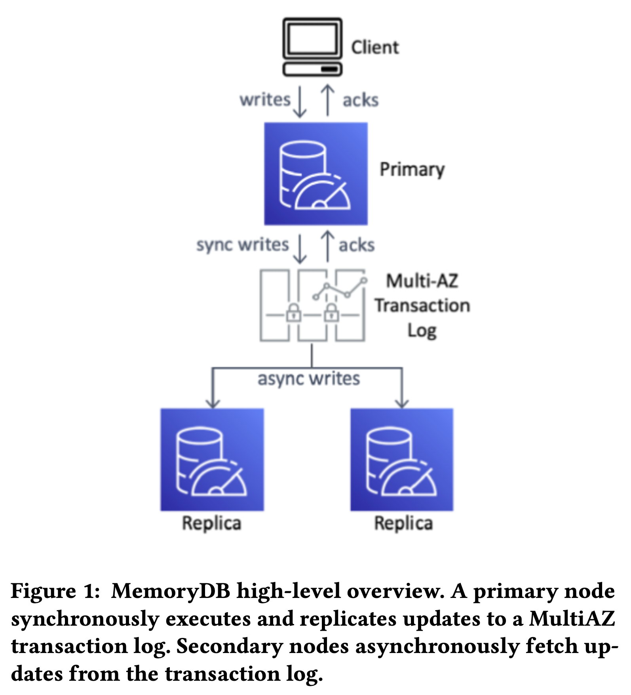
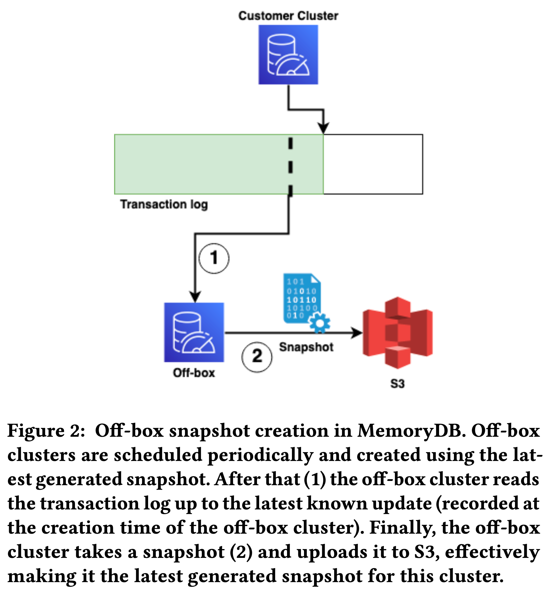
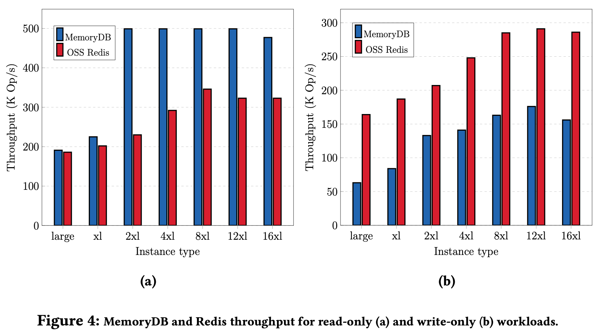
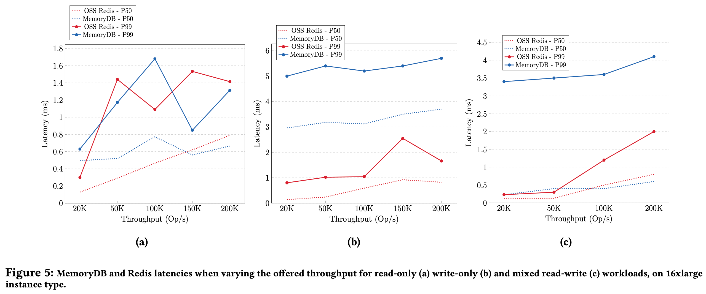
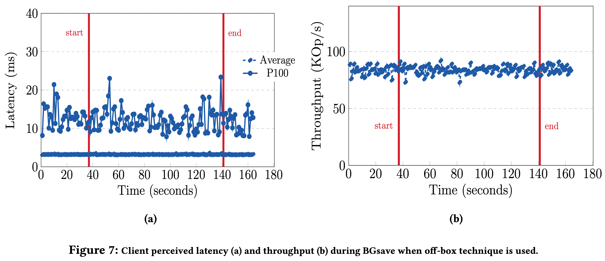

>  Annapurna, 2024

## Introduction

这篇论文讲述了 Amazon MemoryDB for Redis 的架构设计。主要特点是基于跨 AZ 的 distributed transaction log service 和 S3 解耦 Redis 的 durability 和 availability，将 durability 和 consistency 交给共享存储，利用 transaction log 完成 leader 选举，slot 迁移等，解决了 Redis Cluster 在 durability、consistency、availability、scalability 等各方面的问题，架构也更加简约。

论文的 “Introduction” 部分介绍了一个缓存 + 数据库的经典案例，“Background and Motivation” 部分介绍了 Redis Cluster 的架构及其各种问题，熟悉 Redis 的朋友应该非常了解了，本文不再详细介绍。

## Durability and Consistency

### Decoupling Durability

和 Aurora 类似，MemoryDB 将数据持久性（durability）和服务可用性（availability）解耦，把 Redis 作为 in-memory 的计算和存储引擎，把复制流重定向到 transaction log 用数据复制和 leader 选举，避免大量修改 Redis 代码，最大限度的兼容所有 Redis API。

MemoryDB 采用 passive replication，数据从 primary shard 写入，经过 transaction log 同步给 replica shard。具体实现上，MemoryDB 拦截了 Redis 复制流，切割成 record 后写入 transaction log，replica shard 顺序读取和重放这些 record，最终和 primary replica 保持一致。

transaction log service 是一个 AWS 内部服务，具有强一致、跨 AZ 高可用、低延迟的特点。高可用方面，只有当数据同步到多个 AZ 后才对外返回写入成功，保证 11 个 9 的可用性。论文没有描述 transaction log service 的实现细节，推测是基于 EBS 做的一个 log 服务？

数据持久性由 transaction log service 保障后，服务可用性就可按需独自扩缩容，控制成本。transaction log 大小主要取决于写入带宽，snapshot 后可以清理过期 log，资源开销很低。MemoryDB 主要成本来自 shard 节点的内存占用，客户通常只会设置 1 个 primary，或者 1 primary + 1 replica，既节省成本，也能获得 11 个 9 的高可用和持久化能力。

### Maintaining Consistency

Redis 使用异步复制机制，新 leader 不一定有最新数据，故障恢复后可能丢数据。MemoryDB 通过同步复制避免了这个问题：只有数据写入 transaction log 后才返回成功。

MemoryDB 复用了 Redis 在操作结束后生成复制信息的机制，将复制信息作为 WBL（write-behind log）写入 transaction log。把 Redis 命令的结果而不是命令本身写入 transaction log 可以使非确定性命令比如 SPOP（随机删除 set 中的一个元素）的结果在各个副本之间保持一致。

日志复制的一个问题是，primary 内存中修改完成，但是 transaction log 写入失败，此时不能对用户返回成功，也不能对其他并发请求可见。其他数据库系统会使用 MVCC 来解决，但 Redis 不支持 MVCC，于是 MemoryDB 添加了一个 client blocking layer 来解决这个问题。MemoryDB 会追踪每个 key 的读写请求，收到 client 的写请求后，写请求的 reply 先被缓存在 tracker 中，transaction log 写入成功后才将 reply 返回给 client。并发读按以前流程正常处理，但结束时需要访问 tracker 来检查是否需要等某个 log 写入后才能返回结果。MemoryDB 以 key 为粒度检测是否需要 block。

通过上面的机制，读写请求在 primary shard 上满足了 strong consistency。client 也可以向 replica shard 发起 read-only 请求，replica 的数据根据 transaction log 同步而来，代表了某个 point-in-time 的 snapshot。单个 replica 上的读操作满足 sequential consistency，通过 proxy 在多个 shard replica 之上的读操作只能满足 eventual consistency。

## Availability, Recovery and Resilience

### Leader Election

Redis Cluster 中，primary shard 通过 cluster bus 广播心跳给其他 replica，当多数 replica 没有收到心跳后就认为 primary shard 遭遇不测开始重新选主。通过某种 ranking 算法选举出 most up-to-date 的新 leader。这种方式有脑裂、丢数据的风险。

MemoryDB 通过 lease 机制确保只有一个 leader，利用 transaction log 确保只有数据完全 up-to-date 的 replica 能够选主成功，保证数据的强一致性。不再使用原来的 quorum 机制。

选主时需要利用 transaction log service 的 conditional append API。在 transaction log 中每条记录都有唯一 ID，conditional append 要求指定需要使用的 ID 作为前置条件。

各个 replica 竞选 leader 时利用 conditional append 写入一条特殊日志，写入成功既竞选成功，之后 leader 在 transaction log 中定期写入心跳，维持 lease，通过 Redis cluster bus 将拓扑信息广播出去。其他 replica 竞选 leader 失败后会读取 transaction log，读到 leader 的心跳记录后退出选举。

因为 conditional append 的特殊性，只有数据完全 update-to-date 的 replica 才可能竞选成功，多个副本同时竞选也只会有一个成功，老副本加入后也只有追上数据后才能选举成功，简化了选主过程，也避免了数据一致性问题。

### Recovery

MemoryDB 通过外部的 monitoring service 和 Redis 内部 gossip 的拓扑信息进行故障检测。

故障恢复时，先恢复到 S3 存储的最新 snapshot，然后重放增量的 transaction log。不需要和任何现存副本交互，可以并发同时恢复多个副本，也避免了影响健康节点的工作负载。

MemoryDB 采用了下图所示的 off-box snapshot 机制在后台启动用户不可见的 off-box cluster，off-box replica 和普通副本一样从 S3 和 transaction log 中创建，之后一边消费 transaction log 一边按需创建 snapshot，对用户 cluster 无任何影响。避免了使用 Redis fork 机制的一系列问题：

虽然 off-box cluster 增加了集群成本，但考虑到 snapshot 过程的计算和 IO 开销，使用独立的 off-box cluster 可以尽量减少对服务稳定性、可用性的影响。

MemoryDB 根据 snapshot freshness 来判断是否产生新的 snapshot。snapshot freshness 可以认为是自 snapshot 创建以来增量 transaction log 的长度，受 write throughput 和 data set 影响。write throughput 越大 transaction log 就涨的越快，data set 越大 snapshot 的时间就越长，累积的 transaction log 也越多。MemoryDB 不间断的采样 write throughout 和 data set size，计算 snapshot freshness，在 snapshot stale 时创建新的 snapshot。

## Management Operations

这一小节介绍了 control plane 的功能和实现。control plane 负责客户集群的所有运维操作，比如安装、升级、扩缩容、re-sharding、故障恢复等。其中变更副本数比较简单，变更实例类型（scale-up）和变更实例版本一样采用 N+1 rolling update 的方式，变更 shard 数量（scale-out），也就是 re-sharding 采用了 2PC 的方式，会稍微复杂点。

变更 shard 数量，也就是 re-sharding，需要在 shard 之间迁移 slot，操作结束后还需要为新增（或减少）的 shard 创建（或销毁）对应的 transaction log。slot 迁移分为 data movement 和 ownership transfer 2 个步骤：

data movement：需要将属于该 slot 的 key-value 和 transaction log 中的数据迁移到 target primary shard 上，迁移过程中 source primary shard 会继续提供该 slot 的读写服务。在进行 ownership transfer 之前，source primary 会阻塞该 slot 上所有新增的写请求，等待所有正在执行的写请求结束，检查 source 和 target primary 上的数据完整性，如果失败则中断本次 slot 迁移，清理数据，否则进入 slot ownership transfer 阶段。

ownership transfer：slot ownership 记录在 transaction log 中，ownership transfer 需要更新 2 个 shard 的 transaction log，算是一种分布式事务，通过 2PC 完成。所有 2PC 的状态都记录在 source 和 target 的 transaction log 中，source 或 target 故障后新的 primary shard 仍旧可以通过之前 2PC 的状态继续或 abort ownership transfer。

## Performance Benchmark

下图展示了 Redis Cluster 和 MemoryDB 的性能对比，左边是 read-only，右边是 write-only。MemoryDB read-only 性能好的主要原因是采用了 Enhanced IO Multiplexing 功能将多个客户端连接聚合成 1 个，提升了性能和吞吐。write-only 性能更差的原因是 MemoryDB 需要跨 AZ 的写 transaction log，在预期之中：

下图从左到右分别展示了 read-only、write-only、read-write 三个工作负载下的延迟对比，read-only 延迟都差不多，MemoryDB write-only 延迟更高也在预期内：

下图展示了 MemoryDB off-box snapshot 期间 QPS 和延迟的变化情况，也是如预期一般没有任何影响，证明在隔离的环境中读共享的 transaction log 对主服务的影响确实可以忽略不计，用户也不用像以前 Redis 那样为主服务集群保留额外的内存以应对 fork 的影响了：

## 一些思考

MemoryDB 和社区上 RocksDB + Raft + Redis 的方案不太一样，前者（MemoryDB）每个 shard 仍旧是 in-memory 的，后者可以利用 RocksDB 将数据落盘，牺牲性能来降低成本。不过 MemoryDB 的每个 shard 应该也可以采用类似的落盘方案进一步降低成本。

transaction log service 的抽象为上层服务解决了很多问题，许多系统架构应该都可以基于这一层抽象来简化，减少复杂度，提升鲁棒性。