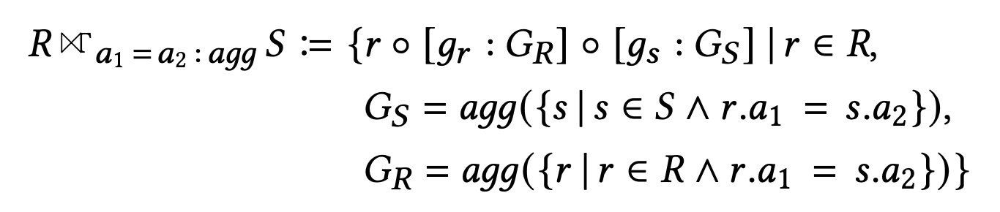
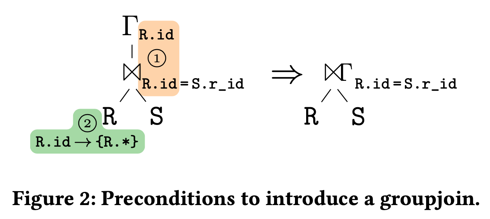
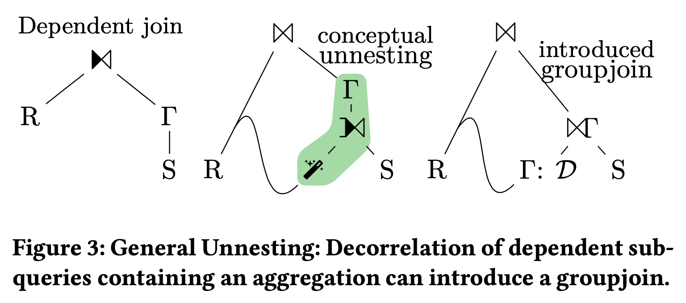
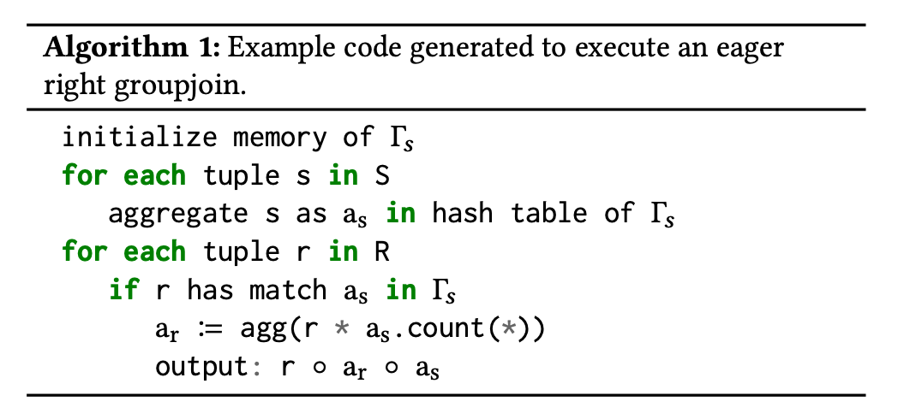
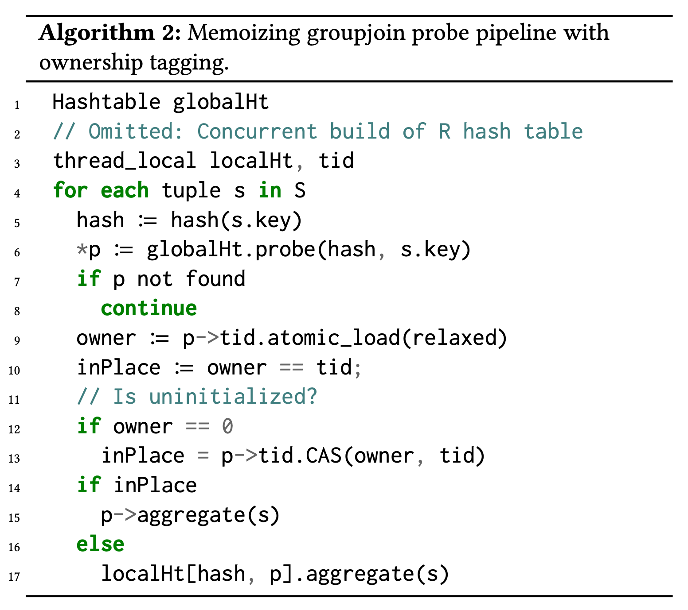

- Introduction
- Why GroupJoin
	- Background and problems
	- GroupJoin Definition
- GroupJoin Implementation
	- Query optimization
	- Query execution
- References
## Introduction

这篇文章介绍 GroupJoin 定义及其实现思路，主要参考这两篇论文：
- [A Practical Approach to Groupjoin and Nested Aggregates](https://vldb.org/pvldb/vol14/p2383-fent.pdf) VLDB 2021
- [Accelerating Queries with Group-By and Join by Groupjoin](https://www.vldb.org/pvldb/vol4/p843-moerkotte.pdf) VLDB 2011

## Why GroupJoin

### Background and problems

GroupJoin 的作用主要体现在两个方面：

**Improve query efficiency**. 考虑下面这个例子：

```sql
SELECT cust.id, COUNT(*), SUM(s.value)
FROM customer cust, sales s
WHERE cust.id = s.c_id
GROUP BY cust.id
```

> In a traditional implementation, we answer the query by building two hash tables on the same key, one for the hash join and one for the group-by. However, we can speed up this query by reusing the join’s hash table to also store the aggregate values.
>
> We spend less time building hash tables, use less memory, and improve the responsiveness of this query.

**de-correlate nested queries**. 考虑下面这个例子：
```sql
SELECT cust.id, cnt, s
FROM customer cust, (
    SELECT COUNT(*) AS cnt, SUM(s.value) as s
    FROM sales s
    WHERE cust.id = s.c_id
)
```

> Answering that query without nested-loop evaluation of the inner query is tricky, as a regular join plus group-by will produce wrong results for empty subqueries, which is known as the COUNT bug
>
> A groupjoin directly supports such queries by evaluating the static aggregate for the nested side of the join, taking the groups from the other side

### GroupJoin definition

Questions:
- 什么是 GroupJoin，形式化定义和举例说明

GroupJoin 的形式化定义如下：


前提条件：
* R 和 S 做等值 join，join condition 中没有非等值条件，其中 a1 为 R 上参与等值 join 的属性集合，a2 为 S 上参与等值 join 的属性集合
* 每个聚合函数只使用 R 或 S 上的属性，不存在同时使用两表数据的聚合函数，例如 avg(R.a + S.a)

上面这个形式化定义也隐含了 GroupJoin 的执行方式：
- 按照 R（或 S）的 join key 集合构建 hash table，key 为参与 join 的 key，value 为该表上聚合函数的中间结果
- 使用 S（或 R）probe 并 join 该 hash table，同时更新 S 表上所有聚合函数的中间结果

## Query optimization

Questions:
- 什么样的 query 可以使用 GroupJoin
- 如何处理 join 和 agg 之间的 filter、projection、sort、limit 等算子
- 如何估算 selectivity/cardinality
- 如何确定 dop
### Fusing join and group by operators



上图代表了 GroupJoin 的基础优化场景，将 Join 和 GroupBy 结合在一起使用同一个 hash table 一并计算完，join 和 group by 能够组合的条件是：
1. join key 等于 group key
2. 或者 join key 是 group key 的超集，也就是论文中说的 group key functional dependent on join key (hash table build key)

### Correlated subquery un-nesting



上图代表了使用 GroupJoin 进行子查询去关联的例子，这个例子中，Dependent Join 代表了传统的 nested loop 的子查询执行方式，计算量最大效率最低，要转成 GroupJoin 需要：
1. 先将 R 表按照 join key 去重得到 D
2. 然后将 D 和 S 做 GroupJoin
3. 最后再和原 R 表做 Join

如果采用 DAG 执行框架，R 表可以只读一次。这个转换的例子中，原本低效执行的 nested loop dependent join 转换成了 GroupJoin + Join，既能保证边界条件下的正确性，又能提高执行性能

## Query execution

Questions:
- 如何复用 hash table
- 如何多线程并发
### Eager right(aggregate) GroupJoin



因为提前计算了右表的 aggregate，所以当右表所有结果都能和左表 join 上时是最佳的执行策略，是一种先聚合在 join 的方法
### Memoizing GroupJoin


### Separating Join and GroupBy


## References


Umbra:
- [Practical Planning and Execution of Groupjoin and Nested Aggregates](https://link.springer.com/content/pdf/10.1007/s00778-022-00765-x.pdf), VLDBJ 2022
- [A Practical Approach to Groupjoin and Nested Aggregates](https://vldb.org/pvldb/vol14/p2383-fent.pdf) VLDB 2021

PolarDB-X:
- https://zhuanlan.zhihu.com/p/701718682

PolarDB-IMCI:
- https://www.alibabacloud.com/help/en/polardb/polardb-for-mysql/user-guide/implementation-of-groupjoin


Databend:
- https://github.com/datafuselabs/databend/issues/8235

CockroachDB:
* https://github.com/cockroachdb/cockroach/pull/101181
* https://github.com/cockroachdb/cockroach/issues/38707

TiDB:
* https://github.com/pingcap/tidb/issues/7469
