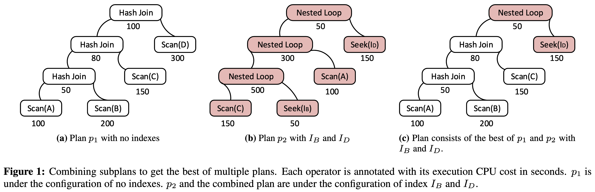
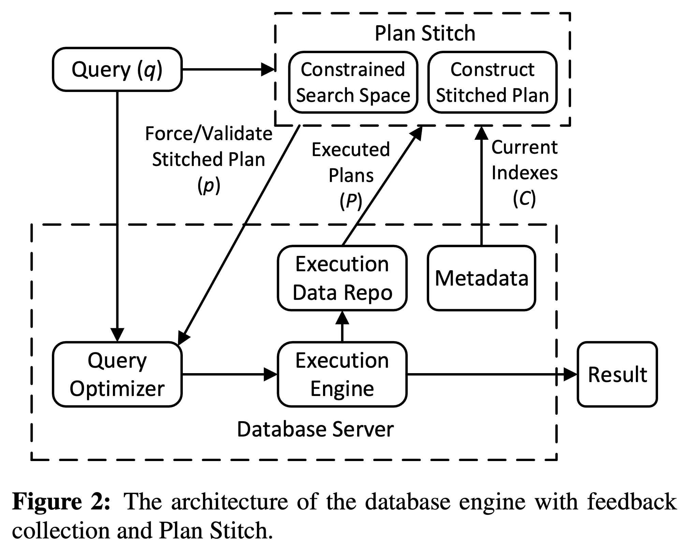
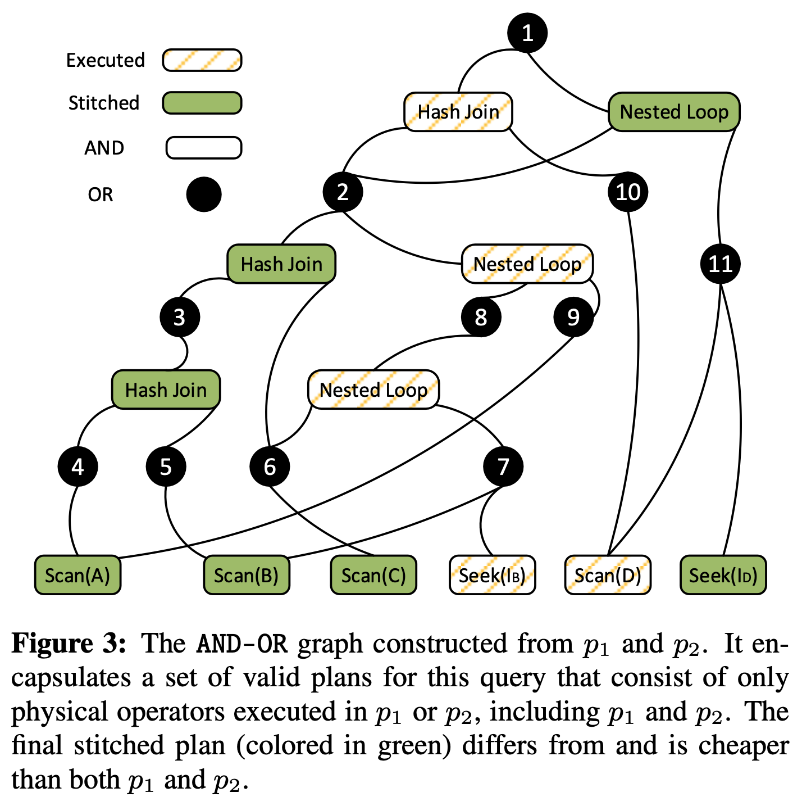
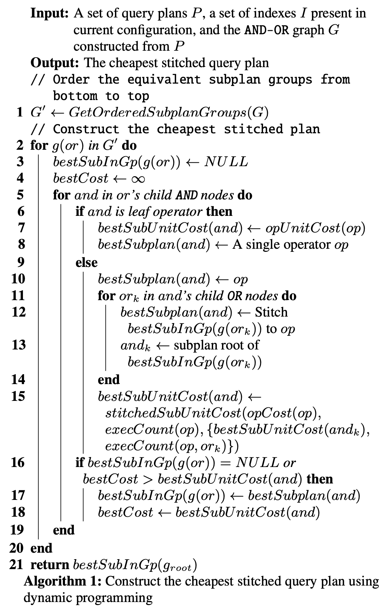
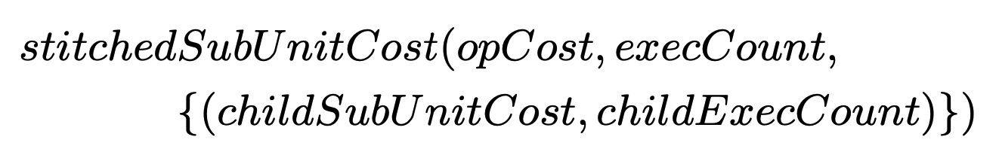
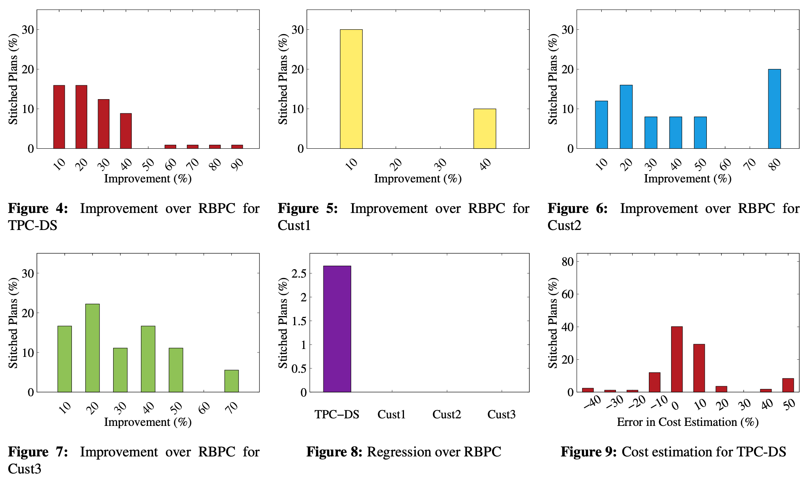

> ACT Day 2
## 简介

通常商用数据库都有 reversion-based plan correction（RBPC）机制来避免 plan regression，比如 SQL Server APC、Oracle SPM 等：从执行过的 plan 中挑出 execution cost 最低的，强制优化器使用该 plan 以避免 regression。

论文中提出的 Plan Stitch 可以看做是 RBPC 的增强：将搜索空间限制在历史上执行过的 physical plan 上，利用算子级的 execution cost 和类似 System R 的搜索方法，“缝合”出 execution cost 最低的 stitched plan。

相比 RBPC，即使某个历史 plan 因为某个表发生了 schema change 导致整体不可用，但只要它的某个 subplan 是有效的，这样的 subplan 也可以被 plan stitch 利用上。

相比基于 query feedback 的查询优化，plan stitch 将搜索空间限制在历史执行过的 physical plan 上，不会产生新的、未执行过的 subplan，这个特点使它比 feedback 更适合那些对 plan 稳定性要求高的场景。

plan stitch 开销很低，即使没有 plan regression 也可以在日常使用 plan stitch 辅助优化器基于历史生成更优的执行计划。

作者在 SQL Server 上利用 TPC-DS 和三个真实负载对 Plan Stitch 进行了充分的测试验证，从测试结果来看 plan stitch 在广度上能比 RBPC 优化更多的 query，在深度上能大幅减少 query 的 execution cost。经过 RBPC 优化后的查询中，83% 都能经过 plan stitch 进一步优化，减少至少 10% 的 execution cost，甚至有些 query 能减少 2 个数量级的 execution cost。

## 问题描述

通常来说，我们希望优化器能够利用当前的索引和统计信息，稳定的生成高效的执行计划。但因为各种原因，有时同一个 SQL 生成的执行计划可能比之前更差，也就是发生了 plan regression。

这个问题在 SQL Server 中可以通过 Automatic Plan Correction (APC) 来解决，其他数据库也有类似的机制，比如 Oracle 的 SQL Plan Management (SPM)。APC 是一种保守的机制，主要思路是统计 SQL 的历史执行计划和执行时间，强制优化器采用历史上执行效率最高的 plan，避免新 plan 带来的 regression 风险。

APC 这样的 reversion-based plan correction（RBPC）机制风险低，大部分情况下非常有效，但也有一定的缺陷：以 plan 粒度的修正方式限制了发现更优 plan 的可能性。

以上图 A、B、C、D 四表 join 为例。它的历史执行计划 p1 如图 a，全部采用 hash join，后来用户为表 B 和 D 创建了能被 nested loop join 使用的索引，优化器产生了新的执行计划 p2 如图 b。执行后发现 p2 出现了性能回退，实际上 p1 的 execution cost 比 p2 更低。按照 RBPC 的策略该查询的 plan 回退到了 p1。

但从 p2 的 execution cost statistics 可以看出，对 D 表执行 index seek + nested loop join 的 execution cost 比 p1 的 scan + hash join 更低。如果像 p1 那样对 A、B、C 采用 hash join，像 p2 那样对 D 表采用 nested loop join，就能得到一个比 p1 更优的 plan，也就是图 c 所示的 p3。

这就是 plan stitch 的目标：根据历史上执行过的 physical plan 和算子级的 execution cost 信息，缝合出 execution cost 最低的 stitched plan。和 APC 一样，Plan Stitch 也是一种保守的机制，仅在历史上执行过的 physical plan 所限制的搜索空间中根据 execution cost 组合最优 plan，发生 regression 的风险很低。

## Plan Stitch 整体架构

Plan Stitch 整体架构如上图所示，plan stitch 实现为优化器的扩展组件，可以是外部服务，也可以是后台线程。输入为用户的 query、存储在 execution data repo 中（sql server 的 query store）的历史 plan、算子级的 execution cost 等信息，以及存储在 metadata 中的 schema、index 等信息。输出为加上 hint 后的 query，也就是论文所说的 “stitched plan”。

任何时候，只要 execution data repo 中发现该 query 拥有多个历史 plan 和对应的 execution statistics 就可以为其计算 stitched plan，然后将 stitched plan 交给优化器，通过现有的 RBPC 机制（比如 sql server 的 APC、oracle 的 SPM）来决定是使用当前优化器实时优化出来的 plan 还是这个 stitched plan。

plan stitch 依赖 execution data 计算 execution cost，为了确保代价估算的准确度，这些历史上的 execution data 需要保持一定的新鲜度。和直方图、ndv 这些统计信息一样，在表的数据量、数据分布发生变化后也需要淘汰过期的 execution plan 和他们的 execution data，和统计信息的更新机制一样有很多启发式机制可以参考。

对于参数化的 sql 或者 prepare 语句，plan stitch 和 RBPC 一样存储和使用所有 plan 的 avg execution cost，也可以根据需要采用带权重的 cost 计算方式。

## 构造搜索空间

plan stitch 需要被限制在所有历史 plan 的 subplan 组成的搜索空间中，要根据一堆历史 physical plan 逆向构造出这个搜索空间有两个难点：一个是如何判断出两个 subplan 相等，一个是如何 encode 这个搜索空间。

判断 subplan 相等采用的方法和物化视图、公共子表达式优化等类似的启发式方法。然后采用了类似 volcano/cascades planner 的方式把整个搜索空间 encode 成了论文中提出的 AND-OR graph。对照 volcano/cascades planner 来看的话，整个搜索空间其实就是由 expression group 和其中的 expression 构成。文中每个 or node 代表一个 logical plan + required physical property，每个 child and node 代表能满足该 required physical property 的 physical plan。不难看出，每个 or node 的 child 一定是 and node，而 and node 的 child 也一定是 or node。

构造这个 AND-OR graph 的方法比较简单直接：对每个 physical plan（图中的 AND node），从所有历史 plan 中找出和它等价的 subplan（也是 physical plan，图中的 AND node），然后为所有这些 AND node 构造一个 OR node，代表这组相同的 physical plan 对应的 logical plan 和 physical property。

plan 的 leaf node 代表了某个表的 access path，如果这个 access path 使用了被 drop 的索引，那么在构造这个 AND-OR graph 时就不能把这个 leaf node 加入进去，确保基于 AND-OR graph 搜索出来的 stitched plan 的有效性。一个 AND-OR graph 的例子如下图所示：

## Bottom-up 的搜索方式

Plan Stitch 和 System R 一样采用 bottom up 的方式搜索 stitched plan：自底向上为每个 or node 计算出 execution cost 最低的 stitched subplan，直到最后计算出根节点 or node 的 stitched plan。整个搜索算法的伪代码如下所示：

搜索时需要估算 stitched subplan 的 cost，文中采用的方法如下，stitchedSubUnitCost 是用来为 op（physical subplan）估算 cost 的函数，它依赖的输入有 4 个：
1. opCost：observed execution cost，根据历史 plan 中该算子的 execution cost 计算而来
2. execCount：该算子在原 plan 中被执行的次数，一般来说都是 1，除非它是原 plan 中 Nested Loop Join 或 Apply（Hyper 中也叫 Dependent Join，用来做计算子查询的算子）的 inner 端
3. childSubUnitCost：child stitched subplan 的 cost
4. childExecCount：child subplan 被执行的次数

整体来看和普通优化器的 cost model 差不太多，只不过 cost 换成了 execution cost 而不是根据直方图、ndv 等估算，每个算子应该都需要根据自己的计算逻辑和这些输入信息计算最终的 cost。

## 实验结果

上图是 plan stitch 相比 RBPC 带来的性能提升和性能 regression。作者根据 TPC-DS 和 3 个 customer workload 设计了测试用例。图 4-7 展示了 plan stitch 相比 RPBC 减少的 cpu time 百分比，计算方式为 `100*(cpu_time_stitched-cpu_time_rbpc)/cpu_time_rbpc`。

图 8 展示了因为估算误差导致 stitched plan 相比 RBPC 出现性能回退的 query 占比，作者只提了回退至少 10% 的 query 的占比低于 2.7%，但是没有提这 2.7% 的 query 里面最差的回退有多少，如果要实际使用 stitched plan 还是得多测试，除了关注回退数量也关注下最差的回退情况。

原文第 5 结  “EXPERIMENT” 从各个方面对 plan stitch 进行测试评估，这篇文章就不再详细介绍了，感兴趣的朋友可以自行阅读：

> - **Plan Quality (Section 5.2)**. How much improvement in plan execution cost does Plan Stitch bring compared to RBPC? How much is the risk of plan regression using Plan Stitch?   
> - **Cost Estimation (Section 5.3)**. How accurate is the stitched plan’s estimated execution cost compared to true execution cost?
> - **Coverage (Section 5.4)**. How many queries and plans can Plan Stitch improve?
> - **Overhead (Section 5.5)**. What is the overhead of Plan Stitch?
> - **Stitched Plan Analysis (Section 5.6)**. How different is the stitched plan compared to the optimizer’s plan? How many previously-executed plans are used for the stitched plan? Why does the optimizer miss the cheaper stitched plan in its optimization?
> - **Parameterized Queries (Section 5.7)**. How much does Plan Stitch improve in aggregated execution cost of query instances?
> - **Data Changes (Section 5.8)**. How much does cost estimation in Plan Stitch degrade when data changes?

## 总结

总的来说，在保证 plan 稳定性的前提下尽可能提升执行性能，plan stitch 这种基于历史同时限制搜索空间的方法是个非常值得借鉴的思路。