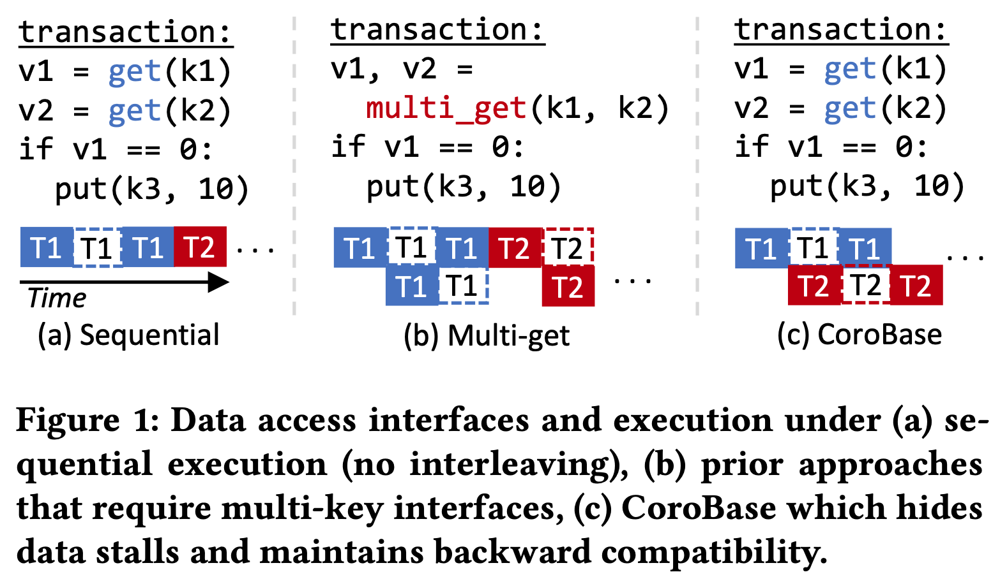
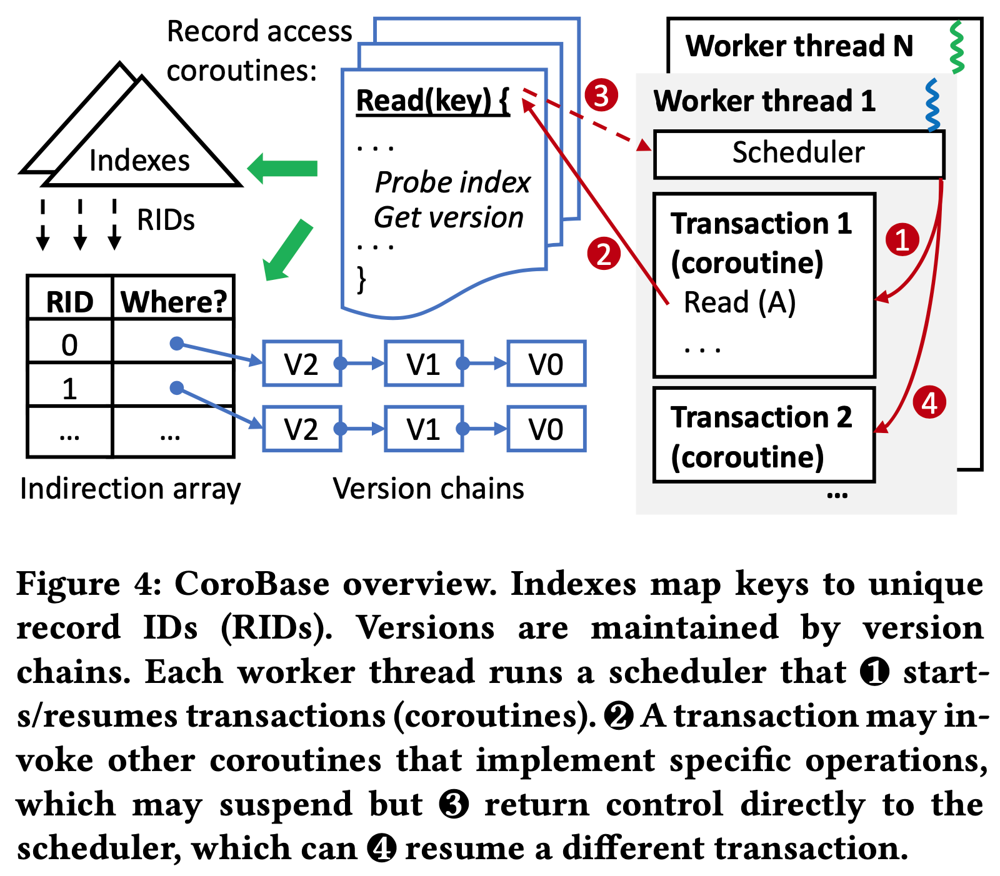
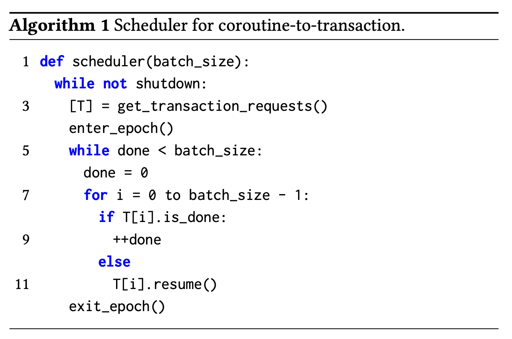
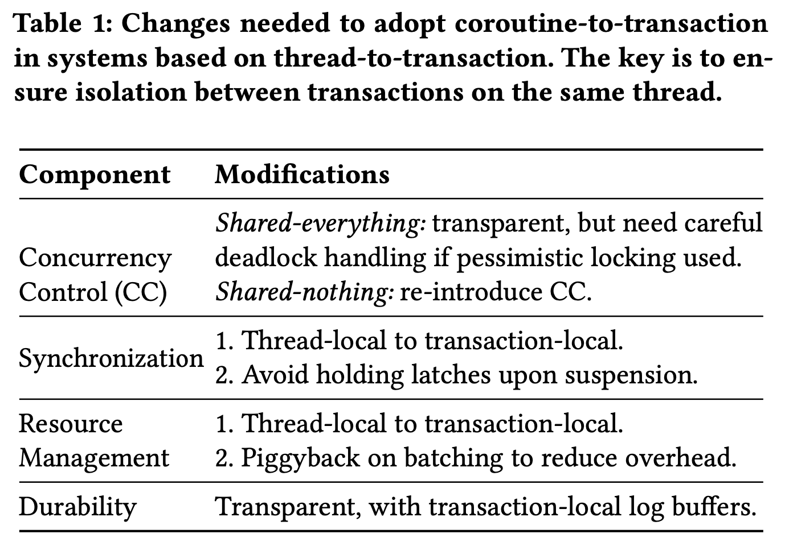
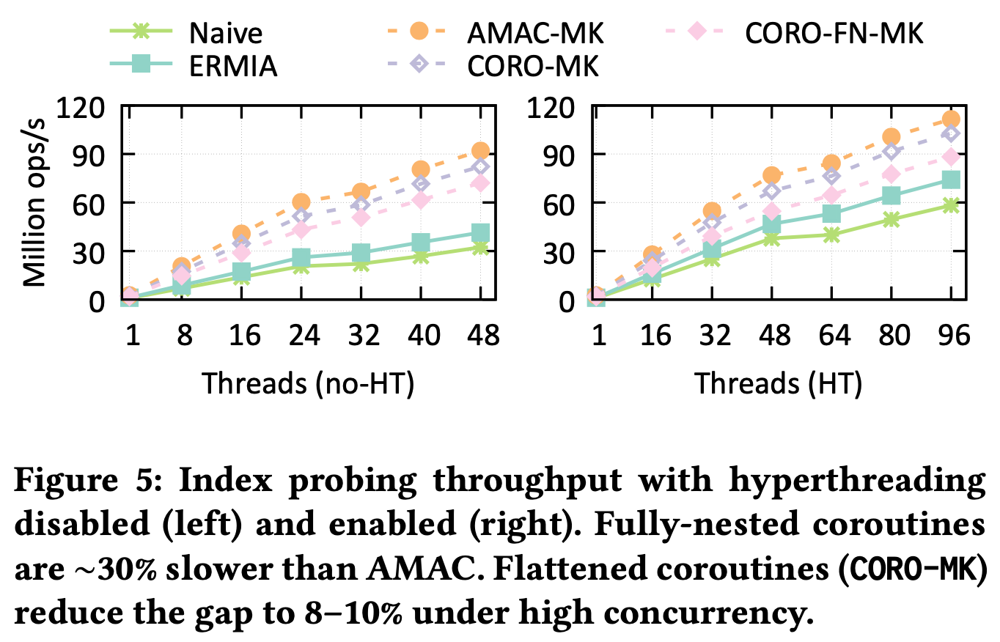
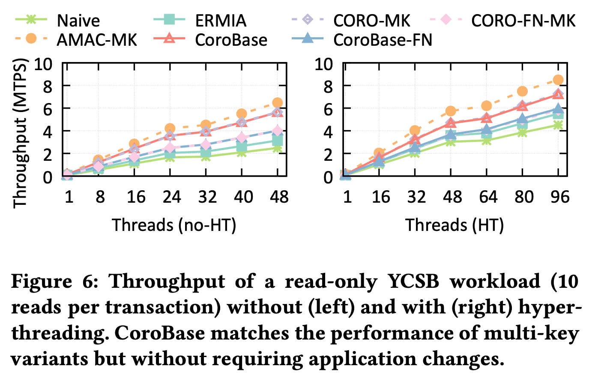
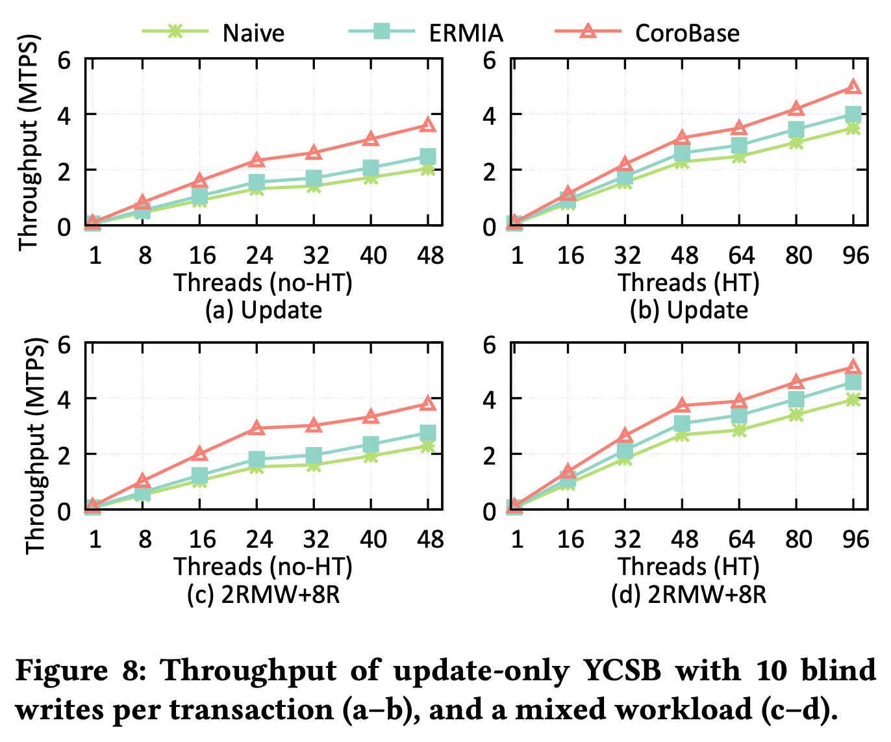

> 乌孙古道，2023
## Introduction

这篇论文中，作者利用 C++ 20 引入的 coroutine 特性将 thread-to-transaction 的执行模型改为 2-level coroutine-to-transaction，并在此基础上实现了基于协程的 software prefetch 机制，减少了后续计算的 cache miss，提升了事务的整体执行性能。相比已有的 group prefetching、software pipelined prefetching 以及 asynchronous memory access chaining (AMAC) 这三种 software prefetch 来说，基于协程的 software prefetch 不需要过多的修改数据结构的接口和内部实现，在代码实现和性能收益之间做了非常不错的平衡，对数据库或高并发系统性能优化有一定的参考价值。

> PS：其实这篇论文很早就关注了，一直想抽时间看看，结果一拖就是 2 年多。。

关于 CPU prefetch，我最早是通过 《[Relaxed Operator Fusion for In-Memory Databases: Making Compilation, Vectorization, and Prefetching Work Together At Last](http://www.vldb.org/pvldb/vol11/p1-menon.pdf)》了解到的，后面又通过《[Improving Hash Join Performance through Prefetching](https://www.cs.cmu.edu/~chensm/papers/hashjoin_icde04.pdf)》以及《[Asynchronous Memory Access Chaining](http://www.vldb.org/pvldb/vol9/p252-kocberber.pdf)》了解了 group prefetching、software pipelined prefetching 以及 asynchronous memory access chaining (AMAC) 的细节，感兴趣的朋友也可以顺便读一下这几篇论文。

在介绍 CoroBase 前，我们先了解下基于协程的 software prefetch 的基本思路和一些已有研究结果。

### Software Prefetching via Coroutines

基于协程的 software prefetch 思路比较简单直接：当协程函数 t1 要通过指针访问数据时，它可以向 CPU 发起 prefetch 指令让 CPU 把这块数据从内存加载到 cache 中，因为加载数据需要时间，在这个协程发完 prefetch 指令去捞数据的时，可以将当前协程挂起，让 CPU 继续执行其他数据已经在 cache 中的协程的计算任务，这样 IO（CPU prefetch）和计算完全并行起来，cache miss 减少，整体的执行效率也提升了。

简单来说，基于协程的 software prefetch 只需要在指针解引用之前加上 prefetch 和 suspend 就可以了，极大简化了开发负担。

之前也有人研究过的基于协程的 software prefetch，比如采用 thread-to-transaction 的处理模型，在事务内采用多个协程并发读写一批数据，实现 software prefetch。这种实现方式对应用层有一定的侵入性，如下图所示，用户需要从 (a) 中的 get 接口改成 (b) 中的 multi_get 接口才能享受到这种事务内部多个协程批量处理多条数据的 software prefetch 方式所带来优化收益：

另外，之前的研究大多是针对具体的计算场景比如 hash join，index lookup 等进行 software prefetch 优化，缺乏整个事务全部采用 software prefetch 优化的研究和实验。

### C++20 Stackless Coroutine

基于协程的 software prefetch 虽然减少了 cache miss，但引入了协程切换开销，要想有收益就需要使协程切换开销低于最后一级 cache miss 的开销。

第三方协程库，比如微软和 boost 协程库等，都是有栈协程（stackfull coroutine），因为 runtime stack 的原因导致有栈协程的切换开销比 L3 cache miss 高许多，利用它们实现本文的 software prefetch 方案不会有直接收益。

作者采用了 C++ 20 引入的无栈协程（stackless coroutine），它的协程上下文保存在堆内存的 coroutine frame 中，切换开销非常小。

关于有栈协程和无栈协程的实现原理和各自的优缺点这里不过多介绍，我了解的也比较有限，大家可以查阅维基百科，或者查阅这份关于 C++ coroutine 的 [Draft Technical Specification](https://www.open-std.org/jtc1/sc22/wg21/docs/papers/2017/n4680.pdf) 详细了解。

## CoroBase Design

作者在内存数据库 ERMIA 的基础上实现了 CoroBase，代码开源在 [https://github.com/sfu-dis/corobase](https://github.com/sfu-dis/corobase)。CoroBase 采用了 coroutine-to-transaction 的处理模型，每个工作线程运行多个协程，每个协程处理一个事务，每个线程上的一批事务共同开始，共同结束。当事务 t1 需要 prefetch 数据时，它所在的协程发起 prefetch 后挂起，其工作线程继续执行事务 t2 的协程。

### Overview

CoroBase 采用了 MVCC，每个 record 通过 RID 来唯一定位，RID 和 record 的版本链存储在 indirection array 中，版本链按照从新到旧的顺序存储所有的数据版本。为了加速数据读取，CoroBase 为每个表维护了一个索引，存储了索引 key 到 RID 的映射关系，一次 index lookup 的过程涉及非常多的指针跳转。CoroBase 的整体架构以及它的 coroutine-to-transaction 执行模式如下图所示：

每个工作线程都运行了一个 round-robin 的协程调度器，每次处理一批协程，不断轮训每个协程的状态，唤醒和执行没有完成的协程直到所有协程都执行完为止。batch_size 和 CPU 支持的 outstanding memory access 相关，CoroBase 使用 8 作为 batch_size：

将一个 thread-to-transaction 的内存数据库改造成 coroutine-to-transaction 的所有改动如下，durability 方面不需要任何修改，最主要的挑战来自协程切换开销、并发的线程和事务之间的资源管理和同步等，作者分成了三个部分逐一介绍：

### Two-Level Coroutine-to-Transaction

要支持所有类型的数据库操作（insert/read/update/scan/delete），最直接的办法就是根据经验和 profile 结果将所有可能导致 cache miss 的地方都转成无栈协程进行 software prefetch，利用协程改写所有需要进行 prefetch 的函数，这种方式下可能产生非常深的协程调用链，发生非常多的协程切换。

为了解决这个问题，CoroBase 采用了 2-level coroutine-to-transaction 的执行方式。第一级协程作为事务执行的驱动函数，串联事务处理的所有过程，调用其他函数或协程完成事务的最终执行。第二级协程用来优化某个步骤中所有可能发生 cache miss 的地方，所有需要改成 coroutine 的函数都通过手动 inline 或编译器 inline 的方式拍平在这个 coroutine 中。将整个 coroutine 调用链深度限制在了 2 层，以此减少协程切换开销。

关于第二级 coroutine 的编码成本：大多数代码手动 inline 的开销并不大（确实见过许多为了不必要的抽象和非常短小的代码），另外也可以借助编译器工具使得用户只需要写模块化的代码，由编译器来完成这样的 source-to-source 的代码转换。

这样的 code flattening 也不完全没有坏处，因为相同的代码片段被内嵌到不同的协程中，比如 update 和 read 时采用的树遍历算法，会导致 CPU 的 instruction cache miss 上升，coroutine 越大 instruction cache miss 可能越多，不过从作者后面的测试来看整体上仍然是有收益的，看来这部分影响还是比较小。

### Resource Management

资源管理通常和事务的执行模型是强相关的。在 thread-to-transaction 的执行模式下，线程本地的所有资源都可以认为都属于该事务，而在 coroutine-to-transaction 的执行模式下，这些资源可能会被并发执行的多个事务共同修改。作者列举了两个比较常见的问题和他们的修改方式，一个是基于 epoch 的内存回收，一个是 thread-local storage。

许多内存数据库都采用了无锁数据结构降低锁竞争提升多核 scalability，对于一块内存来说，为了在不影响其他事务的情况下将其安全的删除，可以采用基于 epoch 的内存回收策略（比如之前分享过的 leanstore、umbra 系列论文中也有类似的机制用于回收不再使用的内存 btree page）。大概思路是每个线程周期性推进自己的 epoch，根据 epoch 判断数据的可见性，当数据对所有线程/事务不可见时即可安全回收。

CoroBase 采用了一种简单不易出错的解决办法：在所有事务的协程处理之前推进一次 epoch，在所有事物结束之后再推进一次 epoch，等这一批事务都执行完后这些不需要的数据就能够回收了。这一部分对应在上面的伪代码中的 enter_epoch 和 exit_epoch。

thread-local storage 的问题解决起来比较简单，基本上所有 thread-local 变量都可以看做是 transaction-local 的，因此 CoroBase 将每个 thread-local 变量转换成大小为 batch_size 的 thread-local 数组，分配给相应的事务独立使用。因为 batch_size 很小，所以这部分内存增长也还能够接受。

### Concurrency Control and Synchronization

如果仅实现 snapshot isolation，从 thread-transaction 模型改成 coroutine-transaction 模型不需要做任何修改，因为并发事务需要访问的数据结构都是通过锁或原子变量保护起来的。

CoroBase 采用了 serial safety net（SSN）的方式提供 Serializability，它会追踪所有事务的依赖关系，abort 可能违反序列化隔离级别的事务。要做的修改和 thread-local storage 一样，将每个 thread-local 的 bitmap 改成 transaction-local。不过因为能够同时执行的事务变多了，可能事务冲突和 abort 也会变多，这个优化就留给将来了。

在数据更新时，对索引、版本链这样的 structural modification operation（SMO）过程中，因为性能瓶颈不在 cache miss（作者测下来占总体开销的 6% 以内），作者没有为这类 SMO 操作进行 prefetch 优化。

## Evaluation

作者采用 8 字节的 key 和 value 分别测试了 YCSB、TPC-C、TPC-CR 和 TPC-CH 等 benchmark，可以重点关注一下 OLTP 的性能测试和对 TPC-CH 的影响

从最基础的测试开始，作者对比了不采用 software prefetch 以及各种方式实现 software prefetch 后的性能对比如下，可以看到不采用任何 software prefetch 的 Navie/ERMIA 性能最差，利用 AMAC 手动改写数据结构后的 AMAC-MK 效果最好，相比 Navie 方式有 2.3× 到 2.96× 的性能提升，将所有 coroutine 拍平以及利用 multi key 接口（最小化 coroutine 切换开销换取最佳 prefetch 收益）的优化方案 CORO-MK 相比完全将所有嵌套函数改成嵌套 coroutine 的方案也有 17% 的性能提升，验证了 two level coroutine to transaction 机制的有效性：

从 TPC-C read-only 负载的测试结果来看，采用 2-level coroutine-to-transaction 机制的CoroBase 性能相比采用 1-level coroutine-to-transaction 和 mutli-key 接口的实现方式来看性能接近，而 CoroBase 因为不需要采用 multi-key 接口，对应用层更加友好，进一步验证了 two level coroutine to transaction 机制的有效性：

除了读以外，作者也测试了 update 的场景，因为 update 需要先读再修改再写回去，cache locality 天然会更好一些，不过 corobase 依然相比不使用 prefetch 的 navie 方式有 1.45× 到 1.77× 的性能提升：

作者还进行了许多其他方面的测试，比如 TPC-CR、TPC-CH 等，感兴趣的朋友们可以阅读原论文 EVALUATION 这一章节获取更详细的测试结果。

## Summary

总的来说 CoroBase 这篇论文提出的基于协程的 software prefetch 方案效果是非常不错的，虽然相比 AMAC 这种手写 hash table 等数据结构的方式在协程切换上有一定的性能开销，并且手动拍平需要嵌套调用的 coroutine 成 2 阶段 coroutine 调用也有一定的实现成本，但它在性能上相比不进行任何 prefetch 的方式有非常明显的收益，且在代码实现方面相比 AMAC 又要简单许多，在性能收益和代码实现方面取得了不错的平衡。不过毕竟它要大动整个数据库的执行框架，要在现有系统中落地实现也有不小的风险。