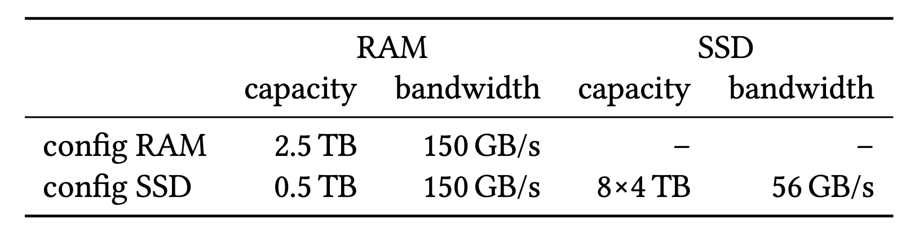
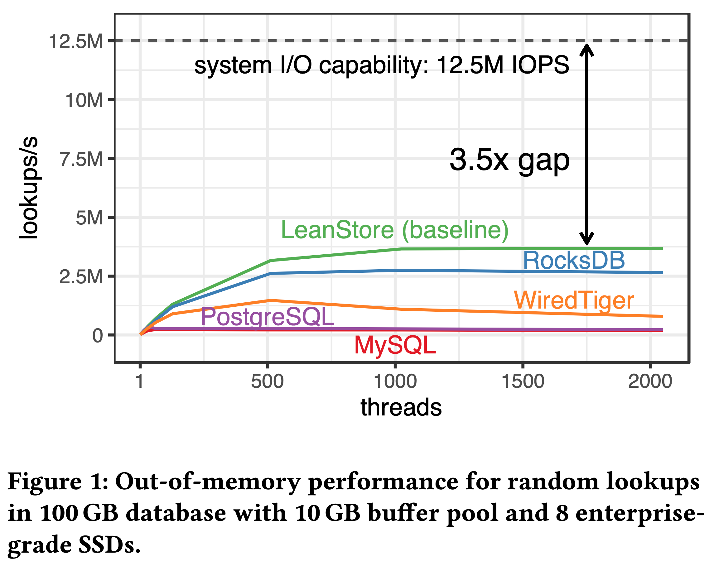
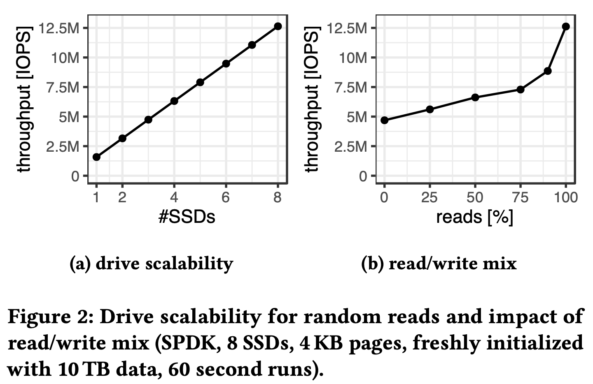
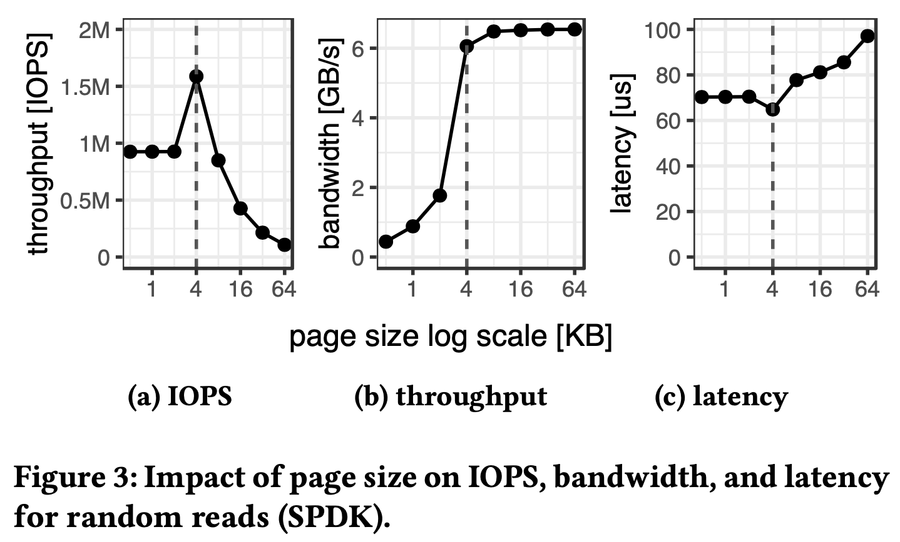
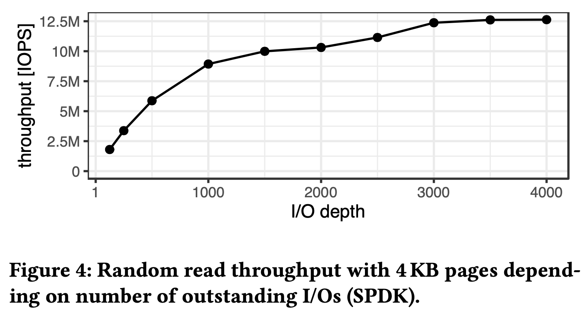
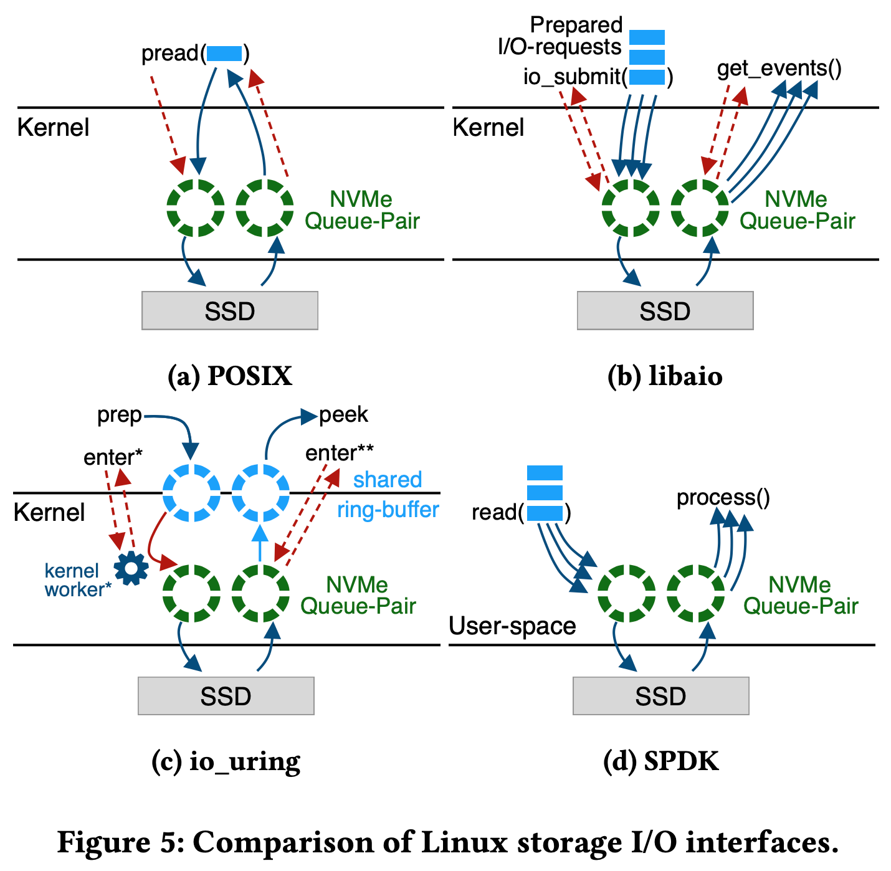
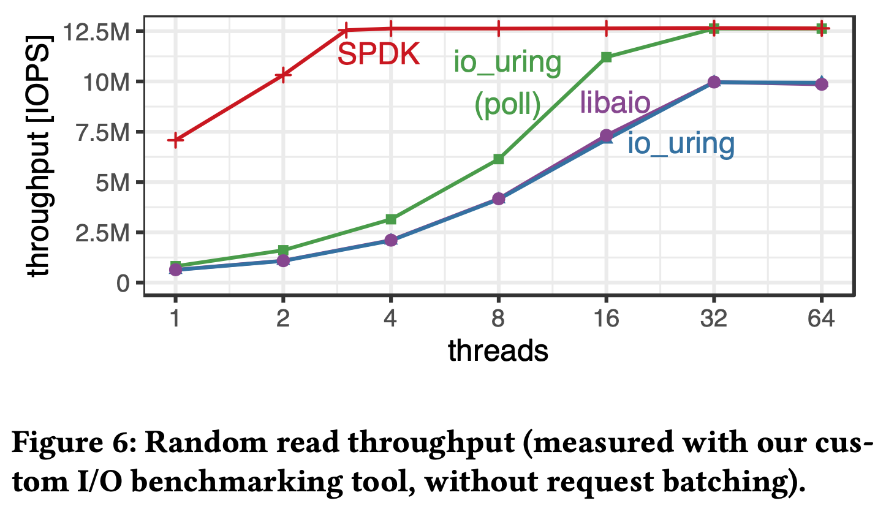
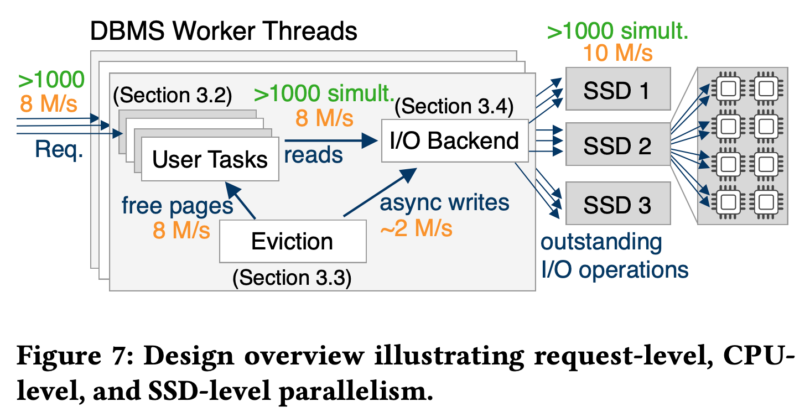
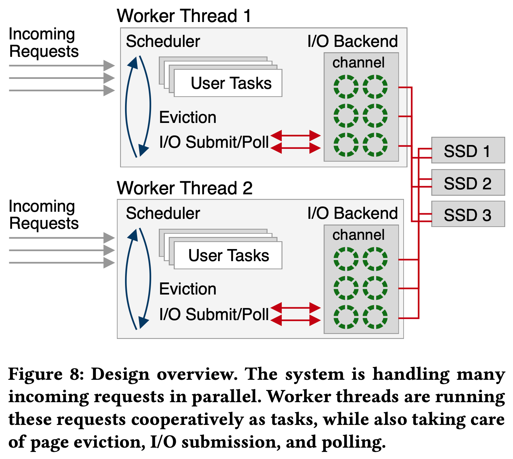

> 那玛峰，2023

## Introduction

闪存的吞吐很高并且还在逐年提升：一块 PCIe 4.0 SSD 的随机读 IOPS 已经可以达到上百万了，总带宽 7GB/s，而新一代 PCIe 5.0 SSD 的带宽更是可以达到快要接近内存的 12GB/s。

闪存的价格不贵并且越来越便宜，目前企业级 SSD 可以实现 $200/TB 的价格，比内存便宜 10-50 倍。如下表所示，假设总共有 $15000 的预算，一半用来配置 64 核 CPU、512GB 内存，剩下的预算可以用来加 2TB 内存，或者加 8 块 4TB 的 PCIe 4.0 NVMe SSD 以实现更大的系统容量。作者相信，随着 Optane 的商业失败，将来 SSD 在数据存储方面会发挥越来越大的作用，成为 cost-efficient 的唯一选择。

虽然可以配置多块 SSD 实现更大存储容量，但现有存储引擎设计并不能充分发挥这些 SSD 的 IOPS 和带宽。作者测试了 5 个系统的随机读，总数据量 100GB，buffer pool 为 10GB，测试环境采用 64 核 AMD CPU，512G 内存，8 块三星 PM1733 SSD。对于 4KB 随机读，每块 SSD 可以达到 1.5M IOPS，8 块 SSD 的 IOPS 上限为 12M。下图是实际测试结果，即使表现最好的 LeanStore 距离理论上限也还有 3.5 倍的差距：

对一组 NVMe SSD 来说，怎样才能达到硬件规格所描述的性能上限，应该使用什么 IO API，pread/pwrite、libaio、io_uring 还是 SPDK？既要减少 IO 放大又要高性能，Buffer pool 中的 page size 应该是多大？如何进行并发控制以达到几百万的 IOPS？如何提升存储引擎性能使其管理几百万的 IOPS？使用专门的 IO 线程池还是每个前端工作线程各自进行 IO？

以上这些问题就是这篇论文希望回答和解决的。作者讨论了 NVMe 闪存的硬件特点，针对这些特点重新设计 LeanStore 使其在多块 SSD 的场景下能够达到 IOPS 的硬件规格上限。

## What Modern NVMe Storage Can Do

这里作者通过一些 micro benchmark 解释了 NVMe SSD 的硬件特性和如何充分发挥其性能。所有实验都基于 64 核 AMD zen4 CPU + 8 块三星 PM1733 SSD。
### Drive Scalability

作者测了 4KB 随机读和读写混合的场景，读写混合负载和事务更接近些，完全随机写的情况下 8 块 SSD 的总 IOPS 为 4.7M，读请求占 90% 时总 IOPS 能提升到 8.9M，完全随机读的情况下总 IOPS 能达到 12.5M。

### The Case for 4KB Pages

对数据库来说 page size 的选择很重要，许多数据库的 page size 都比 4KB 更大，比如 PG、SQL Server 采用 8KB，MySQL 采用 16KB，WiredTiger 采用了 32KB。更大的 page size 对 in-memory 的工作负载更有利（比如减少 B+ 树的高度），也能减少 buffer pool 的 page 数量降低缓存维护负担。但 page size 过大的坏处是 IO 放大。

如上所示，作者在 page size 下进行了随机读测试，结果表明 4KB 的 IO 粒度能最大化 IOPS 和带宽，IO 延迟也最低。page size 小于或大于 4KB 性能都会下降。因此为了充分发挥磁盘性能，最佳 page size 应该是 4KB。

不过接下来我们会看到，仅将 page size 调整为 4KB 还远远不够。

### SSD Parallelism

SSD 是个内部高度并行化的设备，有多个数据通道同时读写。它的随机读延迟在 100us 级别，一次一个 page 的同步 IO 只能获得 10K IOPS，也就是 40MB/s 的带宽，距离单盘 1.5M IOPS 的上限相去甚远。

如上图所示，作者测试了这 8 快盘在不同 IO depth 下的随机读 IOPS。当 IO depth 为 1000 时才获得比较不错的性能，当 IO depth 为 3000 时才达到极限 IOPS，也就是需要 3000 并发的 IO 请求才能打满所有这些盘的 IOPS。

要在数据库中实现和管理这 3000 的并发 IO 是个非常挑战的事情。

### I/O Interfaces

作者讨论了 4 个 Linux 上常用的 IO 库：POSIX pread/pwrite、libaio、io_uring 以及 SPDK。不管使用哪个库，在 NVMe SSD 上读写数据的最终过程都是将用户的 IO 请求发给 NVMe 的 submission queue，SSD 处理完请求后会将 completion event 发送到 completion queue，通知上层 IO 已完成。

POSIX 接口：使用 pread/pwrite 一次处理一个 IO 请求，是一种同步接口，IO 未完成时会被阻塞，每个 IO 请求都会产生 context switch 和系统调用。

libaio：一种异步接口，一次 io_submit() 系统调用可以提交多个 IO 请求，IO 处理不阻塞用户程序，用户通过 get_events() 获取 completion events 来判断之前提交的 IO 请求是否已经完成。降低了系统调用和 context switch，单个线程内可以同时处理多个 IO 请求。

io_uring：在用户态和内核态之间有一组共享的 submission/completion queue（图 C 蓝色部分），用户通过 io_uring_enter() 提交请求，内核的处理过程和其他接口一样各个 layer 都要走一遍，直到最后把用户的 IO 请求提交到 SSD 的 submission queue 中。io_uring 有一个 SQPOLL 模式，开启后会在内核中启动 kernel-worker 后台线程拉取和处理用户 submission queue（图 C 蓝色部分）中的 IO 请求。SQPOLL 模式下不需要任何系统调用。

在这些 IO 接口中，SPDK 拥有最好的性能和最低的 CPU 消耗。SPDK 会直接在用户态分配 NVMe 的 submission 和 completion queue，它不支持中断，用户程序需要从 completion queue 中 poll 相关事件以完成 IO 请求，完全 bypass 了操作系统内核，包括文件系统和 page cache 等。从实验结果来看，SPDK 效果最好，能以最小的 CPU 开销达到极限 IOPS。

### A Tight CPU Budget

打满 12M 的 IOPS 对 CPU 的消耗也很高，按照作者使用的 AMD 2.5GHz 64 核 CPU 来算，平均每 13K 个时钟周期就需要处理一个 IO 请求。

我们要到达的 IOPS 目标很高，但是可用的 CPU 资源却非常有限。作者采用的 AMD CPU 是 2.5GHz 64 核的，算下来要达到 12M 的 IOPS，平均每个 IO 只有约 13k 的 CPU 时钟周期。

作者使用 fio 测试的过程中，发现 fio 因为使用了基于中断的 IO 接口，它并不能打满这些 SSD 的总 IOPS。这也从侧面说明了数据库系统要想充分利用多块 SSD 提供的 IO 能力有多么困难。

如上图所示，使用 io_uring 需要 32 线程才能打满这些 SSD 的 IOPS，而使用 SPDK 只需要 3 个线程。如果不用 SPDK 那么至少一半的 CPU 时钟周期都需要花费在 IO 请求上，
剩下一半的时钟周期留给了数据库其他操作比如查询处理、索引遍历、并发控制、WAL、Buffer Manager 等显然是不够的，SPDK 成了打满磁盘 IOPS 的必选项。

### Implications for High-Performance Storage Engines

LeanStore 虽然专门面向 NVMe SSD 优化，但还是不能充分发挥多块 SSD 的 IOPS，从上面的分析来看，要想充分发挥这些 SSD 的性能，还需要继续优化。

LeanStore 使用一组工作线程用来处理每个用户事务，每个工作线程对应一个操作系统线程，使用同步的  pread 接口从 SSD 读取缺失的 page，这里既有频繁的用户态-内核态上下文切换，又因为 pread 接口的原因该线程会被阻塞无法处理其他事务。正如之前实验结果看到的，我们需要上千个并发事务才能打满这些 SSD 的 IOPS，也就对应了上千个并发的工作线程，当有上千个工作线程的时候，他们对操作系统的线程争用会引发大量的上下文切换开销，反而还会降低性能。

除了处理用户事务的工作线程以外，LeanStore 还有专门的 Page Provider 线程用来寻找 code page 完成 page eviction。

## How to Exploit NVMe Storage

### Design Overview and Outline

要充分利用 SSD 的 IOPS，需要同时处理上千个用户事务，发送上千个 IO 请求，在传统的 thread-to-transaction 执行模式下，就意味着需要上千个线程同时运行，这显然是不可接受的。LeanStore 采用了 boost 提供的 lightweight cooperative thread，也有人把它叫做纤程（[fiber](https://en.wikipedia.org/wiki/Fiber_(computer_science))），降低了上下文切换开销。

如上图所示，LeanStore 在每个工作线程上实现了一个 scheduler 和对应的 user task 队列，每个 user task 对应一个纤程，通过 boost fcontext 实现了用户态的 task switch，task switch 开销在 20 个 CPU 时钟周期左右，相比内核态的上下文切换开销需要上千 CPU 始终周期来说非常轻量。使用纤程能够同时处理上千并发事务，发送上千 IO 请求到 SSD，同时对 LeanStore 代码重构来说也更加简单。

为了实现 mutli-task 调度，当发生 page fault，或者没有 free page，或者用户 task 执行完成的时候都会 yield 控制权给 scheduler，同时为了避免工作线程阻塞在锁等待上，作者修改了所有的锁实现，使得发生锁等待后最终也能将控制权移交给 scheduler。

非阻塞 IO，采用 non-preemptive task 意味着 pread/pwrite 这样的同步 IO 接口不能再用了，作者使用了 libaio、io_uring、SPDK 这样的异步 IO 接口来异步提交 IO 请求到 SSD queue 中，当 task 遇到 page fault 时，该工作线程在将 IO 请求提交到 IO backend 后，对应的 task 会将请求 yield 回 scheduler，使其继续执行后面的其他 user tasks。当 IO 结束后，工作线程最终挑选该 task 以完成后续事务执行。

## 实验结果

## 总结