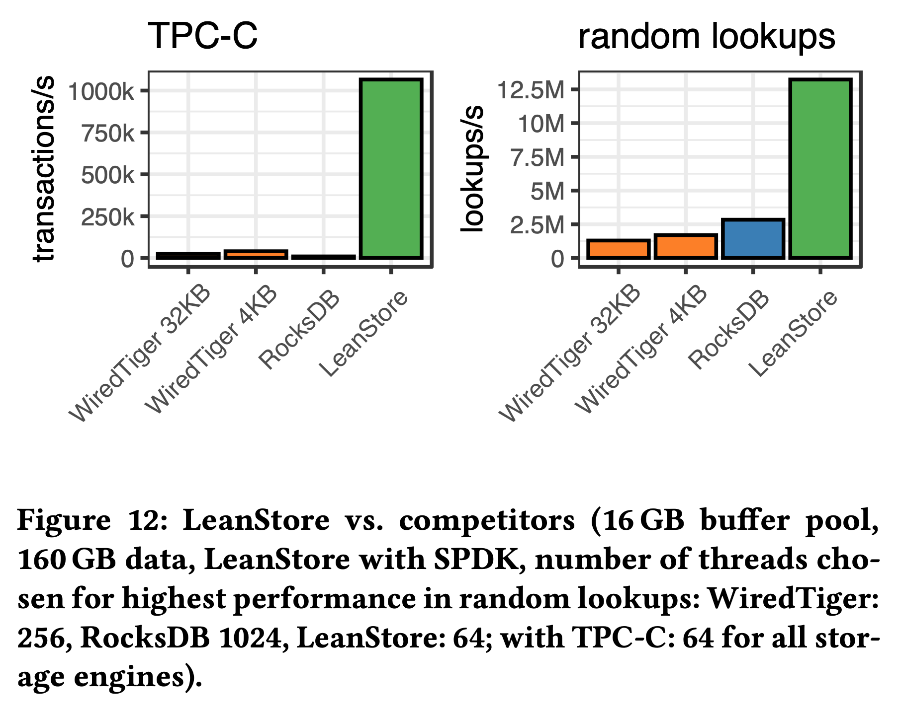

> Manang, Nepal, 2024

## Introduction

闪存的性能越来越强，价格也越来越便宜：一块 PCIe 4.0 SSD 有超过 1M 的随机读 IOPS，7GB/s 的总带宽，而新一代 PCIe 5.0 SSD 拥有 12GB/s 的总带宽，已经很接近内存的带宽了。价格方面，企业级 SSD 的价格差不多 $200/TB，比内存便宜了 10-50 倍。作者相信，随着 Optane 的商业失败，闪存在数据存储方面会发挥越来越大的作用，成为 cost-efficient 的唯一选择。

如下表所示，假设总共有 $15000 的预算，一半用来配置 64 核 CPU、512GB 内存，剩下的预算可以用来加 2TB 内存，或者加 8 块 4TB 的 PCIe 4.0 NVMe SSD 以实现更大的存储容量：

虽然可以配置多块 SSD 实现更大存储容量，但现有存储引擎设计却并不能完全发挥它们的总 IOPS 和带宽。每块 SSD 的 4KB 随机读能达到 1.5M IOPS ，8 块 SSD 可以达到 12M 的总 IOPS。如下图所示，作者测试了 5 个系统的随机读性能，总数据量 100GB，buffer pool 10GB，即使表现最好的 LeanStore 距离理论上限也还有 3.5 倍的差距：

对一组 NVMe SSD 来说，怎样才能发挥它们性能上限？应该使用什么 IO API，pread/pwrite、libaio、io_uring 还是 SPDK？既要减少 IO 放大又要提高性能，应该使用多大的 page size？如何并发控制几百万的 IOPS？应该使用什么样的线程模型，是专门的 IO 线程池还是在每个工作线程中进行 IO？

以上这些问题就是这篇论文希望解决的。作者讨论了 NVMe 闪存的硬件特点，针对这些特点重新设计 LeanStore 使其能够充分发挥多块 SSD 的总 IOPS，最大化系统的读写吞吐。

## What Modern NVMe Storage Can Do

作者通过各种 micro benchmark 揭示了 SSD 的硬件特性和如何充分发挥它的性能。所有实验都基于 64 核 AMD zen4 CPU + 8 块三星 PM1733 SSD。
### Drive Scalability

上图是 4KB 随机读和读写混合的测试结果，揭示了不同读写比例的总 IOPS 上限。完全随机写的情况下 8 块 SSD 的总 IOPS 为 4.7M，90% 随机读的总 IOPS 提升到了 8.9M，完全随机读的总 IOPS 可以达到 12.5M。

### The Case for 4KB Pages

对数据库来说 page size 的选择很重要，许多数据库使用了比 4KB 更大的 page size，比如 PG、SQL Server 为 8KB，MySQL 为 16KB，WiredTiger 为 32KB。更大的 page size 对 in-memory 工作负载更有利（比如减少 B+ 树的高度），也能减少 buffer pool 的 page 数量降低缓存维护负担。但 page size 过大的会导致严重的 IO 放大，可以说 page size 的选择是各种 trade off 后的结果。

上图是不同 page size 的随机读性能测试结果。结果表明 4KB 的 page size 能最大化 IOPS，最小化 IO 延迟。虽然在吞吐方面还不是最优，比如 16KB page size 才能最大化读带宽，但是为了充分发挥磁盘 IOPS 提高存储引擎性能，4KB page size 是最优选择。

### SSD Parallelism

光调整 page size 到 4KB 还不够。SSD 是个内部高度并行化的设备，提供了多个可以同时读写的数据通道。它的随机读延迟在 100us 级别，一次一个 page 的同步 IO 只能获得 10K IOPS，也就是 40MB/s 的带宽，距离单盘 1.5M IOPS 的上限相去甚远。

上图测试了 8 块 SSD 在不同 IO depth 下的 IOPS。当 IO depth 为 3000 时才能达到极限的 12.5M IOPS。换言之，从一次一个 page 的同步 IO 视角来看，需要 3000 并发这样的同步 IO 才能耗尽所有 SSD 的 IOPS，而在单机数据库里实现和管理这 3000 并发是个非常挑战的事情。

### I/O Interfaces

作者讨论了 4 个 Linux 上常用的 IO 库：POSIX pread/pwrite、libaio、io_uring 以及 SPDK。不管使用哪个库，最终都需要将用户的 IO 请求发给 SSD 的 submission queue，SSD 处理完后会将 completion event 发送到 completion queue，通知应用 IO 完成。

POSIX pread/pwrite 是一种同步接口，每次处理一个 IO 请求，IO 未完成会被阻塞，每次请求都会产生 context switch 和系统调用。

libaio 是一种异步接口，通过一次 io_submit() 系统调用提交多个 IO 请求，IO 处理不阻塞用户程序，通过 get_events() 获取 completion events 来判断之前提交的 IO 请求是否已经完成。libaio 降低了系统调用和 context switch，单线程即可同时处理多个 IO 请求。

io_uring 是 libaio 的继任者，也是一种异步接口。通过用户态和内核态共享的 submission/completion queue（图 C 蓝色部分）来提交和收割 IO 请求。用户通过 io_uring_enter() 提交请求，内核的处理过程和其他接口一样各个 layer 都要走一遍，直到最后把 IO 请求提交到 SSD 的 submission queue 中。io_uring 有一个 SQPOLL 模式，开启后会在内核中启动后台线程 kernel-worker 拉取和处理用户 submission queue（图 C 蓝色部分）中的 IO 请求。SQPOLL 模式下不需要任何系统调用。io_uring 还有个 IOPOLL 模式用于通知用户 IO 处理完成。之前所有介绍的 IO 库都是通过硬件中断来通知 IO 完成的，在 io_uring 的 IOPOLL + SQPOLL 模式下，可以完全省去系统调用和硬件中断，理论上比 libaio 性能更好，开销更低。

SPDK 全称是 Intel Storage Performance Development Kit，SPDK NVMe driver 是 NVMe SSD 的用户态驱动，用户可以通过 SPDK bypass 内核直接和 SSD 的 submission/completion queue 交互，也不会有硬件中断，理论上拥有最好的性能和最低的开销。

### A Tight CPU Budget

要打满 12M IOPS 对 CPU 的消耗也很高，按照作者使用的 AMD 2.5GHz 64 核 CPU 来算，平均每 13K（2.5G\*64/12M）个时钟周期就需要完成一个 IO 请求。

上图测试了不同 IO 库实现相同 IOPS 时的 CPU 开销。一些结论：
1. libaio 和普通 io_uring 在使用 32 线程后 IOPS 就上不去了，完全不能打满 12M IOPS，大多时间都消耗在了无法省去的内核处理上。
2. SQPOLL + IOPOLL 模式的 io_uring，禁掉一些内核功能比如文件系统，RAID，OS page cache 后性能会好很多，使用 32 线程可以打满 IOPS。
3. SPDK 的性能最好，CPU 开销最低，3 线程就可以打满 IOPS。

这里基本就宣告只能使用 SPDK 了，因为即使 io_uring 的 SQPOLL + IOPOLL 模式也需要 32 线程才能耗尽 IOPS，而剩下的 CPU，也就是 6.5K 个时钟周期需要用来进行查询处理、索引遍历、并发控制、缓存替换、日志记录等，肯定是不够用的。

### Implications for High-Performance Storage Engines

LeanStore 虽然专门面向 NVMe SSD 优化，但还是不能充分发挥多块 SSD 的 IOPS，上面的分析也给出了差距来源和优化思路。

LeanStore 将工作线程和 page provider 分开。工作线程负责处理用户事务，当需要的 page 不在 buffer pool 时通过 pread 从磁盘读取。page provider 负责缓存替换，将 buffer pool 中不常使用的 page 写回磁盘。

工作线程的 pread 导致每个 page IO 都有一次系统调用，需要同步等待内核返回结果。按之前的分析，这种模式要想打满 12M IOPS 需要上千个工作线程，而真有这么多工作线程时，又会有更多 CPU 用于 context switch 和线程调度，既低效又不鲁棒。

## How to Exploit NVMe Storage

作者基于 LeanStore 继续优化，使其完全发挥所有 SSD 的总 IOPS，在只有 64 核 128 线程的情况下，使系统能处理上千并发的 IO request。

### Design Overview and Outline

上图是 IO request 视角的系统设计概览，优化后的 LeanStore 使用协程调度了上千并发的 IO request，同时设计了高效的缓存替换和异步脏页回写使系统提供足够的空闲 buffer frame，由 IO backend 通过 SPDK 读写 SSD。

### DBMS-Managed Multitasking

如上图所示，系统在每个 CPU core 上启动一个工作线程，工作线程执行一批由 boost coroutine 实现的 user task，coroutine 调度由工作线程的 scheduler 负责，coroutine 调度开销远低于 context switch，只需 ~20 CPU 时钟周期。

coroutine 切换发生在 page fault（此时需要根据 page id 从磁盘读取对应的 page 上来），或者缺乏空闲 buffer frame（此时需要将内存中某些 page 写回磁盘以得到可用的空闲 buffer frame），或者锁等待（为了避免 coroutine 因为等锁而阻塞，作者修改了所有 latch 实现，使当前 coroutine 能够被切换走），或者 user task 结束。

系统采用非阻塞 IO。例如当前 user task 发生 page fault 后会将 IO 请求提交到 IO backend，之后就暂停执行，由 scheduler 调度执行下一个 user task，等 IO 请求完成后才再次调度执行该 user task。

### Background Work Through System Tasks

系统中除了执行用户 query 的 user task 以外还有运行系统任务的 system task。比如 page eviction，如果不够快，user task 的 IO request 会因为等待空闲 buffer frame 而停顿。

老版本的 LeanStore 使用后台线程 page provider 进行缓存替换，要满足百万级别的 page eviction 和 IOPS 就需要多个 page provider 线程，但需要多少 page provider 很难提前预知，尤其是工作负载发生变化的时候。

新版本中，像 page provider 这样的后台任务和 user task 一样采用 boost coroutine 实现为 system task，由 scheduler 在工作线程上调度执行。scheduler 每次调度 task 时都会检查 free buffer frame 是否充足，并按需调度 page eviction task，如果瓶颈在缓存替换，user task 得不到调度，page eviction 就自然得到了更多 CPU 时间。 

以上图为例，scheduler 按照 runTask、submitIO、eviction、pollIO 的顺序调度用户任务和系统任务：
1. 调度执行 user task 1
2. 执行其中的 B+ Tree lookup，在遍历时遇到了 page fault
3. 将对应的 page read request 提交给 IO backend，将 task 状态置为 waitIO
4. suspend 当前 user task，由 scheduler 继续调度下个任务
5. 下个任务是调用 IO backend 的 submit 接口，提交 IO backend 中所有累积的 IO request 到 SSD，接着执行 eviction 任务，根据需要进行缓存替换
6. 接着进入下一个 task 调度循环
7. 这次执行的事 user task 2，它没有 page fault、执行过程中也没有锁等待，所有过程都在 CPU 中完成，user task 2 执行结束后，scheduler 继续调度后面的系统任务
8. 在 pollIO 时发现上个 user task 1 的 IO request 已经执行结束，调用 callback 将其任务状态置为 IOdone
9. 下轮调度开始，scheduler 重新调度到 user task 1，发现 IO 已经完成，于是 resume user task 1 并从上次 suspend 的地方继续执行。

### Managing I/O

IO backend 是一个 async IO 封装，支持包括 libaio、io_uring 和 SPDK 在内的所有主流异步 IO 库，对所有 SSD 做了个类似 RAID 0 的封装使其看起来像是一块 SSD。没用 Linux 的 RAID 0 一方面是为了更好的性能，一方面是为了 SPDK。

需要有专门的线程负责 IO 吗？需要每个线程负责一块 SSD 还是所有线程可以读写所有 SSD？上图展示了 3 种可能的 IO 线程模型：

Dedicated IO threads 模型和 io_uring 的 SQPOLL 模式类似，工作线程需要和 IO 线程交互，每个 IO request 都会有额外的消息传递开销。Dedicated IO threads 的问题在之前的实验中也揭示过，一方面不好确定线程池大小，另一方面这些线程也不能完全发挥 SSD IOPS。

SSD Assignment  模型中，每个工作线程负责一个 SSD，当需要向其他工作线程所负责的 SSD 读写数据时仍然避免不了消息传递开销。IO benchmark 时通常采用这种模型，它的 cache locality 最好，polling 调用最少。但数据库负载和 IO benchmark 负载不一样，在数据库负载中可能需要读写其他线程上的 SSD 的数据，这就引入了线程同步开销，需要实验来看能不能被它带来的收益抵消。

All-to-All 模型中，每个工作线程都可以读写所有 SSD，为每个 SSD 都准备了独立的 submission/completion queue，作者实现了一个 IO channel 的接口用于封装底层不同的 IO 库。每个 worker 都有通过 IO channel 读写底下所有 SSD。不需要在 worker 之间消息传递和线程同步。没有任何特殊角色的线程，这也意味着系统只需 1 个 cpu core 就可以具备完整功能。

上图测试对比了 SSD assignment 和 all-to-all 两种模型，二者性能几乎一致，由于 all-to-all 模型的各种优点，最终 LeanStore 采用了该线程模型。

### CPU Optimizations and Scalability

当所有 IO 优化实现后，作者发现系统的 CPU 成为瓶颈了，IOPS 仍旧没有打满。于是还有不少 CPU 相关的优化需要做。

在多核 scalability 方面锁竞争是最大的瓶颈。早期 LeanStore 设计中，采用了全局大锁保护所有正在进行的 IO 操作，但在多块高性能 SSD 的场景下，这把大锁很快就成为性能瓶颈了。作者将 inflight IO 操作按照 page id 进行分区，每个分区使用各自的小锁，通过减小锁粒度减少了锁竞争。

另一个显著的开销是 findParent。LeanStore 采用了 pointer swizzling，在 page eviction 时需要在当前 page 的父节点中更新其状态，由于节点中没有存储 parent pointer，于是需要不断调用 findParent 从根节点开始遍历。当 IOPS 很高 page eviction 频繁时，findParent 的 CPU 开销就凸显出来了。LeanStore 采用了一种称为 optimistic parent pointer 的优化，主要思路是在当前节点缓存 parent pointer，避免重复的 findParent 开销。

## EVALUATION

还是一开始的实验环境：AMD EPYC 7713 CPU（64 核 128 线程），512GB 内存，8 块三星 PM1733 SSD，每块 3.84TB，每块 SSD 有 1.5M 4KB 随机读 IOPS。在测试所有 SSD 时需要设置内核参数 amd_iommu=off 才能发挥所有性能。每次测试前都擦盘清零。

测试中关闭了 wal，使用了最低可用的事务隔离级别，主要关注整系统的 IO 吞吐。所有系统都配置成 4KB page size，采用 DIRECT IO，8 byte key + 120 byte value。

### System Comparison

1000 warehouse，大约 160GB，buffer pool 10GB，90% 的数据在磁盘上，LeanStore 采用 SPDK 作为 IO backend，使用 64 线程 TPS 1.07M。在 random lookup benchmark 中，key 均匀分布，WiredTiger、RocksDB 和 LeanStore 的 QPS 分别是 1.8M、2.8M 以及 13.2M。

### Incremental Performance Improvements

这里展示了不同优化策略对 TPC-C 和 random lookup 的性能影响。

### Out-Of-Memory Scalability

buffer pool 固定在 400GB，不断增加 TPC-C 数据量， 测试了 LeanStore 在 out-of-memory 下的性能表现。当数据完全在内存中时 64 线程可实现 2M 多 TPS，当 25K warehouse，总数据 4TB 十倍于 buffer pool 时，TPC-C 仍旧有 1.1M，100K warehouse 总数据 16TB 四十倍于 buffer pool 时，TPC-C 仍旧有 400K。
### I/O Interfaces

### CPU Usage

### Latency

## 总结